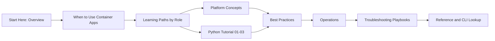

---
hide:
  - toc
content_sources:
  diagrams:
    - id: the-following-flow-helps-teams-move
      type: flowchart
      source: mslearn-adapted
      based_on:
        - https://learn.microsoft.com/azure/container-apps/overview
        - https://learn.microsoft.com/azure/container-apps/get-started
        - https://learn.microsoft.com/azure/container-apps/revisions
        - https://learn.microsoft.com/azure/container-apps/log-monitoring
---

# Tutorial: Azure Container Apps for Python

Follow this tutorial sequence to containerize a Python app, deploy it to Azure Container Apps, configure runtime settings, and operate it with production-ready practices.

## Prerequisites

- Azure CLI 2.57+ with Container Apps extension
- Docker (for local testing)
- An Azure subscription
- A Python web app that exposes `/health`

```bash
az extension add --name containerapp --upgrade
az login
```

## Tutorial Path

1. [01 - Run Locally with Docker](../language-guides/python/01-local-development.md)
2. [02 - First Deploy to Azure Container Apps](../language-guides/python/02-first-deploy.md)
3. [03 - Configuration, Secrets, and Dapr](../language-guides/python/03-configuration.md)
4. [04 - Logging, Monitoring, and Observability](../language-guides/python/04-logging-monitoring.md)
5. [05 - Infrastructure as Code with Bicep](../language-guides/python/05-infrastructure-as-code.md)
6. [06 - CI/CD with GitHub Actions](../language-guides/python/06-ci-cd.md)
7. [07 - Revisions and Traffic Splitting](../language-guides/python/07-revisions-traffic.md)

## Advanced Topics

- Use [Dapr integration](../language-guides/python/recipes/dapr-integration.md) for service invocation, pub/sub, and state APIs.
- Add VNet and private networking patterns from [networking recipes](../platform/networking/vnet-integration.md).
- Standardize environment provisioning with reusable Bicep modules.

## Role-Based Learning Paths

Use the table below to choose a role-first path. Each path points to the same core materials, but in a different order based on daily responsibilities.

| Role | Primary Outcome | Start Modules | Next Modules | Estimated Time (Focused) |
|---|---|---|---|---|
| Developer | Build and ship a reliable API on Container Apps | Python 01, 02, 03 | 04, 07, troubleshooting quick triage | 8-12 hours |
| DevOps Engineer | Standardize deployment and release flow | 02, 05, 06 | operations/deployment, operations/monitoring | 10-14 hours |
| Architect | Select platform boundaries and operating model | overview, when-to-use, platform index | best-practices index, networking, identity | 6-10 hours |
| SRE / Operator | Stabilize production and reduce incident MTTR | 04, operations/monitoring, troubleshooting index | alerts, recovery, KQL packs | 8-12 hours |

!!! tip "Pick one primary role first"
    If you wear multiple hats, complete one role path end-to-end before blending tracks. This creates a coherent mental model of revisions, scaling, and operations.

!!! info "Use reusable variables from day one"
    Keep command examples consistent with this guide's variables: `$RG`, `$APP_NAME`, `$ENVIRONMENT_NAME`, `$ACR_NAME`, and `$LOCATION`.

## Progression Flow

The following flow helps teams move from orientation to production readiness without skipping operational fundamentals.

<!-- diagram-id: the-following-flow-helps-teams-move -->


## Prerequisite-to-Module Mapping

| Prerequisite | Why It Matters | First Module That Uses It | Quick Validation |
|---|---|---|---|
| Azure subscription | Required for all `az containerapp` operations | Python 02 | `az account show --output table` |
| Azure CLI + extension | Needed to create app, revisions, and jobs | Python 02 | `az extension add --name containerapp --upgrade` |
| Docker | Needed for local image build and run | Python 01 | `docker build --tag "$APP_NAME:local" .` |
| Health endpoint (`/health`) | Required for stable probe behavior | Python 01 and best-practices container design | `curl --fail "http://localhost:8000/health"` |
| Log Analytics awareness | Required for production debugging | Python 04 and operations/monitoring | Run any starter KQL in troubleshooting/kql |

## Suggested 2-Week Learning Plan

| Day Range | Focus | Deliverable |
|---|---|---|
| Day 1-2 | Start Here + platform basics | Team-level architecture notes and service choice |
| Day 3-4 | Python 01-03 | First deployed revision with secrets/config |
| Day 5 | Python 04 | Basic dashboard + log query for error rate |
| Day 6-7 | Python 05-06 | Reproducible IaC deploy + CI/CD pipeline |
| Day 8 | Python 07 | Revision split test plan |
| Day 9-10 | operations + troubleshooting | Incident runbook draft and recovery drill |

!!! note "Do not skip observability setup"
    Teams that delay logging and alert basics usually struggle during the first production incident. Complete logging and monitoring before scaling traffic.

!!! warning "Avoid premature multi-service complexity"
    Start with one container app and one clear API workflow. Add Dapr sidecars, jobs, and private networking after the baseline deployment is stable.

## Recommended Command Sequence for New Environments

```bash
az group create --name "$RG" --location "$LOCATION"

az containerapp env create \
  --name "$ENVIRONMENT_NAME" \
  --resource-group "$RG" \
  --location "$LOCATION"

az acr create \
  --name "$ACR_NAME" \
  --resource-group "$RG" \
  --location "$LOCATION" \
  --sku Basic
```

Use the sequence above once, then continue tutorial modules with the same variable names.

## Skill Checkpoints

Before moving from one phase to the next, validate these checkpoints:

| Phase | Checkpoint | Evidence |
|---|---|---|
| Build | App listens on configured port | Successful local run and `/health` response |
| Deploy | Revision becomes healthy | `az containerapp revision list --name "$APP_NAME" --resource-group "$RG" --output table` |
| Operate | Logs are queryable and structured | KQL query returns expected JSON schema |
| Improve | Safe rollout behavior | Successful traffic split or rollback simulation |

## See Also

- [How Container Apps Works](overview.md)
- [Environment Variables Reference](../troubleshooting/first-10-minutes/environment-variables.md)
- [Managed Identity Recipe](../platform/identity-and-secrets/managed-identity.md)
- [When to Use Container Apps](when-to-use-container-apps.md)
- [Repository Map](repository-map.md)
- [Platform Hub](../platform/index.md)
- [Operations Hub](../operations/index.md)
- [Troubleshooting Hub](../troubleshooting/index.md)

## Sources

- [Azure Container Apps overview (Microsoft Learn)](https://learn.microsoft.com/azure/container-apps/overview)
- [Quickstart: Deploy your first container app (Microsoft Learn)](https://learn.microsoft.com/azure/container-apps/get-started)
- [Manage revisions in Azure Container Apps (Microsoft Learn)](https://learn.microsoft.com/azure/container-apps/revisions)
- [Monitor logs in Azure Container Apps (Microsoft Learn)](https://learn.microsoft.com/azure/container-apps/log-monitoring)
