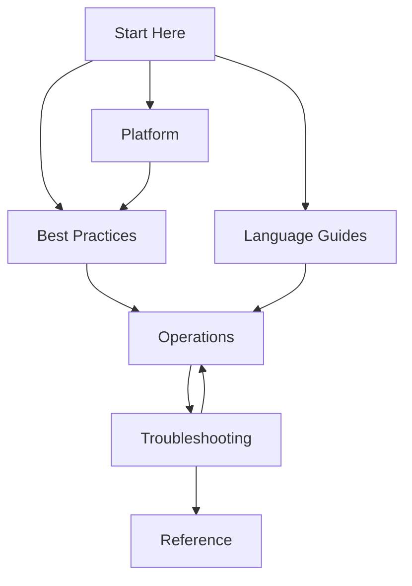
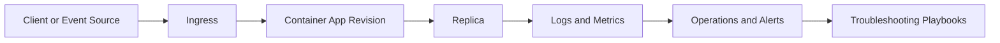

---
content_sources:
  diagrams:
    - id: guide-structure
      type: flowchart
      source: mslearn-adapted
      based_on:
        - https://learn.microsoft.com/azure/container-apps/overview
        - https://learn.microsoft.com/azure/container-apps/
        - https://learn.microsoft.com/azure/container-apps/environment
        - https://learn.microsoft.com/azure/container-apps/scale-app
        - https://learn.microsoft.com/azure/container-apps/revisions
    - id: conceptual-platform-view
      type: flowchart
      source: mslearn-adapted
      based_on:
        - https://learn.microsoft.com/azure/container-apps/overview
        - https://learn.microsoft.com/azure/container-apps/
        - https://learn.microsoft.com/azure/container-apps/environment
        - https://learn.microsoft.com/azure/container-apps/scale-app
        - https://learn.microsoft.com/azure/container-apps/revisions
content_validation:
  status: verified
  last_reviewed: "2026-04-12"
  reviewer: ai-agent
  core_claims:
    - claim: "Azure Container Apps is a fully managed environment for running containerized applications."
      source: "https://learn.microsoft.com/azure/container-apps/overview"
      verified: true
    - claim: "Container Apps supports automatic scaling including scale to zero."
      source: "https://learn.microsoft.com/azure/container-apps/scale-app"
      verified: true
---

# Azure Container Apps Practical Guide

This practical guide helps you design, deploy, operate, and troubleshoot containerized applications on Azure Container Apps. It is organized for hands-on execution across platform concepts, language implementation, and production operations.

This is an independent community project and is not affiliated with Microsoft.

## Guide Scope and Audience

This guide is built for:
- Developers deploying containerized applications to Azure Container Apps
- SREs and operators running production workloads
- Troubleshooting engineers resolving incidents under pressure

## Guide Structure

| Section | Purpose | Entry Link |
|---|---|---|
| Start Here | Orientation, scope, and navigation through the full guide | [Start Here](../start-here/overview.md) |
| Platform | Core platform concepts needed before implementation choices | [Platform](../platform/index.md) |
| Best Practices | Production patterns, standards, and anti-pattern avoidance | [Best Practices](../best-practices/index.md) |
| Language Guides | Runtime-specific tutorials and implementation walkthroughs | [Language Guides](../language-guides/index.md) |
| Operations | Deployment, monitoring, alerting, and recovery workflows | [Operations](../operations/index.md) |
| Troubleshooting | Incident triage, diagnostic playbooks, and investigation paths | [Troubleshooting](../troubleshooting/index.md) |
| Reference | Quick lookup for CLI, environment variables, and limits | [Reference](../reference/index.md) |

<!-- diagram-id: guide-structure -->

## How to Use This Guide

1. Begin with this section to understand navigation and scope.
2. Read Platform before deep implementation or production hardening.
3. Review Best Practices for production patterns and anti-patterns.
4. Select one Language Guide for your runtime stack.
5. Move to Operations to establish deployment, monitoring, and recovery practices.
6. Use Troubleshooting during incident response and for preventive learning.
7. Consult Reference for quick CLI, environment variable, and limits lookups.

## Role-Based Starting Points

If your team includes multiple roles, align on a shared baseline and then split into focused tracks.

| Role | First 3 Documents | Why This Order |
|---|---|---|
| Developer | learning-paths, python 01, python 02 | Establish build/deploy confidence quickly |
| DevOps Engineer | when-to-use, operations/deployment, python 06 | Prioritize release automation and reliability |
| Architect | when-to-use, platform index, best-practices index | Optimize service choice and architecture guardrails |
| SRE / Operator | operations/monitoring, troubleshooting index, platform/revisions | Build incident response and rollback fluency |

!!! info "Use this page as a control tower"
    Revisit this page when introducing new services, new environments, or ownership changes. It keeps navigation and scope consistent across teams.

!!! tip "Sequence reduces rework"
    Teams that study platform behavior before deep implementation generally avoid probe, scaling, and networking redesign later.

## Conceptual Platform View

<!-- diagram-id: conceptual-platform-view -->

The diagram above highlights the operating loop:

1. You deploy a revision.
2. Traffic reaches healthy replicas.
3. Telemetry feeds operations decisions.
4. Incident feedback improves configuration and design.

## First-Week Execution Plan

| Day | Focus | Practical Outcome |
|---|---|---|
| 1 | Read start-here pages | Shared team language and target architecture |
| 2 | Complete Python 01-02 | Running app in Azure Container Apps |
| 3 | Complete Python 03-04 | Config/secrets plus basic monitoring |
| 4 | Review best-practices + platform docs | Hardening backlog |
| 5 | Run troubleshooting labs | Faster diagnosis under pressure |

!!! warning "Do not treat Start Here as optional"
    Skipping orientation often causes teams to apply wrong compute assumptions (for example, cluster-level expectations from AKS) to Container Apps workloads.

## Readiness Checklist Before Production Work

| Readiness Area | Validation Question | Where to Continue |
|---|---|---|
| Service selection | Is Container Apps the right fit for this workload? | [When to Use Container Apps](when-to-use-container-apps.md) |
| Delivery model | Can we deploy reproducibly using IaC and CI/CD? | [Python 05-06](../language-guides/python/index.md) |
| Runtime health | Are startup, readiness, and liveness paths defined? | [Container Design Best Practices](../best-practices/container-design.md) |
| Operational visibility | Can we detect and diagnose failures quickly? | [Operations Monitoring](../operations/monitoring/index.md) |

## See Also

- [Learning Paths](learning-paths.md)
- [When to Use Container Apps](when-to-use-container-apps.md)
- [Repository Map](repository-map.md)
- [Platform](../platform/index.md)
- [Best Practices](../best-practices/index.md)
- [Platform: Revisions](../platform/revisions/index.md)
- [Platform: Scaling](../platform/scaling/index.md)
- [Best Practices: Container Design](../best-practices/container-design.md)
- [Troubleshooting: First 10 Minutes](../troubleshooting/first-10-minutes/index.md)

## Sources

- [Azure Container Apps overview (Microsoft Learn)](https://learn.microsoft.com/azure/container-apps/overview)
- [Azure Container Apps documentation hub (Microsoft Learn)](https://learn.microsoft.com/azure/container-apps/)
- [Azure Container Apps environments (Microsoft Learn)](https://learn.microsoft.com/azure/container-apps/environment)
- [Scale applications in Azure Container Apps (Microsoft Learn)](https://learn.microsoft.com/azure/container-apps/scale-app)
- [Revisions in Azure Container Apps (Microsoft Learn)](https://learn.microsoft.com/azure/container-apps/revisions)
