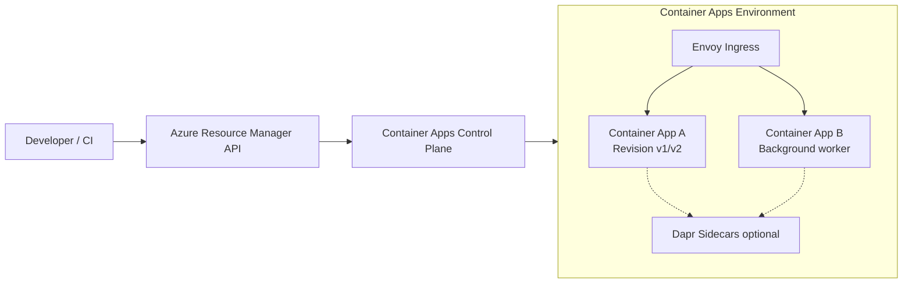
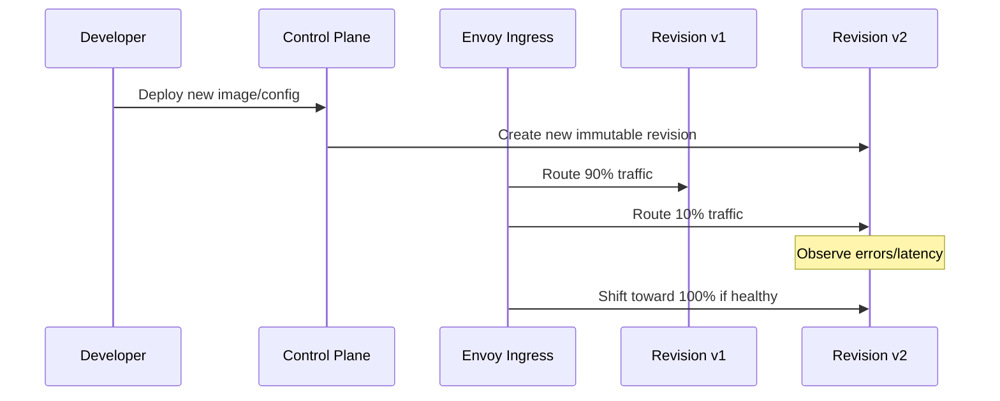

# Welcome to the Azure Container Apps Guide

Welcome to the comprehensive hub for Azure Container Apps! Whether you're a developer deploying your first container, a designer architecting a microservices platform, or an operator managing production workloads, this hub has everything you need.

This guide is structured into 5 distinct areas (Start Here, Platform, Language Guides, Operations, and Troubleshooting) to support you at every stage of your journey.

---

# How Azure Container Apps Works

Azure Container Apps is a managed platform for running containerized applications without managing Kubernetes clusters directly. You provide container images and runtime settings; Azure operates the orchestration, ingress, scaling, and patching layers.

## Platform Architecture

At a high level, Container Apps separates **control-plane operations** (configuration, deployment, policy) from the **runtime data plane** (routing, revisions, replicas).

## Core Building Blocks

### Environment

An environment is the regional boundary where apps share networking, observability integration, and platform runtime.

### Container App

A container app is a deployment unit with one or more containers and policies for ingress, scale, and revisions.

### Revision

Each configuration or image change creates an immutable revision. You can run one active revision (simple mode) or multiple active revisions (progressive delivery).

### Replica

A revision scales to replicas based on KEDA rules, HTTP demand, and min/max replica settings.

## Request and Deployment Lifecycle

This revision model enables low-risk rollouts and fast rollback without rebuilding infrastructure.

## Built-in Platform Capabilities

- **KEDA autoscaling** for event- and metrics-driven scaling.
- **Revision and traffic splitting** for canary and blue/green delivery.
- **Managed certificates** for HTTPS custom domains without manual certificate lifecycle tasks.
- **Dapr integration (optional)** for service invocation, pub/sub, state, and bindings.

## Practical Example: Choosing Runtime Features by App Type

| App Type | Recommended Features | Why |
|---|---|---|
| Public API | Ingress + managed cert + HTTP scale rules | Secure endpoint, automatic scale on traffic |
| Background worker | No public ingress + queue-based KEDA scaler | Event-driven processing with cost control |
| Microservice mesh | Internal ingress + Dapr service invocation | Simplifies service-to-service patterns |

## Next Steps

Now that you understand how Container Apps works, choose your path:

-   **New to the platform?** Follow our **[Learning Paths](learning-paths.md)**.
-   **Ready to design?** Explore the **[Platform Section](../platform/index.md)** for deep dives into networking and scaling.
-   **Need to fix something?** Go to the **[Troubleshooting Hub](../troubleshooting/index.md)**.

## See Also

- [Environments and Apps](../platform/index.md)
- [Scaling with KEDA](../platform/index.md)
- [Networking](../platform/index.md)
- [Revision Management and Traffic Splitting](../operations/index.md)

## References

- [How Azure Container Apps Works (Microsoft Learn)](https://learn.microsoft.com/azure/container-apps/overview)
- [Azure Container Apps architecture (Microsoft Learn)](https://learn.microsoft.com/azure/container-apps/architecture)
