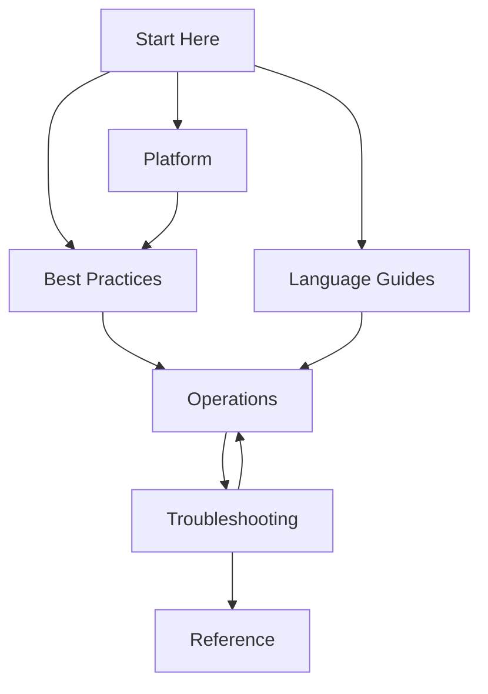

# Azure Container Apps Practical Guide

This practical guide helps you design, deploy, operate, and troubleshoot containerized applications on Azure Container Apps. It is organized for hands-on execution across platform concepts, language implementation, and production operations.

This is an independent community project and is not affiliated with Microsoft.

## Guide Scope and Audience

This guide is built for:
- Developers deploying containerized applications to Azure Container Apps
- SREs and operators running production workloads
- Troubleshooting engineers resolving incidents under pressure

## Guide Structure

| Section | Purpose | Entry Link |
|---|---|---|
| Start Here | Orientation, scope, and navigation through the full guide | [Start Here](../start-here/overview.md) |
| Platform | Core platform concepts needed before implementation choices | [Platform](../platform/index.md) |
| Best Practices | Production patterns, standards, and anti-pattern avoidance | [Best Practices](../best-practices/index.md) |
| Language Guides | Runtime-specific tutorials and implementation walkthroughs | [Language Guides](../language-guides/index.md) |
| Operations | Day-2 deployment, monitoring, alerting, and recovery workflows | [Operations](../operations/index.md) |
| Troubleshooting | Incident triage, diagnostic playbooks, and investigation paths | [Troubleshooting](../troubleshooting/index.md) |
| Reference | Quick lookup for CLI, environment variables, and limits | [Reference](../reference/index.md) |

## How to Use This Guide

1. Begin with this section to understand navigation and scope.
2. Read Platform before deep implementation or production hardening.
3. Review Best Practices for production patterns and anti-patterns.
4. Select one Language Guide for your runtime stack.
5. Move to Operations to establish deployment, monitoring, and recovery practices.
6. Use Troubleshooting during incident response and for preventive learning.
7. Consult Reference for quick CLI, environment variable, and limits lookups.

## See Also

- [Learning Paths](learning-paths.md)
- [When to Use Container Apps](when-to-use-container-apps.md)
- [Repository Map](repository-map.md)
- [Platform](../platform/index.md)
- [Best Practices](../best-practices/index.md)

## Sources

- [Azure Container Apps overview (Microsoft Learn)](https://learn.microsoft.com/azure/container-apps/overview)
- [Azure Container Apps documentation hub (Microsoft Learn)](https://learn.microsoft.com/azure/container-apps/)
