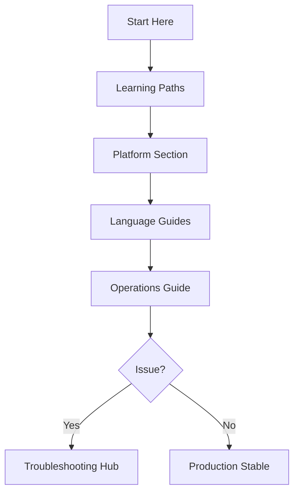
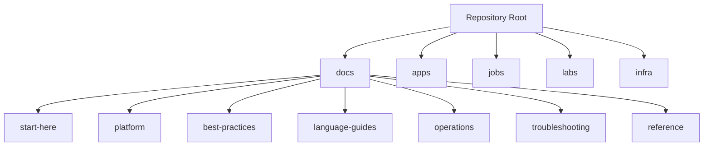

---
content_sources:
  diagrams:
    - id: navigation-flow
      type: flowchart
      source: mslearn-adapted
      based_on:
        - https://learn.microsoft.com/azure/container-apps/
        - https://learn.microsoft.com/azure/well-architected/service-guides/azure-container-apps
        - https://learn.microsoft.com/azure/container-apps/tutorial-deploy-first-app-cli
    - id: visual-repository-topology
      type: flowchart
      source: mslearn-adapted
      based_on:
        - https://learn.microsoft.com/azure/container-apps/
        - https://learn.microsoft.com/azure/well-architected/service-guides/azure-container-apps
        - https://learn.microsoft.com/azure/container-apps/tutorial-deploy-first-app-cli
content_validation:
  status: verified
  last_reviewed: "2026-04-12"
  reviewer: ai-agent
  core_claims:
    - claim: "Azure Container Apps documentation covers platform concepts, deployment tutorials, and operational guidance."
      source: "https://learn.microsoft.com/azure/container-apps/"
      verified: true
    - claim: "The Azure Well-Architected Framework provides service-specific guidance for Container Apps."
      source: "https://learn.microsoft.com/azure/well-architected/service-guides/azure-container-apps"
      verified: true
---

# Repository Map

The Azure Container Apps Guide is a comprehensive hub for all things Container Apps and Jobs. This page describes the structure and how to find what you need.

## Hub Sections

The hub is divided into 5 main categories to help you navigate based on your current task:

1. **Start Here**: The entry point for everyone. Includes a platform overview, learning paths for different skill levels, and this repository map.
2. **Platform**: Architectural and conceptual guides. This is where you go to *design* your application, covering scaling, networking, identity, and jobs.
3. **Language Guides**: Practical, language-specific implementation. Includes step-by-step tutorials, runtime guides, and integration recipes.
4. **Operations**: Focuses on *running* in production. Covers deployment patterns, monitoring, alerts, and operational tasks like secret rotation.
5. **Troubleshooting**: A systematic guide to fixing issues. Includes quick triage steps, detailed playbooks, and Lab Guides for practice.

## Directory Structure

In addition to the documentation, this repository contains practical code samples:

- **`app/python/`**: A reference Flask application that follows production-ready patterns for Container Apps (health checks, structured logging, graceful shutdown).
- **`jobs/python/`**: A reference job implementation showing how to run event-driven or scheduled tasks.
- **`labs/`**: Practical troubleshooting labs designed to help you practice diagnosing common Container Apps issues.
- **`infra/`**: Bicep infrastructure templates for deploying the reference apps and environments.

## How to Navigate

Use this simple logic to find your way:

- **"I'm new"**: Start with [Start Here](overview.md) and follow the [Learning Paths](learning-paths.md).
- **"I'm designing"**: Head to the [Platform](../platform/index.md) section to understand your architectural options.
- **"I'm coding"**: Go to [Language Guides](../language-guides/index.md) for tutorials and recipes.
- **"I'm deploying/running"**: See the [Operations](../operations/index.md) hub for production practices.
- **"Something is broken"**: Check the [Troubleshooting](../troubleshooting/index.md) hub immediately.

## Navigation Flow

<!-- diagram-id: navigation-flow -->

## Navigation by Goal

Use this table when you need a direct path from a practical goal to the right part of the repository.

| Goal | Primary Path | Supporting Path |
|---|---|---|
| Decide if Container Apps is the right service | [when-to-use-container-apps.md](when-to-use-container-apps.md) | [platform/index.md](../platform/index.md) |
| Deploy first Python service | [Python Tutorial: Local Development](../language-guides/python/tutorial/01-local-development.md) | [Python Tutorial: First Deploy](../language-guides/python/tutorial/02-first-deploy.md) |
| Harden production runtime | [best-practices/container-design.md](../best-practices/container-design.md) | [best-practices/index.md](../best-practices/index.md) |
| Establish operations workflow | [operations/index.md](../operations/index.md) | [operations/monitoring/index.md](../operations/monitoring/index.md) |
| Debug a failing revision quickly | [troubleshooting/first-10-minutes/index.md](../troubleshooting/first-10-minutes/index.md) | [troubleshooting/playbooks/index.md](../troubleshooting/playbooks/index.md) |

!!! tip "Treat the repository as a lifecycle map"
    Start Here is orientation, Platform is design, Best Practices is production standards, Operations is execution, and Troubleshooting is incident handling.

!!! note "Prefer hub index pages first"
    If you are unsure where to begin in a section, open its `index.md` page before diving into individual files.

## Visual Repository Topology

<!-- diagram-id: visual-repository-topology -->

## What Lives Where

| Directory | What You Will Find | Typical User |
|---|---|---|
| `docs/start-here/` | Orientation, service-fit guidance, learning routes | All roles |
| `docs/platform/` | Core behavior of environments, revisions, scaling, networking, jobs | Architects, DevOps |
| `docs/best-practices/` | Production guardrails and anti-pattern prevention | DevOps, SRE, Architects |
| `docs/language-guides/` | Step-by-step implementation tutorials by runtime | Developers |
| `docs/operations/` | Deployment, monitoring, alerts, recovery workflows | DevOps, SRE |
| `docs/troubleshooting/` | Fast triage, playbooks, KQL, labs | SRE, Incident responders |
| `apps/` and `jobs/` | Reference code artifacts for app and job patterns | Developers, DevOps |
| `infra/` | Reusable Bicep modules and deployment scripts | DevOps, Platform engineers |

## Quick Entry Paths by Persona

| Persona | Read First | Then |
|---|---|---|
| New Developer | [overview.md](overview.md) | [learning-paths.md](learning-paths.md) |
| Delivery Engineer | [learning-paths.md](learning-paths.md) | [operations/deployment/index.md](../operations/deployment/index.md) |
| Platform Architect | [when-to-use-container-apps.md](when-to-use-container-apps.md) | [platform/index.md](../platform/index.md) |
| On-call SRE | [troubleshooting/index.md](../troubleshooting/index.md) | [operations/monitoring/index.md](../operations/monitoring/index.md) |

!!! warning "Do not skip troubleshooting labs"
    Reading playbooks is useful, but running lab scenarios builds muscle memory for real incidents where time pressure is high.

## Suggested Onboarding Sequence

1. Read [overview.md](overview.md) to align on scope.
2. Read [when-to-use-container-apps.md](when-to-use-container-apps.md) to validate service choice.
3. Follow [learning-paths.md](learning-paths.md) by role.
4. Complete at least one tutorial track in `docs/language-guides/python/`.
5. Set up monitoring and alerts from `docs/operations/` before production traffic.

## See Also

- [Platform Overview](overview.md)
- [Learning Paths](learning-paths.md)
- [Language Guides](../language-guides/index.md)
- [When to Use Container Apps](when-to-use-container-apps.md)
- [Best Practices Hub](../best-practices/index.md)
- [Operations Hub](../operations/index.md)
- [Troubleshooting Hub](../troubleshooting/index.md)
- [Reference Hub](../reference/index.md)

## Sources

- [Azure Container Apps documentation (Microsoft Learn)](https://learn.microsoft.com/azure/container-apps/)
- [Well-Architected Framework for Azure Container Apps (Microsoft Learn)](https://learn.microsoft.com/azure/well-architected/service-guides/azure-container-apps)
- [Deploy to Azure Container Apps (Microsoft Learn)](https://learn.microsoft.com/azure/container-apps/tutorial-deploy-first-app-cli)
