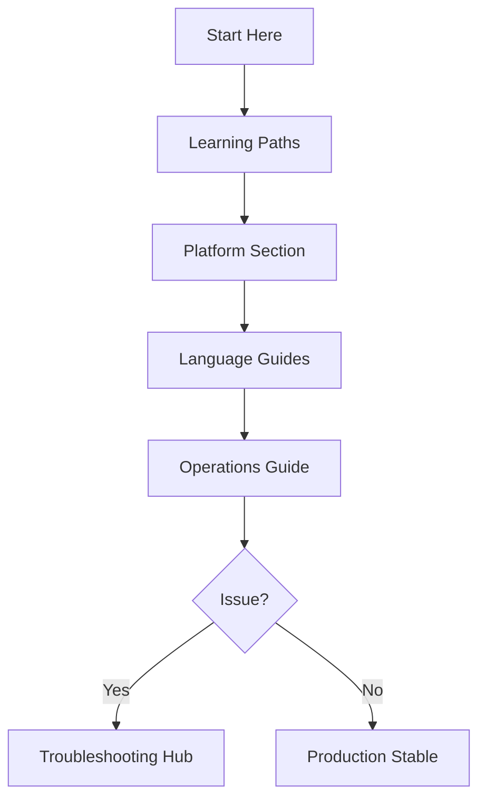

# Repository Map

The Azure Container Apps Guide is a comprehensive hub for all things Container Apps and Jobs. This page describes the structure and how to find what you need.

## Hub Sections

The hub is divided into 5 main categories to help you navigate based on your current task:

1. **Start Here**: The entry point for everyone. Includes a platform overview, learning paths for different skill levels, and this repository map.
2. **Platform**: Architectural and conceptual guides. This is where you go to *design* your application, covering scaling, networking, identity, and jobs.
3. **Language Guides**: Practical, language-specific implementation. Includes step-by-step tutorials, runtime guides, and integration recipes.
4. **Operations**: Focuses on *running* in production. Covers deployment patterns, monitoring, alerts, and day-2 tasks like secret rotation.
5. **Troubleshooting**: A systematic guide to fixing issues. Includes quick triage steps, detailed playbooks, and Lab Guides for practice.

## Directory Structure

In addition to the documentation, this repository contains practical code samples:

- **`app/python/`**: A reference Flask application that follows production-ready patterns for Container Apps (health checks, structured logging, graceful shutdown).
- **`jobs/python/`**: A reference job implementation showing how to run event-driven or scheduled tasks.
- **`labs/`**: Practical troubleshooting labs designed to help you practice diagnosing common Container Apps issues.
- **`infra/`**: Bicep infrastructure templates for deploying the reference apps and environments.

## How to Navigate

Use this simple logic to find your way:

- **"I'm new"**: Start with [Start Here](overview.md) and follow the [Learning Paths](learning-paths.md).
- **"I'm designing"**: Head to the [Platform](../platform/index.md) section to understand your architectural options.
- **"I'm coding"**: Go to [Language Guides](../language-guides/index.md) for tutorials and recipes.
- **"I'm deploying/running"**: See the [Operations](../operations/index.md) hub for production practices.
- **"Something is broken"**: Check the [Troubleshooting](../troubleshooting/index.md) hub immediately.

## Navigation Flow

## See Also

- [Platform Overview](overview.md)
- [Learning Paths](learning-paths.md)
- [Language Guides](../language-guides/index.md)
