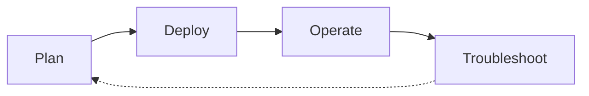

# Scenario Router

Use this page when you have a specific situation and want to jump straight to the page that answers it. This is a breadth-first index across four lifecycle phases — Plan, Deploy, Operate, Troubleshoot — that complements the depth-first [Learning Paths](learning-paths.md) and the symptom-first [Decision Tree](../troubleshooting/decision-tree.md).

!!! tip "Start with Learning Paths if you're new to Container Apps"
    This page assumes you already know what you're trying to do. If you're still deciding what to learn first, start with [Learning Paths](learning-paths.md) — it sequences a role-based tour of the guide. Use this Scenario Router when you have a specific question and want to jump to the exact page that answers it.

## How to Use This Router

- Pick the table for the lifecycle phase you're in — Plan, Deploy, Operate, or Troubleshoot.
- Scan the left column for the situation that matches yours; open the destination on the right.
- If two rows fit, prefer the row from the phase you're actually in — the same platform concept often appears in more than one phase.
- If your situation spans two phases (a design choice today that will become an incident later), check [Cross-Phase Scenarios](#cross-phase-scenarios) first.
- Every destination is a real page in this guide, not an external link and not an aspirational page.
- Rows are intentionally short. Follow the link for the depth; this table is a switchboard, not a summary.
- If your situation is missing, [open an issue](https://github.com/yeongseon/azure-container-apps-practical-guide/issues) — the router is meant to grow.

## Lifecycle Overview

<!-- diagram-id: aca-scenario-router-lifecycle -->

## I'm Planning

| Situation | Where to go |
|---|---|
| I'm choosing which learning path to follow | [Learning Paths](learning-paths.md) — role-based reading paths |
| I want to understand the platform architecture | [Platform Hub](../platform/index.md) — architecture and core concepts |
| I'm deciding whether Container Apps fits my workload | [When to Use Container Apps](when-to-use-container-apps.md) — vs AKS, App Service, ACI, Functions |
| I have to choose between a Container App and a Job | [Jobs vs Apps](../platform/jobs/jobs-vs-apps.md) — long-running services vs on-demand execution |
| I'm sizing an environment and picking a workload profile | [Plans and Workload Profiles](../platform/environments/plans-and-workload-profiles.md) — Consumption vs Dedicated |
| I'm designing VNet topology, ingress, and egress | [Networking Hub](../platform/networking/index.md) — VNet integration, private endpoints, egress |
| I'm deciding the environment-boundary and identity model | [Environment Design](../best-practices/environment-design.md) — team, workload, and blast-radius boundaries |
| I'm planning identity, secret, and Key Vault reference posture | [Identity and Secrets](../best-practices/identity-and-secrets.md) — managed identity, RBAC, and Key Vault references |
| I want to plan cost before I deploy | [Cost Best Practices](../best-practices/cost.md) — min replicas, workload profile, and ingestion cost |

## I'm Deploying

| Situation | Where to go |
|---|---|
| I want the quickest possible first deploy | [Language Guides](../language-guides/index.md) — pick Python, Node.js, Java, or .NET tutorial |
| I need deployment fundamentals for Container Apps | [Deployment Concepts](../platform/deployment.md) — image, revision, and template model |
| I want to see end-to-end deployment topologies | [Deployment Scenarios](../platform/deployment-scenarios.md) — public, internal, VNet-integrated |
| I'm wiring the CI/CD pipeline (GitHub Actions or Pipelines) | [Deployment Operations](../operations/deployment/index.md) — day-1 deploy ops and reconnect flows |
| I need to configure image-pull identity from ACR | [Image Pull and Registry](../operations/image-pull-and-registry/index.md) — AcrPull role and UAMI wiring |
| I'm rolling out with blue/green or canary traffic splitting | [Blue/Green Deployment](../best-practices/blue-green-deployment.md) or [Canary Deployment](../best-practices/canary-deployment.md) — revision-based rollout patterns |
| I need to expose a custom domain with TLS | [Custom Domains](../operations/custom-domains/index.md) — managed certificates and BYO cert flows |

## I'm Operating in Production

| Situation | Where to go |
|---|---|
| I need day-2 operational procedures | [Operations Hub](../operations/index.md) — production runbooks |
| I want to follow production best practices | [Best Practices Hub](../best-practices/index.md) — hardening and design guidance |
| I'm building the monitoring baseline (metrics, logs, workbooks) | [Operations: Monitoring](../operations/monitoring/index.md) — baseline instrumentation |
| I'm designing alerts that catch real incidents without page-storming | [Metric Alerts by Incident Question](../operations/alerts/metric-alerts-by-incident-question.md) — question-first alert design |
| I need to rotate secrets or Key Vault references safely | [Secret Rotation](../operations/secret-rotation/index.md) — rotation without downtime |
| I'm managing revisions and promoting from staging to production | [Revision Management](../operations/revision-management/index.md) — active revision, traffic weight, rollback |
| I need to tune min replicas, scaling rules, or KEDA metadata | [Operations: Scaling](../operations/scaling/index.md) — scaling procedures and cost impact |
| I'm planning zone-redundancy or multi-region failover | [Disaster Recovery](../operations/disaster-recovery/index.md) — ZR limits and multi-region topology |
| I need to configure diagnostic settings so logs reach Log Analytics | [Diagnostic Settings](../operations/logging/diagnostic-settings.md) — console, system, and platform log routing |

## I'm Troubleshooting

| Situation | Where to go |
|---|---|
| I need to systematically diagnose an issue | [Decision Tree](../troubleshooting/decision-tree.md) — hypothesis-driven triage flow |
| I need to know what evidence to collect | [Evidence Map](../troubleshooting/evidence-map.md) — question → CLI + KQL artifact index |
| I want quick pattern-match cards for common symptoms | [Quick Diagnosis Cards](../troubleshooting/quick-diagnosis-cards.md) — 10 one-page symptom cards |
| An incident just started and I have 10 minutes | [First 10 Minutes](../troubleshooting/first-10-minutes/index.md) — ordered triage checklist |
| A new revision is stuck or failing to pull the image | [Image Pull Failure](../troubleshooting/playbooks/startup-and-provisioning/image-pull-failure.md) — ACR auth and manifest issues |
| My app returns 5xx during traffic bursts | [HTTP Scaling Not Triggering](../troubleshooting/playbooks/scaling-and-runtime/http-scaling-not-triggering.md) — replica count vs concurrency |
| My app cannot authenticate to Azure services | [Managed Identity Auth Failure](../troubleshooting/playbooks/identity-and-configuration/managed-identity-auth-failure.md) — identity assignment and RBAC |
| No playbook fits — I need to reason from first principles | [Troubleshooting Methodology](../troubleshooting/methodology/index.md) — competing hypotheses framework |
| The ingress URL returns nothing or the connection is refused | [Ingress Not Reachable](../troubleshooting/playbooks/ingress-and-networking/ingress-not-reachable.md) — public DNS, internal DNS, and NSG paths |
| My container keeps restarting or gets OOMKilled | [Crashloop, OOM, and Resource Pressure](../troubleshooting/playbooks/scaling-and-runtime/crashloop-oom-and-resource-pressure.md) — resource limits and memory sizing |

## Cross-Phase Scenarios

Some situations straddle two phases — the design choice you make while planning determines the failure mode you eventually debug. These rows link the two together so you can see the pattern *and* the drill in one place. If you're only in one phase today, still skim this table: it's the cheapest way to preview which decisions will hurt later.

| Situation | Where to go |
|---|---|
| I'm planning a private-endpoint deployment and want to see failure modes first | [ACR Network Path Selection](../platform/networking/acr-network-path-selection.md) then [Private Endpoint DNS Failure Lab](../troubleshooting/lab-guides/private-endpoint-dns-failure.md) — design + reproducible failure |
| I'm migrating an app from Consumption to Workload Profiles | [Environment Migration](../platform/environments/migration.md) then [Workload Profile Mismatch](../troubleshooting/playbooks/cost-and-quota/workload-profile-mismatch.md) — plan + operate |
| I'm about to ship a revision and want to prove rollback works before I need it | [Revision Strategy](../best-practices/revision-strategy.md) then [Revision Failover Lab](../troubleshooting/lab-guides/revision-failover.md) — pattern + drill |
| My Bicep-provisioned app deployed but isn't scaling as expected | [Bicep Deployment Timeout](../troubleshooting/playbooks/deployment-and-cicd/bicep-deployment-timeout.md) then [KEDA No Metrics Returned](../troubleshooting/playbooks/scaling-and-runtime/keda-no-metrics-returned.md) — deploy signal + scale rule check |
| I set min replicas high for cold-start protection and now the bill is surprising | [Cost Best Practices](../best-practices/cost.md) then [Min Replicas Cost Surprise](../troubleshooting/playbooks/cost-and-quota/min-replicas-cost-surprise.md) — pattern + incident |

## When This Router Isn't the Right Entry Point

- You're brand new to Container Apps → start with [Learning Paths](learning-paths.md) instead.
- You already have a symptom (5xx, OOM, image pull failed) and don't know which lifecycle phase you're in → jump to [Decision Tree](../troubleshooting/decision-tree.md) or [Quick Diagnosis Cards](../troubleshooting/quick-diagnosis-cards.md).
- You're evaluating Container Apps against another Azure compute service → use [When to Use Container Apps](when-to-use-container-apps.md).

## See Also

- [Learning Paths](learning-paths.md) — depth-first, role-based reading order
- [Overview](overview.md) — what Container Apps is and who this guide is for
- [Repository Map](repository-map.md) — full section map
- [When to Use Container Apps](when-to-use-container-apps.md) — service selection vs AKS, App Service, Functions, ACI
- [Decision Tree](../troubleshooting/decision-tree.md) — symptom-first troubleshooting router
- [Evidence Map](../troubleshooting/evidence-map.md) — evidence-collection index
