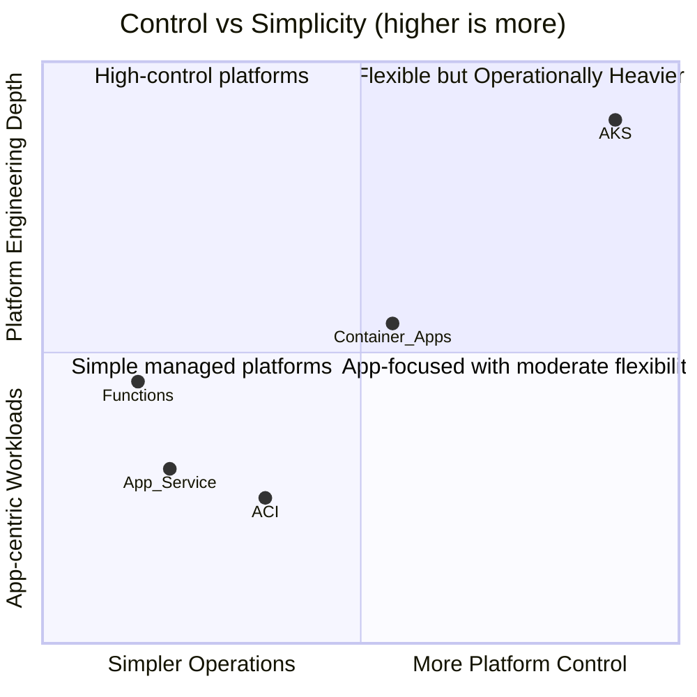
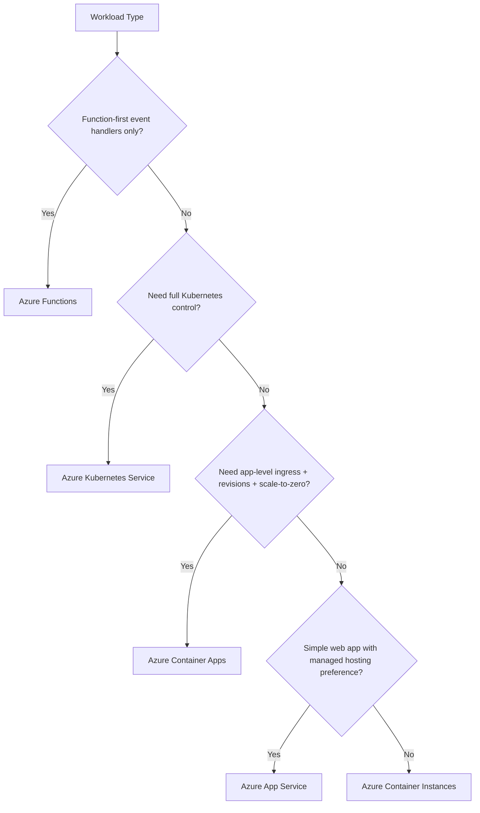

---
content_sources:
  diagrams:
    - id: visual-positioning
      type: quadrantChart
      source: mslearn-adapted
      based_on:
        - https://learn.microsoft.com/azure/container-apps/compare-options
        - https://learn.microsoft.com/azure/architecture/guide/choose-azure-container-service
        - https://learn.microsoft.com/azure/well-architected/service-guides/azure-container-apps
        - https://learn.microsoft.com/azure/app-service/overview
        - https://learn.microsoft.com/azure/aks/
        - https://learn.microsoft.com/azure/azure-functions/
    - id: decision-tree-which-service-should-you-choose
      type: flowchart
      source: mslearn-adapted
      based_on:
        - https://learn.microsoft.com/azure/container-apps/compare-options
        - https://learn.microsoft.com/azure/architecture/guide/choose-azure-container-service
        - https://learn.microsoft.com/azure/well-architected/service-guides/azure-container-apps
        - https://learn.microsoft.com/azure/app-service/overview
        - https://learn.microsoft.com/azure/aks/
        - https://learn.microsoft.com/azure/azure-functions/
content_validation:
  status: verified
  last_reviewed: "2026-04-12"
  reviewer: ai-agent
  core_claims:
    - claim: "Azure Container Apps abstracts away Kubernetes complexity while providing container-native capabilities."
      source: "https://learn.microsoft.com/azure/container-apps/compare-options"
      verified: true
    - claim: "Container Apps is ideal for microservices, APIs, and event-driven workloads that benefit from automatic scaling."
      source: "https://learn.microsoft.com/azure/container-apps/overview"
      verified: true
---

# Azure Container Apps vs Other Azure Compute Options

Azure offers multiple ways to run apps. This guide compares Container Apps with AKS, App Service, ACI, and Functions so you can choose based on operational model, scaling behavior, and control requirements.

## Decision Framing

Choose based on these priorities:

1. How much platform control do you need?
2. Do you need event-driven scaling to zero?
3. Are you optimizing for simplicity, flexibility, or both?

## Comparison Overview

| Service | Best For | Operations Burden | Scale Model | Notable Trade-off |
|---|---|---|---|---|
| **Container Apps** | Microservices, APIs, workers with container portability | Low-to-medium | KEDA-driven, supports scale-to-zero | Less cluster-level control than AKS |
| **AKS** | Full Kubernetes control, advanced platform engineering | High | Kubernetes-native autoscaling | More operational responsibility |
| **App Service** | Web apps with minimal container complexity | Low | Instance-based autoscale | Less event-native scaling behavior |
| **ACI** | Short-lived or burst container jobs | Low | Per-container execution model | Limited app platform features |
| **Functions** | Function-first event processing | Low | Trigger-based, granular execution | Runtime model is function-centric, not app-centric |

## Visual Positioning

<!-- diagram-id: visual-positioning -->

## Service-by-Service Notes

### Container Apps vs AKS

- Pick **Container Apps** when you want Kubernetes benefits (containers, autoscale, revision rollout) without managing clusters.
- Pick **AKS** when you need deep Kubernetes primitives (custom operators, advanced scheduling, full network policy control).

### Container Apps vs App Service

- Pick **Container Apps** for event-driven workers, scale-to-zero scenarios, and revision-based traffic splitting.
- Pick **App Service** for straightforward web hosting patterns with built-in deployment ergonomics.

### Container Apps vs ACI

- Pick **Container Apps** for long-running services that need ingress, revisions, and autoscaling.
- Pick **ACI** for simple ephemeral containers and task-style execution.

### Container Apps vs Functions

- Pick **Container Apps** when your unit is a service/application with custom runtime requirements.
- Pick **Functions** when your unit is an event handler and function-level programming model is preferred.

## Practical Example: Typical Team Choices

| Team Scenario | Better Fit |
|---|---|
| Startup with API + queue worker, small ops team | Container Apps |
| Enterprise platform team standardizing Kubernetes internals | AKS |
| Existing web app modernization with minimal architecture changes | App Service |
| Batch spike processing from CI or scheduled jobs | ACI |
| High-volume event handlers with function-first code model | Functions |

## Advanced Topics

- Hybrid architectures: Container Apps for APIs + Functions for event glue.
- Migration patterns from App Service containers to revisions and KEDA rules.
- Governance models when combining AKS and Container Apps in one organization.

## Decision Tree: Which Service Should You Choose?

<!-- diagram-id: decision-tree-which-service-should-you-choose -->

!!! tip "Start from operational ownership"
    The most reliable decision point is not feature count; it is who will own ongoing operations and how much control they can realistically support.

!!! warning "Do not choose AKS by default"
    AKS is powerful, but if you do not need cluster-level control, Container Apps usually reduces delivery and operations complexity significantly.

## Capability Comparison Matrix

| Capability | Container Apps | AKS | App Service | ACI | Functions |
|---|---|---|---|---|---|
| Deploy arbitrary container images | ✅ | ✅ | ✅ (Web-focused ergonomics) | ✅ | ⚠️ (custom container options vary by plan) |
| Revision-based rollout and traffic splitting | ✅ | ⚠️ (manual patterns via Kubernetes primitives) | ⚠️ (slot model, different semantics) | ❌ | ⚠️ (function deployment model) |
| Native scale-to-zero for app containers | ✅ | ⚠️ (possible with add-ons and tuning) | ❌ | ❌ | ✅ |
| Cluster-level Kubernetes API control | ❌ | ✅ | ❌ | ❌ | ❌ |
| Event-driven scaling for workers | ✅ (KEDA) | ✅ (KEDA + cluster ops) | ⚠️ (depends on app pattern) | ❌ | ✅ |
| Lowest operational burden | ✅ | ❌ | ✅ | ✅ | ✅ |

## Workload Signal Checklist

Use these signals to confirm Container Apps is a strong fit:

| Signal | Interpretation | Recommendation |
|---|---|---|
| You need HTTP APIs and background workers in the same platform | Shared operations model preferred | Favor Container Apps |
| You need safe rollout/rollback with minimal platform engineering | Revision model is beneficial | Favor Container Apps |
| You need custom schedulers, CRDs, or advanced Kubernetes policy | Requires full Kubernetes surface | Favor AKS |
| You have only lightweight function handlers | App container model may be unnecessary | Favor Functions |
| You need quick one-off container execution | Long-running app features not required | Favor ACI |

## Migration Guidance by Source Platform

| Current Platform | Common Reason to Move to Container Apps | First Migration Step |
|---|---|---|
| App Service (container) | Need event-driven workers and revision control | Containerize worker path and define scale rule |
| AKS | Reduce cluster operations overhead | Move non-cluster-specific services first |
| ACI | Need long-running service features (ingress, revisions) | Introduce environment + health probes |
| Functions | Need service-centric runtime and custom dependencies | Carve out API service into a dedicated container app |

!!! note "Hybrid is common"
    Mature teams frequently combine Container Apps with Functions, Event Grid, or AKS based on workload boundaries. Service choice does not need to be exclusive.

## Cost and Complexity Heuristic

| Priority | Suggested First Choice |
|---|---|
| Minimize platform complexity while keeping container flexibility | Container Apps |
| Maximum Kubernetes control and platform engineering depth | AKS |
| Fast web hosting with minimal architecture change | App Service |
| Ephemeral task execution without full app lifecycle | ACI |
| Event-handler programming model and trigger-centric design | Functions |

## See Also

- [How Container Apps Works](overview.md)
- [Environments and Apps](../platform/environments/index.md)
- [Scaling with KEDA](../platform/scaling/index.md)
- [Networking](../platform/networking/index.md)
- [Learning Paths](learning-paths.md)
- [Platform: Jobs](../platform/jobs/index.md)
- [Best Practices: Anti-Patterns](../best-practices/anti-patterns.md)

## Sources

- [Azure Container Apps vs Other Azure Compute Options (Microsoft Learn)](https://learn.microsoft.com/azure/container-apps/compare-options)
- [Choose an Azure container service (Microsoft Learn)](https://learn.microsoft.com/azure/architecture/guide/choose-azure-container-service)
- [Azure Container Apps hosting considerations (Microsoft Learn)](https://learn.microsoft.com/azure/well-architected/service-guides/azure-container-apps)
- [App Service overview (Microsoft Learn)](https://learn.microsoft.com/azure/app-service/overview)
- [Azure Kubernetes Service (AKS) documentation (Microsoft Learn)](https://learn.microsoft.com/azure/aks/)
- [Azure Functions documentation (Microsoft Learn)](https://learn.microsoft.com/azure/azure-functions/)
