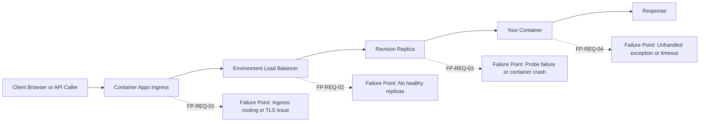
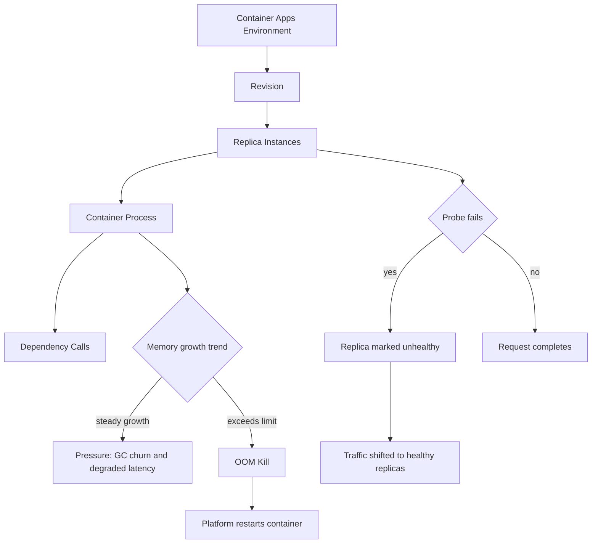
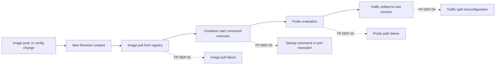
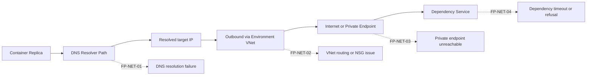
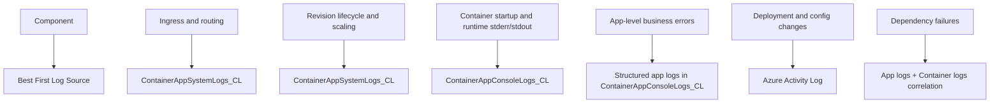

---
hide:
  - toc
content_sources:
  diagrams:
    - id: 1-request-path-architecture-where-5xx-can-originate
      type: flowchart
      source: mslearn-adapted
      based_on:
        - https://learn.microsoft.com/azure/container-apps/overview
        - https://learn.microsoft.com/azure/container-apps/observability
        - https://learn.microsoft.com/azure/container-apps/health-probes
        - https://learn.microsoft.com/azure/container-apps/troubleshooting
    - id: 2-runtime-replica-model-memory-pressure-oom-timeout
      type: flowchart
      source: mslearn-adapted
      based_on:
        - https://learn.microsoft.com/azure/container-apps/overview
        - https://learn.microsoft.com/azure/container-apps/observability
        - https://learn.microsoft.com/azure/container-apps/health-probes
        - https://learn.microsoft.com/azure/container-apps/troubleshooting
    - id: 3-deployment-path-revision-failures-and-config-drift
      type: flowchart
      source: mslearn-adapted
      based_on:
        - https://learn.microsoft.com/azure/container-apps/overview
        - https://learn.microsoft.com/azure/container-apps/observability
        - https://learn.microsoft.com/azure/container-apps/health-probes
        - https://learn.microsoft.com/azure/container-apps/troubleshooting
    - id: 4-outbound-network-path-dns-private-endpoints
      type: flowchart
      source: mslearn-adapted
      based_on:
        - https://learn.microsoft.com/azure/container-apps/overview
        - https://learn.microsoft.com/azure/container-apps/observability
        - https://learn.microsoft.com/azure/container-apps/health-probes
        - https://learn.microsoft.com/azure/container-apps/troubleshooting
    - id: 5-observability-coverage-map
      type: flowchart
      source: mslearn-adapted
      based_on:
        - https://learn.microsoft.com/azure/container-apps/overview
        - https://learn.microsoft.com/azure/container-apps/observability
        - https://learn.microsoft.com/azure/container-apps/health-probes
        - https://learn.microsoft.com/azure/container-apps/troubleshooting
content_validation:
  status: verified
  last_reviewed: "2026-04-12"
  reviewer: ai-agent
  core_claims:
    - claim: "Azure Container Apps revisions are immutable snapshots of a container app version."
      source: "https://learn.microsoft.com/azure/container-apps/revisions"
      verified: true
    - claim: "Azure Container Apps supports startup, liveness, and readiness probes for containers."
      source: "https://learn.microsoft.com/azure/container-apps/health-probes"
      verified: true
    - claim: "Azure Container Apps can send system logs and console logs to a Log Analytics workspace."
      source: "https://learn.microsoft.com/azure/container-apps/observability"
      verified: true
    - claim: "Azure Container Apps supports ingress for HTTP and TCP traffic to applications."
      source: "https://learn.microsoft.com/azure/container-apps/networking"
      verified: true
---

# Troubleshooting Architecture Overview

This page answers one practical question first: **where can this fail?**

Before deep debugging, map the symptom to a platform segment (Ingress, Environment, Revision, Container, or outbound path). That classification tells you which logs to query first and which playbook to open.

## Why this page exists

Playbooks are symptom-driven and detailed. During active incidents, engineers usually need one faster artifact:

1. A request-path view with failure points
2. A runtime model that explains timeout, OOM, and replica behavior
3. A deployment path showing where revision and probe failures happen
4. A network path showing DNS/SNAT/private routing issues

Use this architecture map to route quickly to the right playbook.

## 1) Request Path Architecture (where 5xx can originate)

<!-- diagram-id: 1-request-path-architecture-where-5xx-can-originate -->


### Typical interpretation

- **HTTP 5xx is not one thing**.
- A 5xx can originate at Ingress, Environment, Revision startup, or app code.
- Treat each layer as a competing hypothesis until logs disprove it.

### Request-path failure points and playbooks

| Failure Point | Typical Symptom | First Evidence | Playbook |
|---|---|---|---|
| FP-REQ-01 Ingress | 502/503 bursts, routing issues | `ContainerAppSystemLogs_CL` + HTTP status trend | [Ingress Not Reachable](playbooks/ingress-and-networking/ingress-not-reachable.md) |
| FP-REQ-02 No healthy replicas | Intermittent 5xx during scaling | Replica count, KEDA events | [HTTP Scaling Not Triggering](playbooks/scaling-and-runtime/http-scaling-not-triggering.md) |
| FP-REQ-03 Probe failure | App marked unhealthy, startup failures | Console startup logs + probe messages | [Probe Failure and Slow Start](playbooks/startup-and-provisioning/probe-failure-and-slow-start.md) |
| FP-REQ-04 Application code | 500 with stack traces or long latency | App/console logs + endpoint-level HTTP logs | [CrashLoop OOM and Resource Pressure](playbooks/scaling-and-runtime/crashloop-oom-and-resource-pressure.md) |

## 2) Runtime / Replica Model (memory pressure, OOM, timeout)

<!-- diagram-id: 2-runtime-replica-model-memory-pressure-oom-timeout -->


### Runtime failure mapping

| Failure Point | Why it happens | What to check first | Playbook |
|---|---|---|---|
| FP-RUN-01 Memory pressure | Memory leak, large object churn, high concurrency | Memory trend + console logs for kill/restart | [CrashLoop OOM and Resource Pressure](playbooks/scaling-and-runtime/crashloop-oom-and-resource-pressure.md) |
| FP-RUN-02 OOM Kill | Container exceeded memory limit | Platform kill messages, restart cadence | [CrashLoop OOM and Resource Pressure](playbooks/scaling-and-runtime/crashloop-oom-and-resource-pressure.md) |
| FP-RUN-03 Probe timeout | Slow startup or unresponsive health endpoint | Probe configuration, startup timing | [Probe Failure and Slow Start](playbooks/startup-and-provisioning/probe-failure-and-slow-start.md) |
| FP-RUN-04 Scale mismatch | KEDA rules don't match traffic patterns | KEDA events, replica count over time | [Event Scaler Mismatch](playbooks/scaling-and-runtime/event-scaler-mismatch.md) |

## 3) Deployment Path (revision failures and config drift)

<!-- diagram-id: 3-deployment-path-revision-failures-and-config-drift -->


### Deployment path failure mapping

| Failure Point | Typical signal | Primary playbook |
|---|---|---|
| FP-DEP-01 Image pull failure | ACR auth error, image not found | [Image Pull Failure](playbooks/startup-and-provisioning/image-pull-failure.md) |
| FP-DEP-02 Startup mismatch | Container runs but exits or wrong port | [Container Start Failure](playbooks/startup-and-provisioning/container-start-failure.md) |
| FP-DEP-03 Probe failure | Revision never becomes healthy | [Probe Failure and Slow Start](playbooks/startup-and-provisioning/probe-failure-and-slow-start.md) |
| FP-DEP-04 Traffic split issue | Wrong revision receiving traffic | [Bad Revision Rollout and Rollback](playbooks/platform-features/bad-revision-rollout-and-rollback.md) |

## 4) Outbound / Network Path (DNS, Private Endpoints)

<!-- diagram-id: 4-outbound-network-path-dns-private-endpoints -->


### Outbound path failure mapping

| Failure Point | Symptom pattern | Primary playbook |
|---|---|---|
| FP-NET-01 DNS failure | Intermittent/constant name lookup failures | [Internal DNS and Private Endpoint Failure](playbooks/ingress-and-networking/internal-dns-and-private-endpoint-failure.md) |
| FP-NET-02 VNet routing | Outbound blocked by NSG or route table | [Service-to-Service Connectivity Failure](playbooks/ingress-and-networking/service-to-service-connectivity-failure.md) |
| FP-NET-03 Private endpoint | Endpoint unreachable despite configuration | [Internal DNS and Private Endpoint Failure](playbooks/ingress-and-networking/internal-dns-and-private-endpoint-failure.md) |
| FP-NET-04 Dependency failures | Outbound errors isolated to one backend service | [Service-to-Service Connectivity Failure](playbooks/ingress-and-networking/service-to-service-connectivity-failure.md) |

## 5) Observability Coverage Map

<!-- diagram-id: 5-observability-coverage-map -->


### Quick evidence commands by component

```bash
az containerapp logs show --name $APP_NAME --resource-group $RG --type system
az containerapp logs show --name $APP_NAME --resource-group $RG --type console
az monitor activity-log list --resource-group $RG --offset 24h
az containerapp revision list --name $APP_NAME --resource-group $RG --output table
az containerapp show --name $APP_NAME --resource-group $RG --query "properties.configuration.ingress"
```

```kusto
ContainerAppConsoleLogs_CL
| where TimeGenerated > ago(2h)
| where ContainerAppName_s == "<app-name>"
| summarize count() by bin(TimeGenerated, 5m)
| order by TimeGenerated asc
```

```kusto
ContainerAppSystemLogs_CL
| where TimeGenerated > ago(24h)
| where ContainerAppName_s == "<app-name>"
| where Reason_s has_any ("ProbeFailed", "ContainerStarted", "ContainerTerminated", "PulledImage")
| project TimeGenerated, Reason_s, Log_s
| order by TimeGenerated desc
```

```kusto
ContainerAppConsoleLogs_CL
| where TimeGenerated > ago(6h)
| where ContainerAppName_s == "<app-name>"
| where Log_s has_any ("Exception", "Error", "timeout", "OOM", "killed")
| project TimeGenerated, Log_s
| order by TimeGenerated desc
```

## 6) Fast routing examples

- **Example A**: 5xx appears only during scaling events.
    - Start with runtime/replica model (FP-RUN-03/04), then check KEDA configuration.
    - Open: [HTTP Scaling Not Triggering](playbooks/scaling-and-runtime/http-scaling-not-triggering.md) and [Event Scaler Mismatch](playbooks/scaling-and-runtime/event-scaler-mismatch.md).

- **Example B**: Revision created but never becomes healthy.
    - Start with deployment path (FP-DEP-01/02/03).
    - Open: [Image Pull Failure](playbooks/startup-and-provisioning/image-pull-failure.md) and [Probe Failure and Slow Start](playbooks/startup-and-provisioning/probe-failure-and-slow-start.md).

- **Example C**: Outbound calls fail to private endpoint targets.
    - Start with outbound path (FP-NET-01/03).
    - Open: [Internal DNS and Private Endpoint Failure](playbooks/ingress-and-networking/internal-dns-and-private-endpoint-failure.md).

!!! note "How to use this architecture page during incidents"
    Do not treat any single metric as proof.
    Use this page to identify the most likely failure layer, then validate with time-correlated evidence.
    Move to the linked playbook only after you identify which layer best matches the symptom timing.

## See Also

- [Troubleshooting Method](methodology/index.md)
- [Detector Map](methodology/detector-map.md)
- [First 10 Minutes Index](first-10-minutes/index.md)
- [Playbooks Index](playbooks/index.md)
- [KQL Query Library](kql/index.md)
- [Evidence Map](evidence-map.md)
- [Decision Tree](decision-tree.md)

## Sources

- [Azure Container Apps overview](https://learn.microsoft.com/azure/container-apps/overview)
- [Monitor Azure Container Apps](https://learn.microsoft.com/azure/container-apps/observability)
- [Health probes in Azure Container Apps](https://learn.microsoft.com/azure/container-apps/health-probes)
- [Troubleshoot Azure Container Apps](https://learn.microsoft.com/azure/container-apps/troubleshooting)
