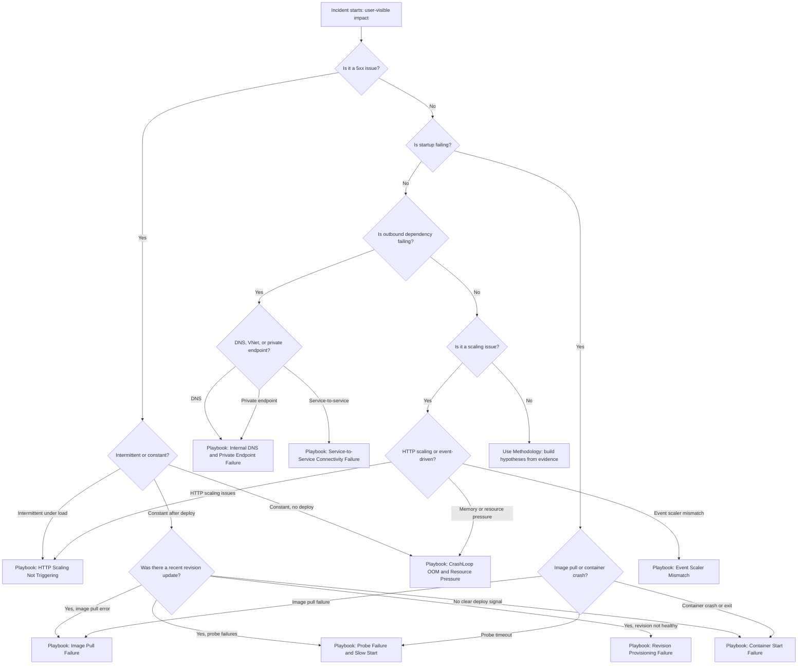
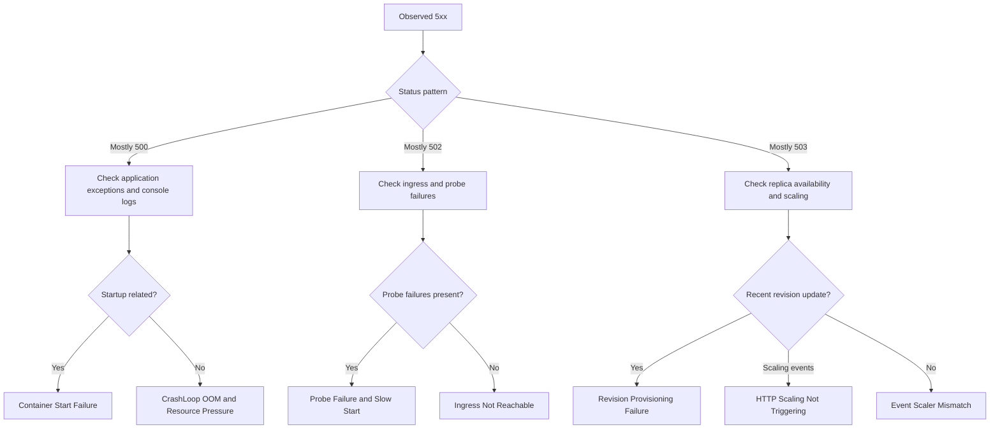

---
content_sources:
  diagrams:
    - id: main-triage-decision-tree
      type: flowchart
      source: mslearn-adapted
      based_on:
        - https://learn.microsoft.com/azure/container-apps/overview
        - https://learn.microsoft.com/azure/container-apps/observability
        - https://learn.microsoft.com/azure/container-apps/troubleshooting
        - https://learn.microsoft.com/azure/container-apps/health-probes
        - https://learn.microsoft.com/azure/container-apps/scale-app
    - id: 5xx-branch-deep-dive-tree
      type: flowchart
      source: mslearn-adapted
      based_on:
        - https://learn.microsoft.com/azure/container-apps/overview
        - https://learn.microsoft.com/azure/container-apps/observability
        - https://learn.microsoft.com/azure/container-apps/troubleshooting
        - https://learn.microsoft.com/azure/container-apps/health-probes
        - https://learn.microsoft.com/azure/container-apps/scale-app
content_validation:
  status: verified
  last_reviewed: "2026-04-12"
  reviewer: ai-agent
  core_claims:
    - claim: "Azure Container Apps provides both system logs and console logs for troubleshooting."
      source: "https://learn.microsoft.com/azure/container-apps/observability"
      verified: true
    - claim: "Health probe failures can prevent a revision from becoming healthy in Azure Container Apps."
      source: "https://learn.microsoft.com/azure/container-apps/health-probes"
      verified: true
    - claim: "Azure Container Apps supports automatic scaling with HTTP and event-driven scale rules."
      source: "https://learn.microsoft.com/azure/container-apps/scale-app"
      verified: true
    - claim: "Azure Container Apps troubleshooting guidance recommends checking logs and deployment events during investigations."
      source: "https://learn.microsoft.com/azure/container-apps/troubleshooting"
      verified: true
---

# Troubleshooting Decision Tree

Use this page when you need to triage quickly from symptom to likely failure category and then open the right playbook.

The tree is intentionally symptom-first and optimized for the first 10–15 minutes of incident response.

## Main triage decision tree

<!-- diagram-id: main-triage-decision-tree -->


## 5xx branch deep-dive tree

<!-- diagram-id: 5xx-branch-deep-dive-tree -->


## Playbook leaves (direct links)

### Startup and Provisioning

- [Image Pull Failure](playbooks/startup-and-provisioning/image-pull-failure.md)
- [Revision Provisioning Failure](playbooks/startup-and-provisioning/revision-provisioning-failure.md)
- [Container Start Failure](playbooks/startup-and-provisioning/container-start-failure.md)
- [Probe Failure and Slow Start](playbooks/startup-and-provisioning/probe-failure-and-slow-start.md)

### Ingress and Networking

- [Ingress Not Reachable](playbooks/ingress-and-networking/ingress-not-reachable.md)
- [Internal DNS and Private Endpoint Failure](playbooks/ingress-and-networking/internal-dns-and-private-endpoint-failure.md)
- [Service-to-Service Connectivity Failure](playbooks/ingress-and-networking/service-to-service-connectivity-failure.md)

### Scaling and Runtime

- [HTTP Scaling Not Triggering](playbooks/scaling-and-runtime/http-scaling-not-triggering.md)
- [Event Scaler Mismatch](playbooks/scaling-and-runtime/event-scaler-mismatch.md)
- [CrashLoop OOM and Resource Pressure](playbooks/scaling-and-runtime/crashloop-oom-and-resource-pressure.md)

### Identity and Configuration

- [Managed Identity Auth Failure](playbooks/identity-and-configuration/managed-identity-auth-failure.md)
- [Secret and Key Vault Reference Failure](playbooks/identity-and-configuration/secret-and-key-vault-reference-failure.md)

### Platform Features

- [Dapr Sidecar or Component Failure](playbooks/platform-features/dapr-sidecar-or-component-failure.md)
- [Container App Job Execution Failure](playbooks/platform-features/container-app-job-execution-failure.md)
- [Bad Revision Rollout and Rollback](playbooks/platform-features/bad-revision-rollout-and-rollback.md)

## Quick reference matrix

| Symptom Pattern | Most Likely Cause Category | Playbook Link |
|---|---|---|
| 5xx spikes only during traffic bursts | Replica count insufficient, scaling delay | [HTTP Scaling Not Triggering](playbooks/scaling-and-runtime/http-scaling-not-triggering.md) |
| 503 after revision update | Startup/probe sequence failure | [Revision Provisioning Failure](playbooks/startup-and-provisioning/revision-provisioning-failure.md) |
| 502 with probe failures | Probe configuration or app health issue | [Probe Failure and Slow Start](playbooks/startup-and-provisioning/probe-failure-and-slow-start.md) |
| Container runs but no responses | Port binding mismatch or app not listening | [Container Start Failure](playbooks/startup-and-provisioning/container-start-failure.md) |
| Image pull errors in system logs | ACR authentication or image tag issue | [Image Pull Failure](playbooks/startup-and-provisioning/image-pull-failure.md) |
| Ingress unreachable externally | Ingress configuration or external access disabled | [Ingress Not Reachable](playbooks/ingress-and-networking/ingress-not-reachable.md) |
| High latency with restarts | Memory growth and OOM kills | [CrashLoop OOM and Resource Pressure](playbooks/scaling-and-runtime/crashloop-oom-and-resource-pressure.md) |
| Event-driven scaler not firing | KEDA configuration mismatch | [Event Scaler Mismatch](playbooks/scaling-and-runtime/event-scaler-mismatch.md) |
| Private endpoint dependency unreachable | DNS/private zone configuration | [Internal DNS and Private Endpoint Failure](playbooks/ingress-and-networking/internal-dns-and-private-endpoint-failure.md) |
| Managed identity token errors | Identity configuration or RBAC issue | [Managed Identity Auth Failure](playbooks/identity-and-configuration/managed-identity-auth-failure.md) |
| Secret resolution failures | Key Vault reference or secret configuration | [Secret and Key Vault Reference Failure](playbooks/identity-and-configuration/secret-and-key-vault-reference-failure.md) |
| Dapr sidecar not starting | Dapr component or configuration issue | [Dapr Sidecar or Component Failure](playbooks/platform-features/dapr-sidecar-or-component-failure.md) |

## Triage prompts to ask in order

1. Is it a 5xx issue? If yes, is it intermittent or constant?
2. Was there a recent revision update or deployment in the incident window?
3. Is startup failing (image pull, container crash, probe timeout)?
4. Is outbound dependency failing (DNS, private endpoint, service-to-service)?
5. Is it a scaling issue (HTTP scaling, event-driven scaling, resource pressure)?

## Minimal evidence before choosing a branch

- 15-minute system log timeline (`ContainerAppSystemLogs_CL`)
- Console logs for startup and errors (`ContainerAppConsoleLogs_CL`)
- Revision list to correlate timing (`az containerapp revision list`)

```kusto
ContainerAppSystemLogs_CL
| where TimeGenerated > ago(2h)
| where ContainerAppName_s == "<app-name>"
| summarize count() by Reason_s
| order by count_ desc
```

```kusto
ContainerAppSystemLogs_CL
| where TimeGenerated > ago(24h)
| where ContainerAppName_s == "<app-name>"
| where Reason_s has_any ("ProbeFailed", "ContainerStarted", "ContainerTerminated", "ImagePullBackOff")
| project TimeGenerated, Reason_s, Log_s
| order by TimeGenerated desc
```

```kusto
ContainerAppConsoleLogs_CL
| where TimeGenerated > ago(6h)
| where ContainerAppName_s == "<app-name>"
| where Log_s has_any ("Exception", "Error", "timeout", "failed", "could not")
| project TimeGenerated, Log_s
| order by TimeGenerated desc
```

## CLI triage bundle

```bash
az containerapp revision list --name $APP_NAME --resource-group $RG --output table
az containerapp logs show --name $APP_NAME --resource-group $RG --type system --tail 50
az containerapp logs show --name $APP_NAME --resource-group $RG --type console --tail 50
az containerapp show --name $APP_NAME --resource-group $RG --query "properties.latestRevisionName"
az monitor activity-log list --resource-group $RG --offset 24h
```

!!! warning "Avoid branch bias"
    Do not choose a branch only because it matches a familiar past issue.
    If the first branch is disproven by timestamps, return to the top and re-classify.
    Decision trees accelerate triage, but evidence still decides root cause.

## Decision Tree Limits

- This tree is optimized for Azure Container Apps consumption workloads.
- Multi-cause incidents can map to more than one branch.
- If no branch matches cleanly, use [Troubleshooting Method](methodology/index.md) and build explicit competing hypotheses.

## Branch-specific first checks

### If you choose the startup branch

- Confirm expected port (8000) and startup command alignment.
- Check whether probe path depends on unavailable dependencies.
- Validate image tag and ACR authentication.

### If you choose the networking branch

- Verify whether only one dependency host fails.
- Compare failure windows against outbound-heavy endpoints.
- Test DNS resolution from within the container using exec.

### If you choose the scaling branch

- Compare replica count with request volume.
- Check KEDA scaling events in system logs.
- Identify whether high latency leads 5xx or follows it.

## Practical triage examples

1. **Intermittent 502 + probe failures + traffic bursts**
    - Decision tree branch: 5xx → intermittent → scaling candidate.
    - Start with [HTTP Scaling Not Triggering](playbooks/scaling-and-runtime/http-scaling-not-triggering.md).

2. **Revision created + immediate 503 + image pull errors**
    - Decision tree branch: restart/deployment → startup failing.
    - Start with [Image Pull Failure](playbooks/startup-and-provisioning/image-pull-failure.md).

3. **Container starts but exits repeatedly + OOM in logs**
    - Decision tree branch: runtime → resource pressure.
    - Start with [CrashLoop OOM and Resource Pressure](playbooks/scaling-and-runtime/crashloop-oom-and-resource-pressure.md).

## See Also

- [Troubleshooting Method](methodology/index.md)
- [Detector Map](methodology/detector-map.md)
- [Architecture Overview](architecture-overview.md)
- [Evidence Map](evidence-map.md)
- [First 10 Minutes Index](first-10-minutes/index.md)

## Sources

- [Azure Container Apps overview](https://learn.microsoft.com/azure/container-apps/overview)
- [Monitor Azure Container Apps](https://learn.microsoft.com/azure/container-apps/observability)
- [Troubleshoot Azure Container Apps](https://learn.microsoft.com/azure/container-apps/troubleshooting)
- [Health probes in Azure Container Apps](https://learn.microsoft.com/azure/container-apps/health-probes)
- [Scale rules in Azure Container Apps](https://learn.microsoft.com/azure/container-apps/scale-app)
