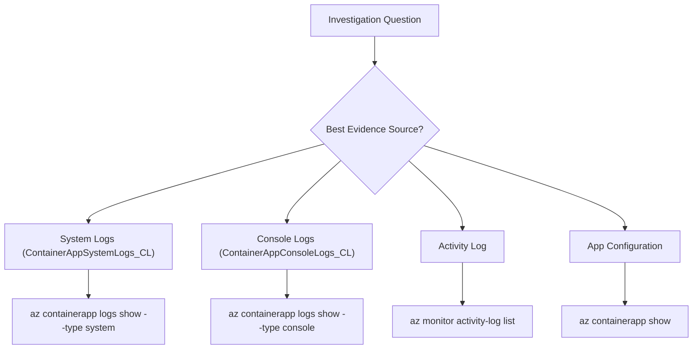

---
content_sources:
  diagrams:
    - id: use-it-when-you-know-what
      type: flowchart
      source: mslearn-adapted
      based_on:
        - https://learn.microsoft.com/azure/container-apps/observability
        - https://learn.microsoft.com/azure/container-apps/log-options
        - https://learn.microsoft.com/azure/azure-monitor/essentials/data-platform-metrics
        - https://learn.microsoft.com/azure/azure-monitor/essentials/activity-log
        - https://learn.microsoft.com/azure/container-apps/troubleshooting
content_validation:
  status: verified
  last_reviewed: "2026-04-12"
  reviewer: ai-agent
  core_claims:
    - claim: "Azure Container Apps can send application console logs and system logs to Azure Monitor Log Analytics."
      source: "https://learn.microsoft.com/azure/container-apps/observability"
      verified: true
    - claim: "Azure Activity Log records subscription-level events for Azure resources."
      source: "https://learn.microsoft.com/azure/azure-monitor/essentials/activity-log"
      verified: true
    - claim: "Azure Monitor metrics stores numeric time-series data from monitored resources."
      source: "https://learn.microsoft.com/azure/azure-monitor/essentials/data-platform-metrics"
      verified: true
    - claim: "Azure Container Apps troubleshooting guidance uses logs and events as key evidence sources."
      source: "https://learn.microsoft.com/azure/container-apps/troubleshooting"
      verified: true
---

# Evidence Map for Container Apps Troubleshooting

This page maps common investigation questions to the best evidence source, the CLI command to run, and the KQL table/query to use.

Use it when you know **what you need to answer** but not **where to collect proof**.

<!-- diagram-id: use-it-when-you-know-what -->


## Why an evidence map

During incidents, teams lose time by checking the wrong signal first.

- HTTP errors are checked in CPU charts
- Startup issues are checked only in app code
- DNS issues are diagnosed without network evidence

An evidence map reduces this by pairing each question with a reproducible command and query.

!!! note "Use CLI and query artifacts for reproducible investigations"
    Since log result capture from the browser is awkward and difficult to maintain, use CLI queries and example outputs.
    This makes investigation reproducible, easier to copy, and easier to interpret.

## Quick Map (Question → Source → Command → Table)

| Question | Best Source | CLI Command | KQL Table |
|---|---|---|---|
| Was the revision restarting? | System logs + Activity Log | `az containerapp revision list --name $APP_NAME --resource-group $RG` | `ContainerAppSystemLogs_CL` |
| Was the app failing health probes? | System logs | `az containerapp logs show --name $APP_NAME --resource-group $RG --type system` | `ContainerAppSystemLogs_CL` |
| Was startup failing? | Console logs | `az containerapp logs show --name $APP_NAME --resource-group $RG --type console` | `ContainerAppConsoleLogs_CL` |
| Was an image pull failing? | System logs | `az containerapp logs show --name $APP_NAME --resource-group $RG --type system` | `ContainerAppSystemLogs_CL` |
| Was scaling not working? | System logs + Metrics | `az containerapp revision list --name $APP_NAME --resource-group $RG` | `ContainerAppSystemLogs_CL` |
| Was there a deployment? | Activity Log | `az monitor activity-log list --resource-group $RG --offset 24h` | Azure Activity Log |
| Was the container killed? | System logs | `az containerapp logs show --name $APP_NAME --resource-group $RG --type system` | `ContainerAppSystemLogs_CL` |
| Were there network errors? | Console logs | `az containerapp logs show --name $APP_NAME --resource-group $RG --type console` | `ContainerAppConsoleLogs_CL` |
| Was ingress configured correctly? | Container App config | `az containerapp show --name $APP_NAME --resource-group $RG --query "properties.configuration.ingress"` | N/A |
| Was managed identity failing? | Console + System logs | `az containerapp logs show --name $APP_NAME --resource-group $RG --type console` | `ContainerAppConsoleLogs_CL` |
| Was a secret missing? | System logs | `az containerapp logs show --name $APP_NAME --resource-group $RG --type system` | `ContainerAppSystemLogs_CL` |
| Was Dapr failing? | System logs | `az containerapp logs show --name $APP_NAME --resource-group $RG --type system` | `ContainerAppSystemLogs_CL` |

## Detailed Evidence Recipes

## 1) Was the revision restarting?

### CLI

```bash
az containerapp revision list --name $APP_NAME --resource-group $RG --output table
az monitor activity-log list --resource-group $RG --offset 24h
```

### KQL

```kusto
ContainerAppSystemLogs_CL
| where TimeGenerated > ago(24h)
| where ContainerAppName_s == "<app-name>"
| where Reason_s has_any ("ContainerStarted", "ContainerTerminated", "ReplicaRestart")
| project TimeGenerated, RevisionName_s, Reason_s, Log_s
| order by TimeGenerated desc
```

## 2) Was the app failing health probes?

### CLI

```bash
az containerapp logs show --name $APP_NAME --resource-group $RG --type system --tail 100
```

### KQL

```kusto
ContainerAppSystemLogs_CL
| where TimeGenerated > ago(6h)
| where ContainerAppName_s == "<app-name>"
| where Reason_s == "ProbeFailed"
| project TimeGenerated, RevisionName_s, Log_s
| order by TimeGenerated desc
```

## 3) Was startup failing?

### CLI

```bash
az containerapp logs show --name $APP_NAME --resource-group $RG --type console --tail 100
```

### KQL

```kusto
ContainerAppConsoleLogs_CL
| where TimeGenerated > ago(6h)
| where ContainerAppName_s == "<app-name>"
| where Log_s has_any ("failed to start", "could not bind", "listen", "startup", "Exception", "Error")
| project TimeGenerated, RevisionName_s, Log_s
| order by TimeGenerated desc
```

## 4) Was an image pull failing?

### CLI

```bash
az containerapp logs show --name $APP_NAME --resource-group $RG --type system --tail 100
```

### KQL

```kusto
ContainerAppSystemLogs_CL
| where TimeGenerated > ago(6h)
| where ContainerAppName_s == "<app-name>"
| where Reason_s has_any ("ImagePullBackOff", "ErrImagePull", "PullingImage", "PulledImage")
| project TimeGenerated, RevisionName_s, Reason_s, Log_s
| order by TimeGenerated desc
```

## 5) Was scaling not working?

### CLI

```bash
az containerapp revision list --name $APP_NAME --resource-group $RG --output table
az containerapp show --name $APP_NAME --resource-group $RG --query "properties.template.scale"
```

### KQL

```kusto
ContainerAppSystemLogs_CL
| where TimeGenerated > ago(24h)
| where ContainerAppName_s == "<app-name>"
| where Reason_s has_any ("KEDAScaleTargetActivated", "KEDAScaleTargetDeactivated", "ScaledReplica")
| project TimeGenerated, RevisionName_s, Reason_s, Log_s
| order by TimeGenerated asc
```

## 6) Was there a deployment?

### CLI

```bash
az monitor activity-log list --resource-group $RG --offset 24h --status Succeeded
az containerapp revision list --name $APP_NAME --resource-group $RG --output table
```

### KQL

```kusto
ContainerAppSystemLogs_CL
| where TimeGenerated > ago(24h)
| where ContainerAppName_s == "<app-name>"
| where Reason_s has_any ("RevisionCreated", "ContainerCreated", "PulledImage")
| project TimeGenerated, RevisionName_s, Reason_s, Log_s
| order by TimeGenerated desc
```

## 7) Was the container killed?

### CLI

```bash
az containerapp logs show --name $APP_NAME --resource-group $RG --type system --tail 100
```

### KQL

```kusto
ContainerAppSystemLogs_CL
| where TimeGenerated > ago(24h)
| where ContainerAppName_s == "<app-name>"
| where Reason_s == "ContainerTerminated"
| where Log_s has_any ("OOMKilled", "exit code", "killed", "terminated")
| project TimeGenerated, RevisionName_s, Log_s
| order by TimeGenerated desc
```

## 8) Were there network errors?

### CLI

```bash
az containerapp logs show --name $APP_NAME --resource-group $RG --type console --tail 100
```

### KQL

```kusto
ContainerAppConsoleLogs_CL
| where TimeGenerated > ago(6h)
| where ContainerAppName_s == "<app-name>"
| where Log_s has_any ("connection refused", "connection reset", "timeout", "DNS", "ECONNRESET", "ETIMEDOUT")
| project TimeGenerated, Log_s
| order by TimeGenerated desc
```

## 9) Was ingress configured correctly?

### CLI

```bash
az containerapp show --name $APP_NAME --resource-group $RG --query "properties.configuration.ingress" --output json
az containerapp show --name $APP_NAME --resource-group $RG --query "properties.configuration.ingress.fqdn" --output tsv
```

### KQL

```kusto
ContainerAppSystemLogs_CL
| where TimeGenerated > ago(6h)
| where ContainerAppName_s == "<app-name>"
| where Log_s has_any ("ingress", "routing", "target port", "external")
| project TimeGenerated, Reason_s, Log_s
| order by TimeGenerated desc
```

## 10) Was managed identity failing?

### CLI

```bash
az containerapp logs show --name $APP_NAME --resource-group $RG --type console --tail 100
az containerapp identity show --name $APP_NAME --resource-group $RG
```

### KQL

```kusto
ContainerAppConsoleLogs_CL
| where TimeGenerated > ago(6h)
| where ContainerAppName_s == "<app-name>"
| where Log_s has_any ("managed identity", "DefaultAzureCredential", "ManagedIdentityCredential", "token", "unauthorized", "403")
| project TimeGenerated, Log_s
| order by TimeGenerated desc
```

## 11) Was a secret missing?

### CLI

```bash
az containerapp logs show --name $APP_NAME --resource-group $RG --type system --tail 100
az containerapp secret list --name $APP_NAME --resource-group $RG --output table
```

### KQL

```kusto
ContainerAppSystemLogs_CL
| where TimeGenerated > ago(6h)
| where ContainerAppName_s == "<app-name>"
| where Log_s has_any ("secret", "key vault", "SecretNotFound", "reference")
| project TimeGenerated, Reason_s, Log_s
| order by TimeGenerated desc
```

## 12) Was Dapr failing?

### CLI

```bash
az containerapp logs show --name $APP_NAME --resource-group $RG --type system --tail 100
az containerapp dapr show --name $APP_NAME --resource-group $RG
```

### KQL

```kusto
ContainerAppSystemLogs_CL
| where TimeGenerated > ago(6h)
| where ContainerAppName_s == "<app-name>"
| where Log_s has_any ("dapr", "sidecar", "component", "state store", "pubsub")
| project TimeGenerated, Reason_s, Log_s
| order by TimeGenerated desc
```

## Evidence Quality Checklist

- Keep all evidence in one incident time window.
- Correlate system, console, and activity log signals before selecting a root cause.
- Preserve query text used during the incident for post-incident review.
- Capture command outputs in ticket notes with sensitive identifiers removed.

## See Also

- [Troubleshooting Method](methodology/index.md)
- [Detector Map](methodology/detector-map.md)
- [Architecture Overview](architecture-overview.md)
- [Decision Tree](decision-tree.md)
- [KQL Query Library](kql/index.md)
- [Revision Failures and Startup](kql/system-and-revisions/revision-failures-and-startup.md)
- [Image Pull and Auth Errors](kql/system-and-revisions/image-pull-and-auth-errors.md)
- [Replica Crash Signals](kql/system-and-revisions/replica-crash-signals.md)

## Sources

- [Monitor Azure Container Apps](https://learn.microsoft.com/azure/container-apps/observability)
- [Azure Container Apps logging](https://learn.microsoft.com/azure/container-apps/log-options)
- [Azure Monitor metrics overview](https://learn.microsoft.com/azure/azure-monitor/essentials/data-platform-metrics)
- [Azure Activity Log overview](https://learn.microsoft.com/azure/azure-monitor/essentials/activity-log)
- [Troubleshoot Azure Container Apps](https://learn.microsoft.com/azure/container-apps/troubleshooting)
