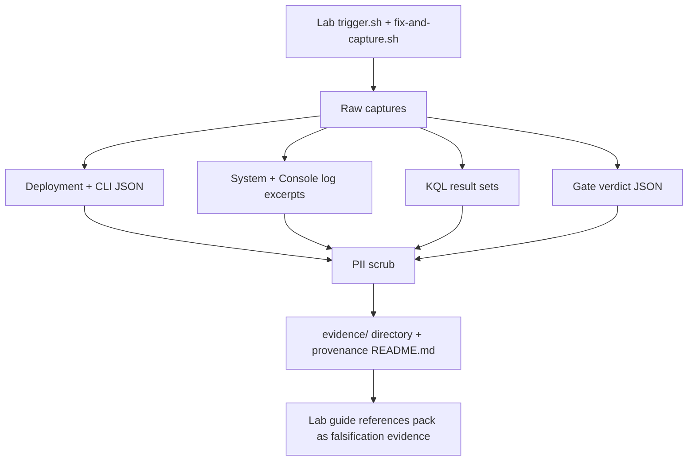

# Evidence Pack Index

Provenance-first catalog of every reproducible **evidence pack** in this guide. Each troubleshooting lab under `labs/` ships an `evidence/` directory containing the raw Azure captures — deployment JSON, CLI output, KQL results, gate verdicts, and curl probes — that back the lab's falsification claim. This page is the single entry point for auditing that evidence.

Use the [Lab Finder](lab-finder.md) when you know a *symptom* and want the matching reproduction lab. Use **this page** when you want to inspect the *raw evidence* a lab captured, verify its provenance, or reuse a capture as a baseline instead of redeploying.

---

## What an evidence pack contains

Every evidence pack is captured in a single live-Azure window by the lab's own `trigger.sh` (failure cohort) and `fix-and-capture.sh` / `verify.sh` (recovery cohort), then PII-scrubbed before commit. A typical pack carries four artifact classes.

<!-- diagram-id: evidence-pack-anatomy -->

| Artifact class | Typical files | Purpose |
|---|---|---|
| **Deployment + CLI state** | `*-deployment-result.json`, `*-containerapp-show-*.json`, `*-revisions-list-*.json` | Capture the failure cohort and the post-fix recovery cohort as raw resource state. |
| **Log excerpts** | `*-system-logs-*.txt`, `*-console-logs-*.txt` | Preserve the first-observed error signal from `ContainerAppSystemLogs_CL` / `ContainerAppConsoleLogs_CL`. |
| **KQL result sets** | `*-kql-*.json`, `*-kql-*-raw.txt` | Quantify the observation (row counts, latency, error rates) against Log Analytics. |
| **Gate verdicts** | `*-gate.json` (e.g. `14-h1-gate.json`, `32-recovery-materialization-gate.json`) | Machine-checkable pass/fail predicates that encode the falsification logic. |

!!! info "Provenance README is authoritative"
    Each pack's `evidence/README.md` documents the exact capture timeline, Azure region, CLI versions, the JSONPath where each smoking-gun value lives, and every PII substitution applied. When the table below and a provenance README disagree, the README wins.

---

## PII-scrubbing guarantee

Every committed evidence artifact is scrubbed before it enters the repository, per the [AGENTS.md PII rules](../contributing/index.md):

- Subscription, tenant, object, and workspace GUIDs are replaced with the zero-GUID placeholder `00000000-0000-0000-0000-000000000000`.
- Employee aliases are replaced with `demouser`; employee emails with `user@example.com`.
- Synthetic example identifiers (demo correlation IDs, ACR Tasks build-volume IDs) are **retained** deliberately to aid readability and are called out as synthetic in each provenance README.

If you find a raw Azure identifier in any evidence artifact, treat it as a P0 leak and open an issue.

---

## Evidence pack catalog

All 30 evidence-bearing labs, alphabetical. **Files / JSON / Gates** are current artifact counts. **Provenance** marks whether the pack carries a dedicated `evidence/README.md`. **Captured** is the live-Azure capture date (from the provenance README, or the gate verdict timestamp where no README exists yet).

| Lab | Evidence pack | Provenance | Files / JSON / Gates | Captured | Lab guide |
|---|---|---|---:|---|---|
| aca-secret-kv-ref-mi-network-path | [evidence/](https://github.com/yeongseon/azure-container-apps-practical-guide/tree/main/labs/aca-secret-kv-ref-mi-network-path/evidence) | Yes | 1 / 0 / 0 | in progress | [guide](lab-guides/aca-secret-kv-ref-mi-network-path.md) |
| acr-network-path-dns-forwarder-bypass | [evidence/](https://github.com/yeongseon/azure-container-apps-practical-guide/tree/main/labs/acr-network-path-dns-forwarder-bypass/evidence) | Yes | 17 / 16 / 4 | 2026-06-29 | [guide](lab-guides/acr-network-path-dns-forwarder-bypass.md) |
| acr-network-path-firewall-allowlist | [evidence/](https://github.com/yeongseon/azure-container-apps-practical-guide/tree/main/labs/acr-network-path-firewall-allowlist/evidence) | Yes | 17 / 15 / 4 | 2026-06-29 | [guide](lab-guides/acr-network-path-firewall-allowlist.md) |
| acr-network-path-pe-direct | [evidence/](https://github.com/yeongseon/azure-container-apps-practical-guide/tree/main/labs/acr-network-path-pe-direct/evidence) | Yes | 17 / 15 / 4 | 2026-06-26 | [guide](lab-guides/acr-network-path-pe-direct.md) |
| acr-network-path-pe-forced-inspection | [evidence/](https://github.com/yeongseon/azure-container-apps-practical-guide/tree/main/labs/acr-network-path-pe-forced-inspection/evidence) | Yes | 17 / 15 / 4 | 2026-06-29 | [guide](lab-guides/acr-network-path-pe-forced-inspection.md) |
| acr-network-path-record-split-brain | [evidence/](https://github.com/yeongseon/azure-container-apps-practical-guide/tree/main/labs/acr-network-path-record-split-brain/evidence) | Yes | 17 / 15 / 4 | 2026-06-28 | [guide](lab-guides/acr-network-path-record-split-brain.md) |
| acr-pull-failure | [evidence/](https://github.com/yeongseon/azure-container-apps-practical-guide/tree/main/labs/acr-pull-failure/evidence) | Yes | 29 / 24 / 6 | 2026-06-22 | [guide](lab-guides/acr-pull-failure.md) |
| appgw-to-internal-aca-nsg-mismatch | [evidence/](https://github.com/yeongseon/azure-container-apps-practical-guide/tree/main/labs/appgw-to-internal-aca-nsg-mismatch/evidence) | Yes | 12 / 8 / 0 | 2026-07-03 | [guide](lab-guides/appgw-to-internal-aca-nsg-mismatch.md) |
| appinsights-connection-string-missing | [evidence/](https://github.com/yeongseon/azure-container-apps-practical-guide/tree/main/labs/appinsights-connection-string-missing/evidence) | Yes | 25 / 20 / 4 | 2026-06-22 | [guide](lab-guides/appinsights-connection-string-missing.md) |
| cd-reconnect-rbac-conflict | [evidence/](https://github.com/yeongseon/azure-container-apps-practical-guide/tree/main/labs/cd-reconnect-rbac-conflict/evidence) | No | 20 / 15 / 2 | 2026-06-23 | [guide](lab-guides/cd-reconnect-rbac-conflict.md) |
| cpu-throttling | [evidence/](https://github.com/yeongseon/azure-container-apps-practical-guide/tree/main/labs/cpu-throttling/evidence) | Yes | 20 / 17 / 4 | 2026-06-22 | [guide](lab-guides/cpu-throttling.md) |
| dapr-integration | [evidence/](https://github.com/yeongseon/azure-container-apps-practical-guide/tree/main/labs/dapr-integration/evidence) | Yes | 17 / 15 / 4 | 2026-06-03 | [guide](lab-guides/dapr-integration.md) |
| diagnostic-settings-missing | [evidence/](https://github.com/yeongseon/azure-container-apps-practical-guide/tree/main/labs/diagnostic-settings-missing/evidence) | Yes | 25 / 18 / 4 | 2026-06-22 | [guide](lab-guides/diagnostic-settings-missing.md) |
| image-size-startup-delay | [evidence/](https://github.com/yeongseon/azure-container-apps-practical-guide/tree/main/labs/image-size-startup-delay/evidence) | Yes | 16 / 13 / 4 | 2026-06-22 | [guide](lab-guides/image-size-startup-delay.md) |
| ingress-target-port-mismatch | [evidence/](https://github.com/yeongseon/azure-container-apps-practical-guide/tree/main/labs/ingress-target-port-mismatch/evidence) | Yes | 30 / 23 / 4 | 2026-06-22 | [guide](lab-guides/ingress-target-port-mismatch.md) |
| keda-no-metrics-returned | [evidence/](https://github.com/yeongseon/azure-container-apps-practical-guide/tree/main/labs/keda-no-metrics-returned/evidence) | Yes | 23 / 16 / 4 | 2026-06-20 | [guide](lab-guides/keda-no-metrics-returned.md) |
| managed-identity-key-vault-failure | [evidence/](https://github.com/yeongseon/azure-container-apps-practical-guide/tree/main/labs/managed-identity-key-vault-failure/evidence) | Yes | 17 / 15 / 4 | 2026-06-26 | [guide](lab-guides/managed-identity-key-vault-failure.md) |
| memory-leak-oomkilled | [evidence/](https://github.com/yeongseon/azure-container-apps-practical-guide/tree/main/labs/memory-leak-oomkilled/evidence) | Yes | 40 / 25 / 4 | 2026-06-20 | [guide](lab-guides/memory-leak-oomkilled.md) |
| memory-percentage-vs-keda-utilization | [evidence/](https://github.com/yeongseon/azure-container-apps-practical-guide/tree/main/labs/memory-percentage-vs-keda-utilization/evidence) | Yes | 26 / 24 / 4 | 2026-06-24 | [guide](lab-guides/memory-percentage-vs-keda-utilization.md) |
| observability-tracing | [evidence/](https://github.com/yeongseon/azure-container-apps-practical-guide/tree/main/labs/observability-tracing/evidence) | Yes | 27 / 22 / 2 | 2026-06-24 | [guide](lab-guides/observability-tracing.md) |
| probe-and-port-mismatch | [evidence/](https://github.com/yeongseon/azure-container-apps-practical-guide/tree/main/labs/probe-and-port-mismatch/evidence) | Yes | 28 / 19 / 2 | 2026-06-23 | [guide](lab-guides/probe-and-port-mismatch.md) |
| replica-node-spread | [evidence/](https://github.com/yeongseon/azure-container-apps-practical-guide/tree/main/labs/replica-node-spread/evidence) | Yes | 20 / 5 / 4 | 2026-06-14 | [guide](lab-guides/replica-node-spread.md) |
| revision-failover | [evidence/](https://github.com/yeongseon/azure-container-apps-practical-guide/tree/main/labs/revision-failover/evidence) | No | 24 / 17 / 2 | 2026-06-22 | [guide](lab-guides/revision-failover.md) |
| revision-history-limit | [evidence/](https://github.com/yeongseon/azure-container-apps-practical-guide/tree/main/labs/revision-history-limit/evidence) | Yes | 19 / 14 / 4 | 2026-06-22 | [guide](lab-guides/revision-history-limit.md) |
| revision-provisioning-failure | [evidence/](https://github.com/yeongseon/azure-container-apps-practical-guide/tree/main/labs/revision-provisioning-failure/evidence) | Yes | 17 / 15 / 4 | 2026-06-20 | [guide](lab-guides/revision-provisioning-failure.md) |
| scale-rule-mismatch | [evidence/](https://github.com/yeongseon/azure-container-apps-practical-guide/tree/main/labs/scale-rule-mismatch/evidence) | No | 26 / 22 / 2 | 2026-06-22 | [guide](lab-guides/scale-rule-mismatch.md) |
| startup-degraded-transient-failure | [evidence/](https://github.com/yeongseon/azure-container-apps-practical-guide/tree/main/labs/startup-degraded-transient-failure/evidence) | Yes | 96 / 41 / 4 | 2026-06-12 | [guide](lab-guides/startup-degraded-transient-failure.md) |
| traffic-routing-canary | [evidence/](https://github.com/yeongseon/azure-container-apps-practical-guide/tree/main/labs/traffic-routing-canary/evidence) | Yes | 28 / 21 / 2 | 2026-06-24 | [guide](lab-guides/traffic-routing-canary.md) |
| zone-redundancy-best-effort | [evidence/](https://github.com/yeongseon/azure-container-apps-practical-guide/tree/main/labs/zone-redundancy-best-effort/evidence) | Yes | 60 / 18 / 4 | 2026-06-12 | [guide](lab-guides/zone-redundancy-best-effort.md) |

!!! note "Special-case packs"
    - **`metrics-load-test`** is intentionally omitted from the catalog above. It is the data source for the [metrics reference](../reference/index.md) rather than a trigger/fix/falsification lab, so it has no lab guide and emits no gate verdicts (47 files, 46 JSON, 0 gates).
    - **`aca-secret-kv-ref-mi-network-path`** is an in-progress reproducer (single provenance file, no cohort captured yet). Its evidence pack will be populated when the reproduction lands.
    - **`cd-reconnect-rbac-conflict`**, **`revision-failover`**, and **`scale-rule-mismatch`** carry full gate-verdict cohorts but do not yet ship a dedicated `evidence/README.md`. Their capture dates above are read from the gate verdict timestamps; a provenance README is a tracked follow-up.

---

## How to use an evidence pack

1. **Audit a falsification claim.** Open the lab guide's Falsification / Experiment Log section, then open the matching `*-gate.json` to see the exact predicate that was evaluated and its pass/fail verdict.
2. **Reuse a capture as a baseline.** When a smoking-gun signal is deterministic (for example `MANIFEST_UNKNOWN` in `acr-pull-failure`), the provenance README documents the JSONPath so you can validate a new predicate against the captured schema instead of redeploying.
3. **Verify PII hygiene.** Every artifact is scrubbed; the provenance README lists every substitution. Use it to confirm no raw Azure identifier survives before citing an artifact externally.

---

## See Also

- [Lab Finder](lab-finder.md) — Symptom-first routing to the matching reproduction lab
- [Lab Guides catalog](lab-guides/index.md) — Browse every lab by difficulty and duration
- [Evidence Map](evidence-map.md) — Signal-to-lab evidence mapping
- [Methodology](methodology/index.md) — Detector map and the evidence-integrity model behind every gate
- [KQL Query Library](kql/index.md) — Production queries that generated the KQL result sets in these packs
- [Contributing Guide](../contributing/index.md) — PII rules and evidence-capture standards

## Sources

- [Azure Container Apps troubleshooting overview](https://learn.microsoft.com/en-us/azure/container-apps/troubleshooting)
- [Monitor logs in Azure Container Apps with Log Analytics](https://learn.microsoft.com/en-us/azure/container-apps/log-monitoring)
- [Troubleshoot container start failures](https://learn.microsoft.com/en-us/azure/container-apps/troubleshoot-container-start-failures)
- [Azure Container Apps revisions](https://learn.microsoft.com/en-us/azure/container-apps/revisions)
