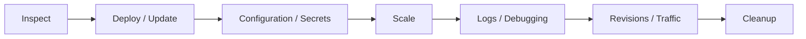

---
content_sources:
  diagrams:
    - id: use-app-name-ca-myapp-for-troubleshooting-examples-in
      type: flowchart
      source: mslearn-adapted
      based_on:
        - https://learn.microsoft.com/cli/azure/containerapp
        - https://learn.microsoft.com/azure/container-apps/overview
content_validation:
  status: verified
  last_reviewed: "2026-04-12"
  reviewer: ai-agent
  core_claims:
    - claim: "Azure Container Apps supports revisions for deploying and managing application versions."
      source: "https://learn.microsoft.com/azure/container-apps/revisions"
      verified: true
    - claim: "Azure Container Apps supports ingress configuration with a target port."
      source: "https://learn.microsoft.com/azure/container-apps/networking"
      verified: true
    - claim: "Azure Container Apps supports minimum and maximum replica settings for scaling."
      source: "https://learn.microsoft.com/azure/container-apps/scale-app"
      verified: true
    - claim: "Azure Container Apps provides console logs and system logs for running apps."
      source: "https://learn.microsoft.com/azure/container-apps/observability"
      verified: true
    - claim: "Azure Container Apps supports splitting traffic between active revisions."
      source: "https://learn.microsoft.com/azure/container-apps/revisions"
      verified: true
---

# CLI Cheatsheet

Use shell variables in examples:

```bash
RG="rg-myapp"
APP_NAME="ca-myapp"
ENVIRONMENT_NAME="cae-myapp"
ACR_NAME="acrmyapp"
IMAGE_TAG="v1"
```

Use `APP_NAME="ca-myapp"` for troubleshooting examples in this guide.

<!-- diagram-id: use-app-name-ca-myapp-for-troubleshooting-examples-in -->


## Inspect

| Task | Command |
| --- | --- |
| Show app config | `az containerapp show --name "$APP_NAME" --resource-group "$RG"` |
| Show provisioning state | `az containerapp show --name "$APP_NAME" --resource-group "$RG" --query provisioningState --output tsv` |
| Get FQDN | `az containerapp show --name "$APP_NAME" --resource-group "$RG" --query properties.configuration.ingress.fqdn --output tsv` |
| List revisions | `az containerapp revision list --name "$APP_NAME" --resource-group "$RG"` |
| Show latest revision state | `az containerapp revision list --name "$APP_NAME" --resource-group "$RG" --query "[0].{name:name,active:properties.active,health:properties.healthState}"` |
| List replicas | `az containerapp replica list --name "$APP_NAME" --resource-group "$RG"` |

Observed output patterns:

```text
$ az containerapp show --name "$APP_NAME" --resource-group "$RG" --query provisioningState --output tsv
Succeeded

$ az containerapp revision list --name "$APP_NAME" --resource-group "$RG" --output table
Name               Active    TrafficWeight    Replicas    HealthState    RunningState
-----------------  --------  ---------------  ----------  -------------  ------------
ca-myapp--0000001  True      100              1           Healthy        Running
```

## Deploy / Update

```bash
# Build image in ACR
az acr build \
  --registry "$ACR_NAME" \
  --image "aca-python-app:${IMAGE_TAG}" \
  .

# Create app
az containerapp create \
  --name "$APP_NAME" \
  --resource-group "$RG" \
  --environment "$ENVIRONMENT_NAME" \
  --image "${ACR_NAME}.azurecr.io/aca-python-app:${IMAGE_TAG}" \
  --target-port 8000 \
  --ingress external \
  --registry-server "${ACR_NAME}.azurecr.io"

# Update image
az containerapp update \
  --name "$APP_NAME" \
  --resource-group "$RG" \
  --image "${ACR_NAME}.azurecr.io/aca-python-app:v2"
```

## Configuration / Secrets

```bash
# Set app settings
az containerapp update \
  --name "$APP_NAME" \
  --resource-group "$RG" \
  --set-env-vars "LOG_LEVEL=INFO" "TELEMETRY_MODE=advanced"

# Set secret
az containerapp secret set \
  --name "$APP_NAME" \
  --resource-group "$RG" \
  --secrets "db-connection=<redacted>"

# Bind secret to env var
az containerapp update \
  --name "$APP_NAME" \
  --resource-group "$RG" \
  --set-env-vars "DB_CONNECTION_STRING=secretref:db-connection"
```

## Scale

```bash
# HTTP scale rule
az containerapp update \
  --name "$APP_NAME" \
  --resource-group "$RG" \
  --min-replicas 1 \
  --max-replicas 10 \
  --scale-rule-name "http-rule" \
  --scale-rule-type http \
  --scale-rule-http-concurrency 50

# Scale to zero
az containerapp update \
  --name "$APP_NAME" \
  --resource-group "$RG" \
  --min-replicas 0
```

## Logs / Debugging

```bash
# Application logs (stream)
az containerapp logs show \
  --name "$APP_NAME" \
  --resource-group "$RG" \
  --type console \
  --follow

# System logs (startup, pull, probes)
az containerapp logs show \
  --name "$APP_NAME" \
  --resource-group "$RG" \
  --type system

# Exec into running replica
az containerapp exec \
  --name "$APP_NAME" \
  --resource-group "$RG" \
  --command "/bin/bash"
```

Observed runtime/system snippets:

```text
Starting application...
PORT=8000
Workers=auto
[2026-04-04 11:30:53 +0000] [7] [INFO] Starting gunicorn 25.3.0
[2026-04-04 11:30:53 +0000] [7] [INFO] Listening at: http://0.0.0.0:8000 (7)

Reason_s      Log_s
------------  -----------------------------------------------------------------
PullingImage  Pulling image '<acr-name>.azurecr.io/myapp:v1.0.0'
PulledImage   Successfully pulled image in 2.42s. Image size: 58720256 bytes.
ProbeFailed   Probe of StartUp failed with status code: 1
RevisionReady Revision ready
```

## Revisions / Traffic

```bash
# Enable multiple revision mode
az containerapp revision set-mode \
  --name "$APP_NAME" \
  --resource-group "$RG" \
  --mode multiple

# Split traffic
az containerapp ingress traffic set \
  --name "$APP_NAME" \
  --resource-group "$RG" \
  --revision-weight "${APP_NAME}--rev1=80" "${APP_NAME}--rev2=20"

# Roll back
az containerapp ingress traffic set \
  --name "$APP_NAME" \
  --resource-group "$RG" \
  --revision-weight "${APP_NAME}--rev1=100"
```

## Cleanup

```bash
az group delete --name "$RG" --yes --no-wait
```

## Sources
- [Azure CLI containerapp reference (Microsoft Learn)](https://learn.microsoft.com/cli/azure/containerapp)
- [Azure Container Apps overview (Microsoft Learn)](https://learn.microsoft.com/azure/container-apps/overview)
