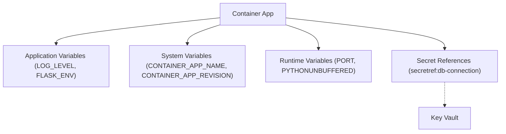

---
hide:
  - toc
---

# Environment Variables



## Application Variables (Reference App)

| Variable | Used by | Purpose | Default | Example |
| --- | --- | --- | --- | --- |
| `LOG_LEVEL` | `app/src/app.py` | Python logging level | `INFO` | `DEBUG` |
| `FLASK_ENV` | `app/src/routes/info.py` | App environment label | `development` (route fallback) | `production` |
| `TELEMETRY_MODE` | `app/src/config/telemetry.py` | Telemetry behavior | `basic` | `advanced` |
| `APPLICATIONINSIGHTS_CONNECTION_STRING` | `app/src/config/telemetry.py` | Azure Monitor/OpenTelemetry connection | _none_ | `InstrumentationKey=<redacted>;...` |
| `DB_CONNECTION_STRING` | App config pattern | Database connection secret mapping | _none_ | `secretref:db-connection` |
| `STORAGE_ACCOUNT_NAME` | App config pattern | Storage account name | _none_ | `mystorageaccount` |

## Container Apps System Variables

| Variable | Description | Example |
| --- | --- | --- |
| `CONTAINER_APP_NAME` | Container App name | `ca-myapp` |
| `CONTAINER_APP_REVISION` | Active revision | `ca-myapp--0000001` |
| `CONTAINER_APP_REPLICA_NAME` | Replica identifier | `ca-myapp--0000001-646779b4c5-bhc2v` |
| `CONTAINER_APP_ENV_DNS_SUFFIX` | Environment DNS suffix | `eastus.azurecontainerapps.io` |

## Runtime Variables

| Variable | Source | Notes |
| --- | --- | --- |
| `PORT` | Container platform / startup command | This app binds Gunicorn to `8000`; keep `targetPort` aligned |
| `PYTHONUNBUFFERED` | Optional app setting | Set to `1` for immediate stdout/stderr flushing |

## Secret Mapping Patterns

| Pattern | Example |
| --- | --- |
| Inline env var | `--set-env-vars "LOG_LEVEL=INFO"` |
| Secret creation | `az containerapp secret set --name "$APP_NAME" --resource-group "$RG" --secrets "db-connection=<redacted>"` |
| Secret reference in env var | `--set-env-vars "DB_CONNECTION_STRING=secretref:db-connection"` |

## Quick Validation

```bash
RG="rg-myapp"
APP_NAME="ca-myapp"

az containerapp show \
  --name "$APP_NAME" \
  --resource-group "$RG" \
  --query "properties.template.containers[0].env"

az containerapp exec \
  --name "$APP_NAME" \
  --resource-group "$RG" \
  --command "/bin/bash"

# Inside container
env | sort
```

Observed output pattern from a healthy replica:

```text
CONTAINER_APP_ENV_DNS_SUFFIX=<region>.azurecontainerapps.io
CONTAINER_APP_NAME=ca-myapp
CONTAINER_APP_REPLICA_NAME=ca-myapp--0000001-646779b4c5-bhc2v
CONTAINER_APP_REVISION=ca-myapp--0000001
PORT=8000
```

## Minimal Best Practices

| Do | Avoid |
| --- | --- |
| Use `secretref:` for sensitive values | Plain text passwords in `--set-env-vars` |
| Keep optional defaults in code (`os.environ.get`) | Hardcoded environment-specific constants |
| Redact connection strings in docs | PII, subscription IDs, keys/tokens |

## Sources
- [Environment variables in Azure Container Apps (Microsoft Learn)](https://learn.microsoft.com/azure/container-apps/environment-variables)
- [Manage secrets in Azure Container Apps (Microsoft Learn)](https://learn.microsoft.com/azure/container-apps/manage-secrets)
