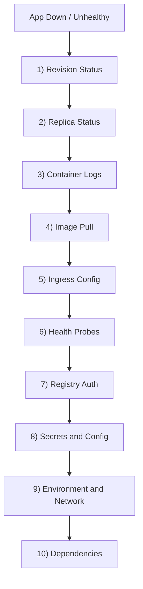
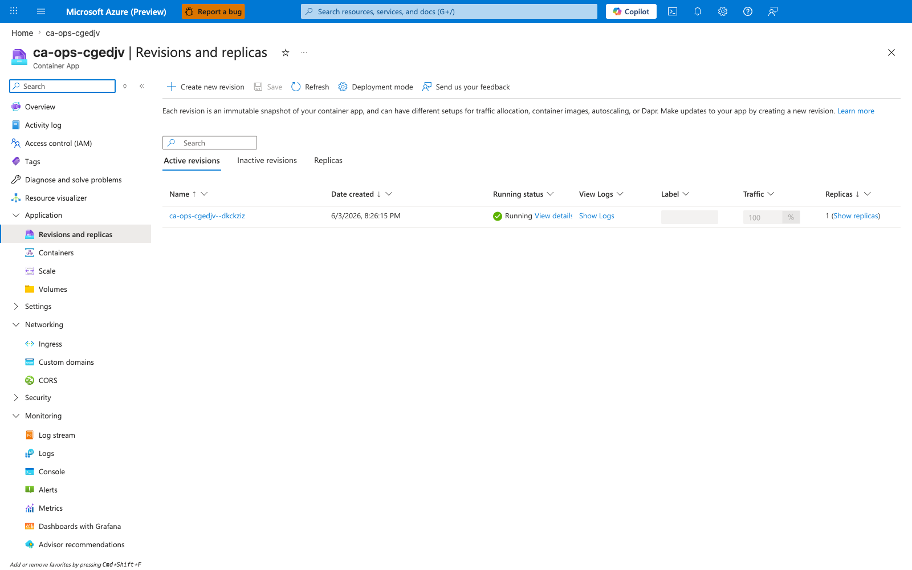
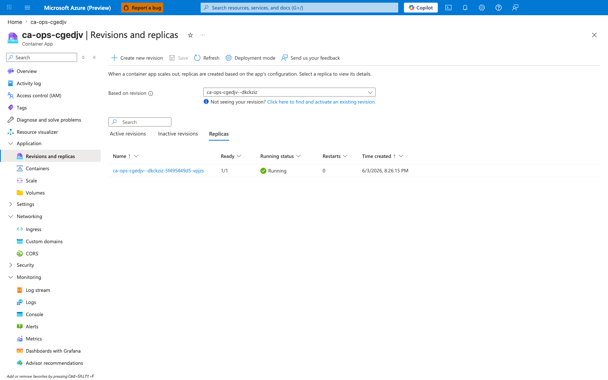
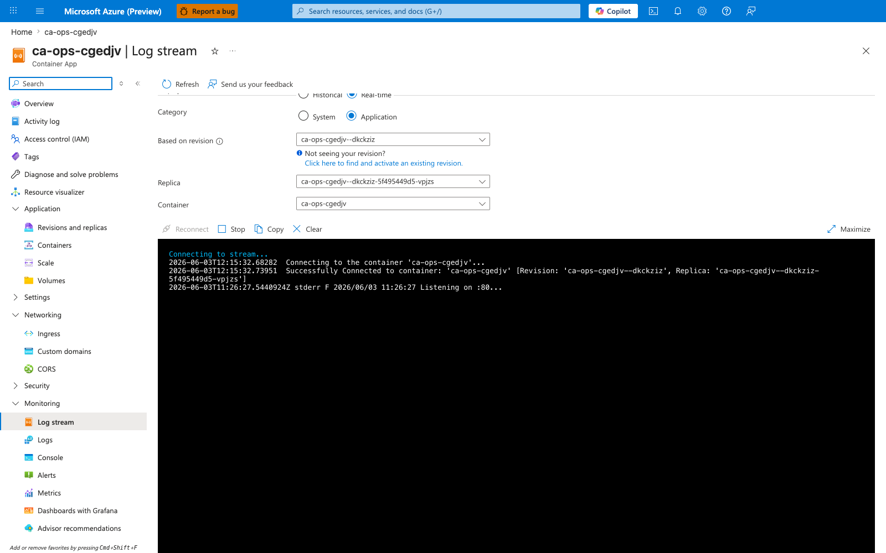
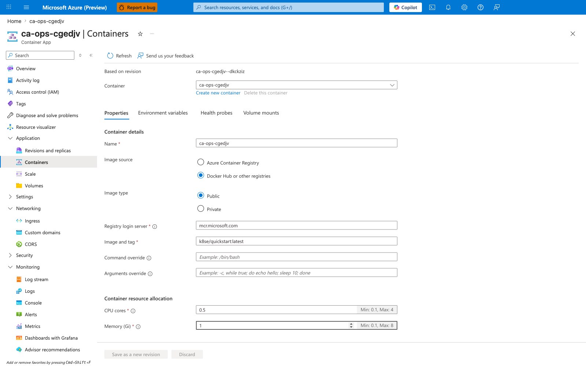
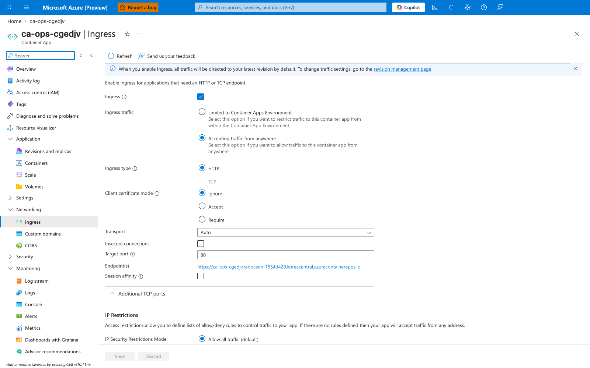
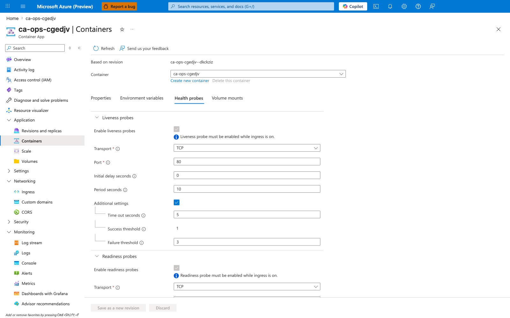
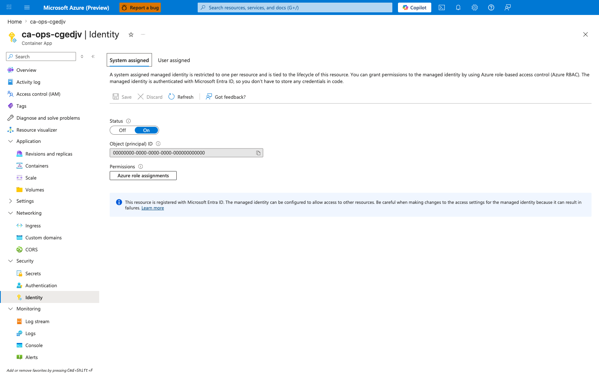
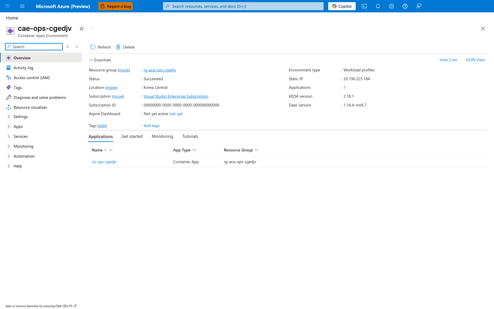
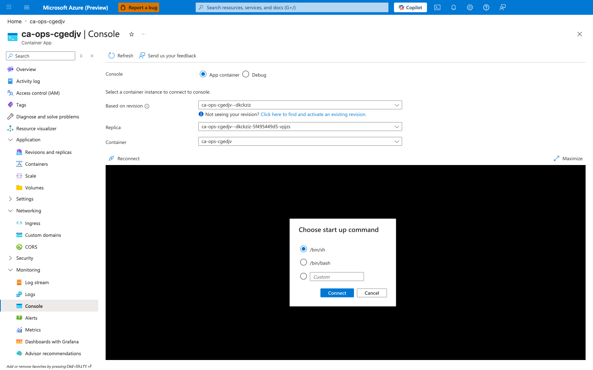

---
content_sources:
  diagrams:
  - id: use-this-ordered-checklist-when-a
    type: flowchart
    source: mslearn-adapted
    based_on:
    - https://learn.microsoft.com/azure/container-apps/
---
# First 10 Minutes: Quick Triage Checklist

Use this ordered checklist when a Container App is down, unhealthy, or unreachable. Run each step in sequence and stop when you find the first confirmed failure.

<!-- diagram-id: use-this-ordered-checklist-when-a -->


!!! tip "Run from a clean shell session"
    Export variables once to avoid command mistakes:

    ```bash
    RG="rg-myapp"
    APP_NAME="ca-myapp"
    ENVIRONMENT_NAME="cae-myapp"
    ACR_NAME="acrmyapp"
    ```

## 1) Revision Status

```bash
az containerapp show --name "$APP_NAME" --resource-group "$RG" --query "properties.provisioningState" --output tsv
```

| Command | Why it is used |
|---|---|
| `az containerapp show --name ...` | Reads the Container App configuration so the documented setting can be verified. |

Expected baseline from a healthy deployment:

```text
Succeeded
```

```bash
az containerapp revision list --name "$APP_NAME" --resource-group "$RG" --query "[].{name:name,active:properties.active,health:properties.healthState,running:properties.runningState,created:properties.createdTime}" --output table
```

| Command | Why it is used |
|---|---|
| `az containerapp revision list ...` | Lists revisions so rollout state, traffic, and health can be verified. |

Observed output pattern:

```text
Name               Active    Health    Running    Created
-----------------  --------  --------  ---------  -------------------------
ca-myapp--0000001  True      Healthy   Running    2026-04-04T11:30:41+00:00
```

- Look for the latest revision with `health=Healthy` and `running=Running`.
- Failure patterns: `Provisioning failed`, `Failed`, `Degraded`, inactive latest revision.
- If failed → go to [Revision Provisioning Failure](../playbooks/startup-and-provisioning/revision-provisioning-failure.md).

### Portal view: Revisions and replicas

Navigate: **Container App → Application → Revisions and replicas → Active revisions**.



`[Observed]` The **Active revisions** tab lists the revision `ca-ops-cgedjv--dkckziz` with **Running status: Running**, **Traffic: 100%**, and **Replicas: 1**.

`[Inferred]` A single active revision serving 100% of traffic with a Running replica is the expected steady state for this app, so this snapshot is consistent with a healthy deployment. If the latest revision is missing, shows `Provisioning failed`, or is split into multiple competing revisions, jump to the playbook linked above.

`[Not Proven]` This blade does not confirm that the replica is **handling requests successfully** — only that the platform considers it Running. End-to-end health requires a probe response or a request-log entry (see Step 6 and Step 3).

## 2) Replica Status

```bash
az containerapp replica list --name "$APP_NAME" --resource-group "$RG" --query "[].{replica:name,runningState:properties.runningState,created:properties.createdTime}" --output table
```

| Command | Why it is used |
|---|---|
| `az containerapp replica list ...` | Runs the Azure CLI operation required by the documented step. |

Observed output pattern:

```text
Replica                                RunningState    Created
-------------------------------------  --------------  -------------------------
ca-myapp--0000001-646779b4c5-bhc2v     Running         2026-04-04T11:30:52+00:00
```

- Look for replicas that remain in `Running` state.
- Failure patterns: repeated short-lived replicas, no replicas created, restart loops.
- If failed → go to [Container Start Failure](../playbooks/startup-and-provisioning/container-start-failure.md).

### Portal view: Replicas tab

Navigate: **Container App → Application → Revisions and replicas → Replicas**.



`[Observed]` The **Replicas** tab lists a single replica `ca-ops-cgedjv--dkckziz-5f495449d5-vpjzs` in **Running** state, tied to the active revision.

`[Inferred]` If you refresh the blade every 30 seconds and see the replica name change repeatedly (different pod-hash suffix), the container is crash-looping even though the revision shows healthy. That symptom maps to [Container Start Failure](../playbooks/startup-and-provisioning/container-start-failure.md).

`[Not Proven]` A single observation of one Running replica does not prove the replica is long-lived; only repeated refreshes (or `kubectl`-style restart counters, which this blade does not expose) can confirm stability over time.

## 3) Container Logs

```bash
az containerapp logs show --name "$APP_NAME" --resource-group "$RG" --type console --tail 50
```

| Command | Why it is used |
|---|---|
| `az containerapp logs show ...` | Runs the Azure CLI operation required by the documented step. |

For continuous streaming, add `--follow` and press Ctrl+C to exit.

Observed healthy startup console sequence (Gunicorn):

```text
Starting application...
PORT=8000
Workers=auto
[2026-04-04 11:30:53 +0000] [7] [INFO] Starting gunicorn 25.3.0
[2026-04-04 11:30:53 +0000] [7] [INFO] Listening at: http://0.0.0.0:8000 (7)
[2026-04-04 11:30:53 +0000] [7] [INFO] Using worker: sync
[2026-04-04 11:30:54 +0000] [8] [INFO] Booting worker with pid: 8
```

- Look for Python traceback, startup command failures, bind errors, missing configuration.
- Failure patterns: `ModuleNotFoundError`, `Address already in use`, `connection refused`, crash loops.
- If failed → go to [Container Start Failure](../playbooks/startup-and-provisioning/container-start-failure.md).

### Portal view: Log stream

Navigate: **Container App → Monitoring → Log stream**.



`[Observed]` The **Log stream** blade exposes **Replica** and **Container** dropdowns above a console area that renders incoming stdout/stderr from the selected target.

`[Inferred]` This surface is the right tool when a replica has just started and you need output immediately — it subscribes to the live log channel rather than querying ingested data, so it avoids whatever ingestion delay the workspace currently has.

`[Not Proven]` The blade does not show **historical** logs — only what arrives after you open it — and the exact ingestion lag for the same lines to appear in `ContainerAppConsoleLogs_CL` is not visible here. For past failures, query the workspace through the **Logs** blade.

## 4) Image Pull

```bash
az containerapp logs show --name "$APP_NAME" --resource-group "$RG" --type system
az acr repository show-tags --name "$ACR_NAME" --repository "$APP_NAME" --output table
```

| Command | Why it is used |
|---|---|
| `az containerapp logs show ...` | Runs the Azure CLI operation required by the documented step. |

Observed pull success pattern:

```text
TimeGenerated              Reason_s      Log_s
-------------------------  ------------  ---------------------------------------------------------------
2026-04-04T12:54:11.477Z   PullingImage  Pulling image '<acr-name>.azurecr.io/myapp:v1.0.0'
2026-04-04T12:54:11.477Z   PulledImage   Successfully pulled image in 2.42s. Image size: 58720256 bytes.
```

- Confirm image tag exists and system logs do not show pull/auth errors.
- Failure patterns: `ImagePullBackOff`, `manifest unknown`, `unauthorized`, `denied`.
- If failed → go to [Image Pull Failure](../playbooks/startup-and-provisioning/image-pull-failure.md).

### Portal view: Container image configuration

Navigate: **Container App → Application → Containers → Properties**.



`[Observed]` The **Properties** tab under **Containers** shows the **Registry login server** (`mcr.microsoft.com`) and **Image and tag** (`k8se/quickstart:latest`) currently configured on the active revision, along with the CPU/memory allocation for the container.

`[Inferred]` If the values here do not match what your last CI/CD run pushed, the most recent revision was created from a stale template — re-check the `az containerapp update --image` step (or equivalent IaC) in the pipeline.

`[Not Proven]` This blade only shows the **configured** image reference; it does not prove the pull actually succeeded. Pull success must still be verified through system logs (the CLI command above) or the Activity log.

## 5) Ingress Configuration

```bash
az containerapp show --name "$APP_NAME" --resource-group "$RG" --query "properties.configuration.ingress" --output json
```

| Command | Why it is used |
|---|---|
| `az containerapp show --name ...` | Reads the Container App configuration so the documented setting can be verified. |

- Confirm `external` setting matches your access model and `targetPort` matches app listening port.
- Failure patterns: ingress disabled, wrong `targetPort`, internal app tested from public internet.
- If failed → go to [Ingress Not Reachable](../playbooks/ingress-and-networking/ingress-not-reachable.md).

### Portal view: Ingress

Navigate: **Container App → Networking → Ingress**.



`[Observed]` The **Ingress** blade shows **Ingress: enabled**, **Accepting traffic from: Anywhere**, **Target port: 80**, **Transport: Auto**, and an **Endpoint(s)** field that lists the app's URL.

`[Inferred]` Because **Accepting traffic from** is set to **Anywhere**, the URL listed under **Endpoint(s)** should be reachable from the public internet — this is the externally exposed FQDN for the app. Three common misconfigurations are visible here at a glance: (1) toggle off → no FQDN issued, (2) **Accepting traffic from** set to **VNet** while you are testing from the public internet → DNS resolves but connection times out, (3) **Target port** does not match the port your app listens on (e.g. app binds `8000` but ingress points at `80`) → connections reset with no app logs.

`[Not Proven]` This blade does not prove the FQDN actually resolves in public DNS or that an HTTP request reaches the container — confirm with `curl -v https://<fqdn>/` from outside the VNet.

## 6) Health Probes

```bash
az containerapp show --name "$APP_NAME" --resource-group "$RG" --query "properties.template.containers[0].probes" --output json
```

| Command | Why it is used |
|---|---|
| `az containerapp show --name ...` | Reads the Container App configuration so the documented setting can be verified. |

- Confirm liveness/readiness probe paths and ports are valid; startup probe timeout fits app boot time.
- Failure patterns: probe path returns 404/500, startup timeout too short, wrong probe port.
- If failed → go to [Probe Failure and Slow Start](../playbooks/startup-and-provisioning/probe-failure-and-slow-start.md).

!!! warning "Probe defaults can still fail"
    Apps with migrations, cold dependency checks, or large model loads often need a longer startup probe window.

### Portal view: Health probes

Navigate: **Container App → Application → Containers → Health probes**.



`[Observed]` The **Health probes** tab under **Containers** lists the configured probes — the visible portion of the blade shows **Liveness** and **Readiness** sections with their transport (HTTP/TCP/gRPC), path, port, and timing fields exposed as editable form fields rather than raw JSON. **Startup** probe (the third type Container Apps supports) is rendered in the same scrollable list.

`[Inferred]` This view is the fastest way to catch the three classic probe mistakes: (1) path returns 404 in the app's router → readiness flaps, (2) **Startup probe** timeout shorter than actual boot time (e.g. 30 s for an app that needs 60 s to warm a model) → revision never goes Ready, (3) probe **Port** does not match the container's listening port → TCP probe succeeds (port open) but HTTP probe fails.

`[Not Proven]` The Portal does not show **historical** probe results; for that, query `ContainerAppSystemLogs_CL | where Reason_s in ("LivenessProbeFailed","ReadinessProbeFailed","StartupProbeFailed")` in Log Analytics.

## 7) Registry Authentication

```bash
az containerapp show --name "$APP_NAME" --resource-group "$RG" --query "identity" --output json
az role assignment list --scope "$(az acr show --name "$ACR_NAME" --query id --output tsv)" --assignee "$(az containerapp show --name "$APP_NAME" --resource-group "$RG" --query identity.principalId --output tsv)" --output table
```

| Command | Why it is used |
|---|---|
| `az containerapp show --name ...` | Reads the Container App configuration so the documented setting can be verified. |

- Confirm managed identity exists and has `AcrPull` role on the registry scope.
- Failure patterns: no principal ID, missing `AcrPull`, ACR firewall blocks environment egress.
- If failed → go to [Managed Identity Auth Failure](../playbooks/identity-and-configuration/managed-identity-auth-failure.md) and [Image Pull Failure](../playbooks/startup-and-provisioning/image-pull-failure.md).

### Portal view: Identity

Navigate: **Container App → Settings → Identity**.



`[Observed]` The **System assigned** tab shows **Status: On**, an **Object (principal) ID** value, a **User assigned** sibling tab, and an **Azure role assignments** button under **Permissions**. A notice at the bottom of the blade confirms the resource is **registered with Microsoft Entra ID**.

`[Inferred]` If **Status** is **Off**, the app cannot use a system-assigned managed identity at all — registry pulls fall back to admin credentials (which may be disabled on hardened ACRs) and any Key Vault references fail at revision-provisioning time. The **Azure role assignments** button is the quickest way to verify that this Object ID actually holds `AcrPull` (or whatever role) on the registry scope.

`[Not Proven]` This blade does not show which **revisions** are currently using the identity, nor whether a recent role assignment has propagated through Entra ID — propagation can lag image-pull attempts by minutes.

## 8) Secrets and Config

```bash
az containerapp secret list --name "$APP_NAME" --resource-group "$RG"
az containerapp show --name "$APP_NAME" --resource-group "$RG" --query "properties.template.containers[0].env" --output json
```

| Command | Why it is used |
|---|---|
| `az containerapp secret list ...` | Manages Container Apps secrets without exposing secret values in plain configuration. |

- Confirm secret references exist and expected environment variables are present.
- Failure patterns: `secretRef` points to missing secret, null env var values, stale revision after secret update.
- If failed → go to [Secret and Key Vault Reference Failure](../playbooks/identity-and-configuration/secret-and-key-vault-reference-failure.md) and [Revision Provisioning Failure](../playbooks/startup-and-provisioning/revision-provisioning-failure.md).

!!! note "Portal capture intentionally omitted for this step"
    The Portal **Secrets** blade is intentionally not captured for this step. The CLI commands above are authoritative because they print secret **references** (env-var name → secret name → Key Vault URI) in a single output, which the Portal splits across multiple blades. Use the CLI as the source of truth for triage; open the Portal **Secrets** blade only when you need the inline edit/version UI.

## 9) Environment and Network

```bash
az containerapp env show --name "$ENVIRONMENT_NAME" --resource-group "$RG" --output json
az network private-endpoint list --resource-group "$RG" --output table
```

| Command | Why it is used |
|---|---|
| `az containerapp env show ...` | Reads managed environment settings for networking, logging, or workload profile verification. |

- Confirm environment is healthy and network dependencies (private DNS/private endpoints) are correctly configured.
- Failure patterns: DNS resolution failures, blocked NSG outbound rules, missing private DNS link.
- If failed → go to [Internal DNS and Private Endpoint Failure](../playbooks/ingress-and-networking/internal-dns-and-private-endpoint-failure.md).

### Portal view: Container Apps Environment overview

Navigate: **Container Apps Environment → Overview**.



`[Observed]` The **Environment** Overview blade shows **Status: Succeeded**, the linked **Log Analytics workspace**, the **Environment type** (Workload profiles or Consumption only), and the list of Container Apps deployed inside the environment.

`[Inferred]` If the environment is in a custom VNet, the Overview also exposes the **Infrastructure subnet** — use that as the starting point for verifying outbound NSG rules and route tables. If the environment status is anything other than **Succeeded** (`Failed`, `Updating`, `Canceled`), every app inside is affected; fix the environment before debugging individual apps.

`[Not Proven]` The Overview does not show DNS resolution success or NSG flow logs — use **Network Watcher → Connection Troubleshoot** from the environment's subnet to test specific dependency endpoints.

## 10) Dependencies

```bash
az containerapp exec --name "$APP_NAME" --resource-group "$RG" --command "python -c 'import socket; print(socket.gethostbyname(\"example.database.windows.net\"))'"
```

| Command | Why it is used |
|---|---|
| `az containerapp exec --name ...` | Runs the Azure CLI operation required by the documented step. |

- Confirm the app can resolve and reach critical services (database, storage, API endpoints).
- Failure patterns: DNS timeout, TLS handshake errors, outbound firewall denials.
- If failed → go to [Service-to-Service Connectivity Failure](../playbooks/ingress-and-networking/service-to-service-connectivity-failure.md), [Managed Identity Auth Failure](../playbooks/identity-and-configuration/managed-identity-auth-failure.md), or [Internal DNS and Private Endpoint Failure](../playbooks/ingress-and-networking/internal-dns-and-private-endpoint-failure.md).

### Portal view: Console (exec into a replica)

Navigate: **Container App → Monitoring → Console**.



`[Observed]` The **Console** blade exposes **Replica** and **Container** dropdowns and opens a **Choose start up command** dialog offering `/bin/sh`, `/bin/bash`, or a custom command before attaching an in-browser shell.

`[Inferred]` Once attached, you can run dependency probes interactively (`nslookup`, `curl -v`, `nc -zv`) without needing `az containerapp exec` from your laptop, which is useful when corporate egress blocks the CLI control plane. If **Reconnect** loops or the shell exits immediately, the container image likely lacks a shell (distroless / scratch base) — verify dependencies from a sidecar or rebuild with a debug image.

`[Not Proven]` The Console runs **inside one replica**; a single successful probe does not prove every replica can reach the same dependency. Repeat against multiple replicas if you suspect intermittent network issues.

## Escalate with Context

Observed healthy system lifecycle sequence for reference:

```text
ContainerAppUpdate    → Updating containerApp: ca-myapp
RevisionCreation      → Creating new revision
PullingImage          → Pulling image '<acr-name>.azurecr.io/myapp:v1.0.0'
PulledImage           → Successfully pulled image in 2.42s (58720256 bytes)
ContainerCreated      → Created container 'ca-myapp'
ContainerStarted      → Started container 'ca-myapp'
ProbeFailed (Warning) → Probe of StartUp failed (multiple times during startup)
RevisionReady         → Revision ready
ContainerAppReady     → Running state reached
```

If the checklist does not isolate root cause, continue with [Troubleshooting Methodology](../methodology/index.md) and include:

- failing revision name
- exact error text from system/console logs
- ingress mode and target port
- dependency endpoint(s) that failed

## See Also

- [Troubleshooting Methodology](../methodology/index.md)
- [Troubleshooting Playbooks](../playbooks/index.md)
- [KQL Query Library](../kql/index.md)

## Sources

- [Azure Container Apps documentation (Microsoft Learn)](https://learn.microsoft.com/azure/container-apps/)
