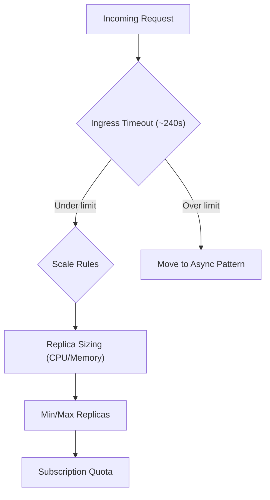

---
hide:
  - toc
content_sources:
  diagrams:
    - id: use-this-page-as-a-quick
      type: flowchart
      source: mslearn-adapted
      based_on:
        - https://learn.microsoft.com/azure/container-apps/quotas
        - https://learn.microsoft.com/azure/container-apps/scale-app
---

# Platform Limits

Use this page as a quick checkpoint before scaling, rollout, or incident response.

<!-- diagram-id: use-this-page-as-a-quick -->


## Common Limits and Timeouts

| Area | Typical value / behavior | Notes |
| --- | --- | --- |
| Ingress request timeout | ~240 seconds | Long-running HTTP should move to async/background patterns |
| Scale to zero | Supported (`minReplicas=0`) | First request may incur cold start latency |
| Revision model | Immutable revisions | Any template/config change creates a new revision |
| Log ingestion delay | Usually 1-2 minutes | Use `az containerapp logs show --follow` for near real-time |
| Traffic split granularity | Percentage per active revision | Multiple revision mode required |

## Resource Sizing Reference

| Setting | Where configured | Practical guidance |
| --- | --- | --- |
| CPU / Memory per replica | Container template resources | Right-size for startup + peak load |
| `minReplicas` | Scale section | `0` for cost, `>=1` for lower latency |
| `maxReplicas` | Scale section | Set high enough for burst traffic |
| HTTP concurrency threshold | HTTP scale rule | Lower value = faster scale-out |

## Quota / Capacity Checks

```bash
# Region resource availability and subscription constraints
az containerapp env list --resource-group "$RG"

# Current app scaling bounds
az containerapp show \
  --name "$APP_NAME" \
  --resource-group "$RG" \
  --query "properties.template.scale"
```

Observed baseline before limit testing:

```text
$ az containerapp show --name "$APP_NAME" --resource-group "$RG" --query provisioningState --output tsv
Succeeded

$ az containerapp revision list --name "$APP_NAME" --resource-group "$RG" --output table
Name               Active    TrafficWeight    Replicas    HealthState    RunningState
-----------------  --------  ---------------  ----------  -------------  ------------
ca-myapp--0000001  True      100              1           Healthy        Running
```

## Symptoms That Often Indicate Limits

| Symptom | Likely limit area | First action |
| --- | --- | --- |
| Frequent 504s on heavy endpoints | Ingress timeout | Move to async job pattern; shorten sync request path |
| High latency after idle period | Scale-to-zero cold start | Increase `minReplicas` |
| Throttled/slow during burst | `maxReplicas` too low or high concurrency target | Raise `maxReplicas`, lower concurrency threshold |
| New revision unhealthy under load | CPU/memory under-sized | Increase container resources |

## Design Guardrails

| Workload type | Recommendation |
| --- | --- |
| API calls < 30s | Standard HTTP ingress pattern |
| API calls 30-240s | Careful timeout handling, aggressive observability |
| API calls > 240s | Queue + worker revision (non-HTTP trigger) |
| High burst traffic | Pre-warm with `minReplicas >= 1` + tuned scale rules |

For architecture-level implications, see [How Container Apps Works](../../start-here/overview.md).

## Sources
- [Azure Container Apps quotas and limits (Microsoft Learn)](https://learn.microsoft.com/azure/container-apps/quotas)
- [Container Apps scale rules and replicas (Microsoft Learn)](https://learn.microsoft.com/azure/container-apps/scale-app)
