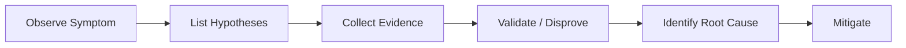
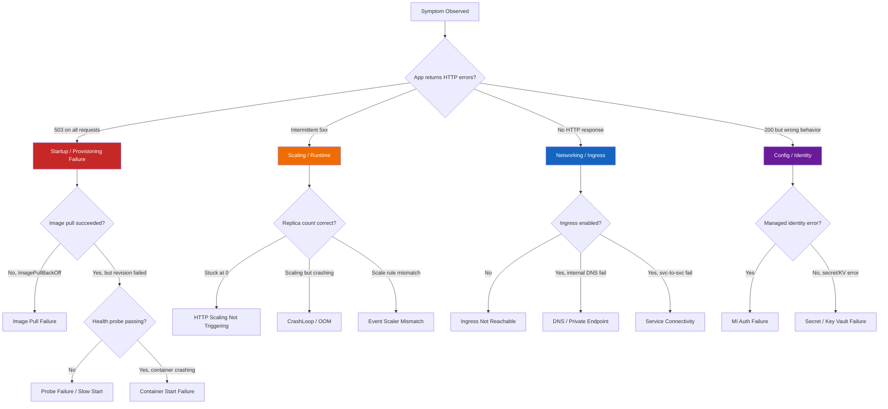

---
content_sources:
  diagrams:
    - id: how-it-works
      type: flowchart
      source: mslearn-adapted
      based_on:
        - https://learn.microsoft.com/azure/container-apps/
    - id: quick-decision-tree
      type: flowchart
      source: mslearn-adapted
      based_on:
        - https://learn.microsoft.com/azure/container-apps/
---

# Container Apps Troubleshooting

This section is a practical field guide for troubleshooting real-world issues on Azure Container Apps. Use it to quickly narrow symptoms, validate hypotheses, and apply targeted mitigation.

This is not a general tutorial. It is designed to help engineers move from symptom to validated interpretation faster during active incidents.

---

## What This Is

This is a hypothesis-driven troubleshooting guide built around repeatable incident patterns. Each playbook follows the same reasoning model so you can move from observation to root cause with less guesswork.

## How It Works

<!-- diagram-id: how-it-works -->

Every playbook uses this 6-step flow: observe symptoms, enumerate likely causes, gather targeted evidence, validate or disprove each hypothesis, isolate the root cause, then apply mitigation.

## Scope

| Included | Not Included |
| --- | --- |
| Commands, tables, snippets | Long conceptual explanations (see [Platform](../platform/index.md)) |
| Frequent incidents and fixes | End-to-end deployment tutorials (see [Language Guides](../language-guides/index.md)) |
| Runtime defaults and knobs | Operational guides (see [Operations](../operations/index.md)) |

## Start Here

| Your Situation | Go To |
|---|---|
| First incident, no idea where to start | [First 10 Minutes](first-10-minutes/index.md) |
| Need to identify the failure category | [Detector Map](methodology/detector-map.md) |
| Already know the symptom category | Jump to [Playbooks](#topics) below |
| Want a systematic diagnosis framework | [Methodology](methodology/index.md) |
| Need KQL queries to investigate | [KQL Query Library](kql/index.md) |
| Want hands-on practice | [Labs](#hands-on-labs) below |

## Triage Logic

When something goes wrong, ask these questions in order:

1. **Is the revision provisioned?** Check `az containerapp revision list`.
2. **Is the replica running?** Check `az containerapp replica list`.
3. **Is the health probe failing?** Check system logs in Log Analytics.
4. **Is the app crashing?** Check console logs via log stream or Log Analytics.

## Quick Decision Tree

<!-- diagram-id: quick-decision-tree -->

## Representative Log Patterns

| Pattern | Indicates | Playbook |
|---|---|---|
| `ImagePullBackOff` + `401 Unauthorized` | Registry auth failure | [Image Pull Failure](playbooks/startup-and-provisioning/image-pull-failure.md) |
| Revision stuck in `Provisioning` > 5 min | Resource or config error | [Revision Provisioning Failure](playbooks/startup-and-provisioning/revision-provisioning-failure.md) |
| `Replica X exited with code 1` in system logs | Container crash on startup | [Container Start Failure](playbooks/startup-and-provisioning/container-start-failure.md) |
| Startup probe failed, 0 console logs | Wrong entrypoint or port mismatch | [Probe Failure and Slow Start](playbooks/startup-and-provisioning/probe-failure-and-slow-start.md) |
| `ConnectionRefused` on internal FQDN | Service discovery or DNS issue | [Service-to-Service Connectivity](playbooks/ingress-and-networking/service-to-service-connectivity-failure.md) |
| Replica count stuck at 0, HTTP requests queuing | Scale rule not triggering | [HTTP Scaling Not Triggering](playbooks/scaling-and-runtime/http-scaling-not-triggering.md) |
| `OOMKilled` in system logs | Memory limit exceeded | [CrashLoop OOM and Resource Pressure](playbooks/scaling-and-runtime/crashloop-oom-and-resource-pressure.md) |
| `ManagedIdentityCredential` auth error | MI not assigned or wrong scope | [Managed Identity Auth Failure](playbooks/identity-and-configuration/managed-identity-auth-failure.md) |
| `SecretNotFound` or Key Vault 403 | Secret ref or RBAC misconfiguration | [Secret and Key Vault Reference Failure](playbooks/identity-and-configuration/secret-and-key-vault-reference-failure.md) |
| Dapr sidecar `connection refused` on :3500 | Dapr not enabled or component error | [Dapr Sidecar or Component Failure](playbooks/platform-features/dapr-sidecar-or-component-failure.md) |

## Topics

### Startup and Provisioning
- [Image Pull Failure](playbooks/startup-and-provisioning/image-pull-failure.md)
- [Revision Provisioning Failure](playbooks/startup-and-provisioning/revision-provisioning-failure.md)
- [Container Start Failure](playbooks/startup-and-provisioning/container-start-failure.md)
- [Probe Failure and Slow Start](playbooks/startup-and-provisioning/probe-failure-and-slow-start.md)

### Ingress and Networking
- [Ingress Not Reachable](playbooks/ingress-and-networking/ingress-not-reachable.md)
- [Internal DNS and Private Endpoint Failure](playbooks/ingress-and-networking/internal-dns-and-private-endpoint-failure.md)
- [Service-to-Service Connectivity Failure](playbooks/ingress-and-networking/service-to-service-connectivity-failure.md)

### Scaling and Runtime
- [HTTP Scaling Not Triggering](playbooks/scaling-and-runtime/http-scaling-not-triggering.md)
- [Event Scaler Mismatch](playbooks/scaling-and-runtime/event-scaler-mismatch.md)
- [CrashLoop OOM and Resource Pressure](playbooks/scaling-and-runtime/crashloop-oom-and-resource-pressure.md)

### Identity and Configuration
- [Managed Identity Auth Failure](playbooks/identity-and-configuration/managed-identity-auth-failure.md)
- [Secret and Key Vault Reference Failure](playbooks/identity-and-configuration/secret-and-key-vault-reference-failure.md)

### Platform Features
- [Dapr Sidecar or Component Failure](playbooks/platform-features/dapr-sidecar-or-component-failure.md)
- [Container App Job Execution Failure](playbooks/platform-features/container-app-job-execution-failure.md)
- [Bad Revision Rollout and Rollback](playbooks/platform-features/bad-revision-rollout-and-rollback.md)

## Quick Start

| Need | Start Here |
|------|-----------|
| First 10 minutes of any incident | [First 10 Minutes](first-10-minutes/index.md) |
| Reusable KQL queries | [KQL Query Library](kql/index.md) |
| Systematic diagnosis framework | [Methodology](methodology/index.md) |
| Symptom-to-playbook routing | [Detector Map](methodology/detector-map.md) |

## Hands-on Labs

Deploy reproduction environments and observe real symptoms:

- [ACR Pull Failure](lab-guides/acr-pull-failure.md)
- [Revision Failover](lab-guides/revision-failover.md)
- [Scale Rule Mismatch](lab-guides/scale-rule-mismatch.md)
- [Probe and Port Mismatch](lab-guides/probe-and-port-mismatch.md)
- [Managed Identity Key Vault Failure](lab-guides/managed-identity-key-vault-failure.md)
- [Revision Provisioning Failure](lab-guides/revision-provisioning-failure.md)
- [Ingress Target Port Mismatch](lab-guides/ingress-target-port-mismatch.md)
- [Traffic Routing Canary Failure](lab-guides/traffic-routing-canary.md)
- [Dapr Integration](lab-guides/dapr-integration.md)
- [Observability and Tracing](lab-guides/observability-tracing.md)

## Architecture and Methodology

- [Methodology](methodology/index.md) — Systematic root-cause workflow
- [Detector Map](methodology/detector-map.md) — Symptom-to-playbook routing tree and error-string mapping

## Incident Escalation and Routing Matrix

| Signal | Severity Hint | First Escalation Target | Immediate Containment |
|---|---|---|---|
| All requests fail with 5xx after rollout | High | App owner + platform on-call | Route traffic to last healthy revision |
| Region-wide ingress anomalies | Critical | Platform/SRE + cloud operations | Shift traffic or activate fallback path |
| Single endpoint fails with identity errors | Medium | App owner + security/identity | Validate role assignment and token scope |
| Scale-out not triggering under rising traffic | High | App owner + capacity/SRE | Temporarily raise min replicas and tune rules |

!!! note "Escalate by blast radius, not by stack layer"
    Start with user impact and affected scope first. Then route to the owning team while continuing evidence collection.

!!! tip "Preserve a timeline while troubleshooting"
    Capture timestamps for deployment, first failure, mitigation action, and recovery confirmation. A precise timeline accelerates post-incident reviews.

## See Also

- [Operations](../operations/index.md)
- [Troubleshooting Playbooks](playbooks/index.md)

## Sources

- [Azure Container Apps documentation (Microsoft Learn)](https://learn.microsoft.com/azure/container-apps/)
