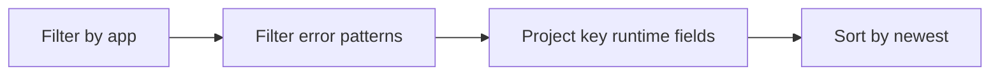

---
content_sources:
  diagrams:
    - id: query-pipeline
      type: flowchart
      source: mslearn-adapted
      based_on:
        - https://learn.microsoft.com/en-us/azure/container-apps/observability
        - https://learn.microsoft.com/en-us/azure/container-apps/log-monitoring
        - https://learn.microsoft.com/en-us/azure/container-apps/troubleshooting
content_validation:
  status: verified
  last_reviewed: "2026-04-12"
  reviewer: ai-agent
  core_claims:
    - claim: "Azure Container Apps can send application console logs to a Log Analytics workspace for querying."
      source: "https://learn.microsoft.com/azure/container-apps/logging"
      verified: true
    - claim: "Log Analytics uses Kusto Query Language to filter, summarize, and visualize collected log data."
      source: "https://learn.microsoft.com/azure/azure-monitor/logs/log-analytics-tutorial"
      verified: true
---

# Latest Errors and Exceptions

Use this query for quick inspection of recent application exceptions and error logs.

## Data Source

| Table | Schema Note |
|---|---|
| `ContainerAppConsoleLogs_CL` | Legacy schema. If empty, try `ContainerAppConsoleLogs` (non-`_CL`). |

## Query Pipeline

<!-- diagram-id: query-pipeline -->


## Query

```kusto
let AppName = "my-container-app";
ContainerAppConsoleLogs_CL
| where ContainerAppName_s == AppName
| where Log_s has_any ("error", "exception", "traceback", "failed")
| project TimeGenerated, RevisionName_s, Log_s
| order by TimeGenerated desc
```

## Example Output

| TimeGenerated | RevisionName_s | Log_s | Stream |
|---|---|---|---|
| 2026-04-12T05:59:05.795Z | ca-cakqltest-54kxmtjeuidri--nu8o2ji | 100.100.0.125 - - [12/Apr/2026:05:59:04 +0000] "GET /api/exceptions/test-error HTTP/1.1" 500 173 "-" "curl/8.5.0" | stdout |

## Interpretation Notes

- Capture the first exception after deployment for root-cause context.
- Compare error text across revisions to identify rollout regressions.
- Normal pattern: occasional warnings, not sustained exception streams.

## Limitations

- Requires app to emit logs to stdout/stderr.
- Large multi-line traces may be split across rows.

## See Also

- [Top Noisy Messages](top-noisy-messages.md)
- [Container Start Failure Playbook](../../playbooks/startup-and-provisioning/container-start-failure.md)
