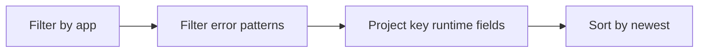

# Latest Errors and Exceptions

Use this query for quick inspection of recent application exceptions and error logs.

## Data Source

| Table | Schema Note |
|---|---|
| `ContainerAppConsoleLogs_CL` | Legacy schema. If empty, try `ContainerAppConsoleLogs` (non-`_CL`). |

## Query Pipeline



## Query

```kusto
let AppName = "my-container-app";
ContainerAppConsoleLogs_CL
| where ContainerAppName_s == AppName
| where Log_s has_any ("error", "exception", "traceback", "failed")
| project TimeGenerated, RevisionName_s, ReplicaName_s, Log_s
| order by TimeGenerated desc
```

## Interpretation Notes

- Capture the first exception after deployment for root-cause context.
- Compare error text across revisions to identify rollout regressions.
- Normal pattern: occasional warnings, not sustained exception streams.

## Limitations

- Requires app to emit logs to stdout/stderr.
- Large multi-line traces may be split across rows.

## See Also

- [Top Noisy Messages](top-noisy-messages.md)
- [Container Start Failure Playbook](../../playbooks/startup-and-provisioning/container-start-failure.md)
