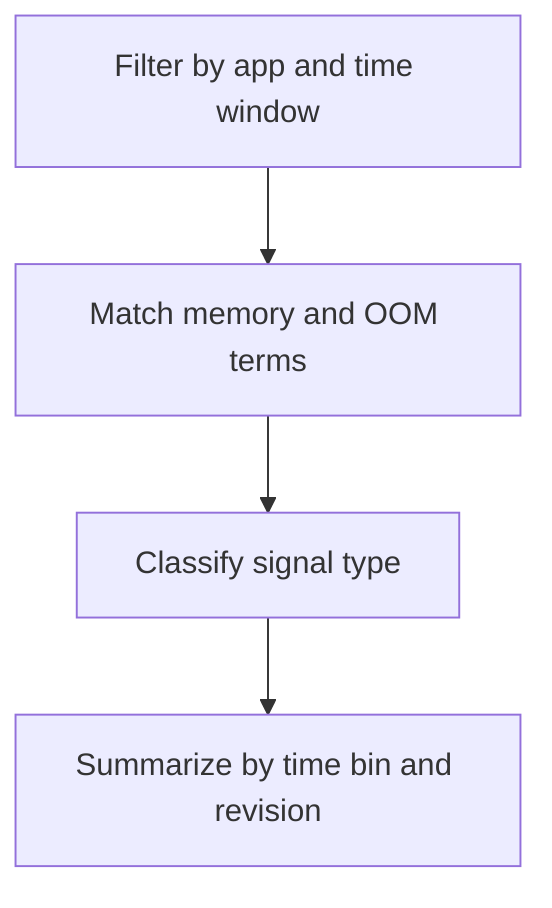

---
content_sources:
  diagrams:
    - id: query-pipeline
      type: flowchart
      source: mslearn-adapted
      based_on:
        - https://learn.microsoft.com/en-us/azure/container-apps/observability
        - https://learn.microsoft.com/en-us/azure/container-apps/troubleshooting
        - https://learn.microsoft.com/en-us/azure/azure-monitor/logs/log-analytics-tutorial
content_validation:
  status: verified
  last_reviewed: "2026-04-12"
  reviewer: ai-agent
  core_claims:
    - claim: "Azure Container Apps can send container console logs to a Log Analytics workspace for troubleshooting and analysis."
      source: "https://learn.microsoft.com/azure/container-apps/observability"
      verified: true
    - claim: "Log Analytics uses Kusto Query Language to filter, parse, and summarize collected log data."
      source: "https://learn.microsoft.com/azure/azure-monitor/logs/log-analytics-tutorial"
      verified: true
---

# Memory Usage Patterns

Use this query to spot memory pressure trends, allocation failures, and likely OOM indicators from application console output.

## Data Source

| Table | Schema Note |
|---|---|
| `ContainerAppConsoleLogs_CL` | Legacy schema. If empty, try `ContainerAppConsoleLogs` (non-`_CL`). |

## Query Pipeline

<!-- diagram-id: query-pipeline -->


## Query

```kusto
let AppName = "my-container-app";
let Window = 24h;
ContainerAppConsoleLogs_CL
| where ContainerAppName_s == AppName and TimeGenerated >= ago(Window)
| where Log_s has_any ("oom", "out of memory", "memoryerror", "heap out of memory", "cannot allocate memory", "memory limit")
| extend Signal = case(
    Log_s has_any ("oomkilled", "out of memory", "oom-kill", "killed process"), "OOM indicator",
    Log_s has_any ("heap out of memory", "memoryerror", "cannot allocate memory"), "Allocation failure",
    Log_s has_any ("memory limit", "high memory", "max_old_space_size"), "Memory pressure warning",
    "Other memory signal"
)
| summarize events=count(), sampleLog=take_any(Log_s) by bin(TimeGenerated, 15m), RevisionName_s, Stream_s, Signal
| order by TimeGenerated desc, events desc
```

## Example Output

| TimeGenerated | RevisionName_s | Stream_s | Signal | events | sampleLog |
|---|---|---|---|---:|---|
| 2026-04-04T11:45:00.000Z | ca-myapp--0000003 | stderr | OOM indicator | 4 | FATAL ERROR: Reached heap limit Allocation failed - JavaScript heap out of memory |
| 2026-04-04T11:30:00.000Z | ca-myapp--0000003 | stderr | Allocation failure | 2 | MemoryError: cannot allocate 67108864 bytes |
| 2026-04-04T11:15:00.000Z | ca-myapp--0000002 | stdout | Memory pressure warning | 6 | warning: process rss=472MiB approaching memory limit=512MiB |

## Interpretation Notes

- Repeated `Memory pressure warning` bins often appear before harder failures in later bins.
- `OOM indicator` on `stderr` usually means the process hit a hard limit or was terminated after exhausting memory.
- Normal pattern: occasional memory diagnostics, not sustained warning or OOM clusters.

## Limitations

- Depends on the application or runtime emitting memory-related text to stdout/stderr.
- This query infers memory issues from console messages and does not measure actual container memory metrics.

## See Also

- [Latest Errors and Exceptions](latest-errors-and-exceptions.md)
- [CrashLoop OOM and Resource Pressure Playbook](../../playbooks/scaling-and-runtime/crashloop-oom-and-resource-pressure.md)
