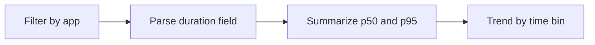

# Request Latency from Logs

Use this query when your app emits request duration values (for example `duration_ms=<number>`) and you need percentile trends.

## Data Source

| Table | Schema Note |
|---|---|
| `ContainerAppConsoleLogs_CL` | Legacy schema. If empty, try `ContainerAppConsoleLogs` (non-`_CL`). |

## Query Pipeline



## Query

```kusto
let AppName = "my-container-app";
ContainerAppConsoleLogs_CL
| where ContainerAppName_s == AppName
| where Log_s has "duration_ms="
| parse Log_s with * "duration_ms=" duration:long *
| summarize p50=percentile(duration, 50), p95=percentile(duration, 95), p99=percentile(duration, 99), max=max(duration) by bin(TimeGenerated, 5m), RevisionName_s
| order by TimeGenerated desc
```

## Interpretation Notes

- Rising `p95` with flat replica count suggests scaling constraints.
- Compare `p95` and `p99` to identify tail latency risk.
- Normal pattern: stable percentiles within SLO band.

## Limitations

- Depends on consistent log format.
- Parsing fails if duration string format changes.

## See Also

- [Scaling Events](../scaling-and-replicas/scaling-events.md)
- [HTTP Scaling Not Triggering Playbook](../../playbooks/scaling-and-runtime/http-scaling-not-triggering.md)
