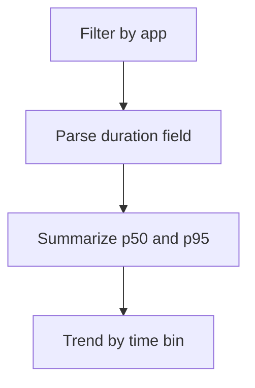

---
content_sources:
  diagrams:
    - id: query-pipeline
      type: flowchart
      source: mslearn-adapted
      based_on:
        - https://learn.microsoft.com/en-us/azure/container-apps/observability
        - https://learn.microsoft.com/en-us/azure/container-apps/log-monitoring
        - https://learn.microsoft.com/en-us/azure/container-apps/troubleshooting
content_validation:
  status: verified
  last_reviewed: "2026-04-12"
  reviewer: ai-agent
  core_claims:
    - claim: "Azure Container Apps can send application console logs to a Log Analytics workspace for querying."
      source: "https://learn.microsoft.com/azure/container-apps/logging"
      verified: true
    - claim: "Log Analytics uses Kusto Query Language to filter, summarize, and visualize collected log data."
      source: "https://learn.microsoft.com/azure/azure-monitor/logs/log-analytics-tutorial"
      verified: true
---

# Request Latency from Logs

Use this query when your app emits request duration values (for example `duration_ms=<number>`) and you need percentile trends.

## Data Source

| Table | Schema Note |
|---|---|
| `ContainerAppConsoleLogs_CL` | Legacy schema. If empty, try `ContainerAppConsoleLogs` (non-`_CL`). |

## Query Pipeline

<!-- diagram-id: query-pipeline -->


## Query

```kusto
let AppName = "my-container-app";
ContainerAppConsoleLogs_CL
| where ContainerAppName_s == AppName
| where Log_s has "duration_ms="
| parse Log_s with * "duration_ms=" duration:long *
| summarize p50=percentile(duration, 50), p95=percentile(duration, 95), p99=percentile(duration, 99), max=max(duration) by bin(TimeGenerated, 5m), RevisionName_s
| order by TimeGenerated desc
```

## Example Output

| TimeGenerated | RevisionName_s | p50 | p95 | p99 | max |
|---|---|---:|---:|---:|---:|
| 2026-04-04T11:40:00.000Z | ca-myapp--0000001 | 34 | 112 | 189 | 241 |
| 2026-04-04T11:35:00.000Z | ca-myapp--0000001 | 29 | 96 | 141 | 166 |
| 2026-04-04T11:30:00.000Z | ca-myapp--0000001 | 27 | 88 | 133 | 158 |

## Interpretation Notes

- Rising `p95` with flat replica count suggests scaling constraints.
- Compare `p95` and `p99` to identify tail latency risk.
- Normal pattern: stable percentiles within SLO band.

## Limitations

- Depends on consistent log format.
- Parsing fails if duration string format changes.

## See Also

- [Scaling Events](../scaling-and-replicas/scaling-events.md)
- [HTTP Scaling Not Triggering Playbook](../../playbooks/scaling-and-runtime/http-scaling-not-triggering.md)
