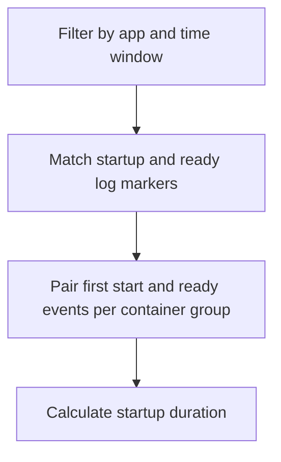

---
content_sources:
  diagrams:
    - id: query-pipeline
      type: flowchart
      source: mslearn-adapted
      based_on:
        - https://learn.microsoft.com/en-us/azure/container-apps/observability
        - https://learn.microsoft.com/en-us/azure/container-apps/troubleshooting
        - https://learn.microsoft.com/en-us/azure/azure-monitor/logs/log-analytics-tutorial
content_validation:
  status: verified
  last_reviewed: "2026-04-12"
  reviewer: ai-agent
  core_claims:
    - claim: "Azure Container Apps can send container console logs to a Log Analytics workspace for troubleshooting and analysis."
      source: "https://learn.microsoft.com/azure/container-apps/observability"
      verified: true
    - claim: "Log Analytics uses Kusto Query Language to filter, parse, and summarize collected log data."
      source: "https://learn.microsoft.com/azure/azure-monitor/logs/log-analytics-tutorial"
      verified: true
---

# Startup Duration Analysis

Use this query when the app emits both startup and ready messages and you need to estimate container startup duration by instance.

## Data Source

| Table | Schema Note |
|---|---|
| `ContainerAppConsoleLogs_CL` | Legacy schema. If empty, try `ContainerAppConsoleLogs` (non-`_CL`). |

## Query Pipeline

<!-- diagram-id: query-pipeline -->


## Query

```kusto
let AppName = "my-container-app";
let Window = 24h;
let Startup =
    ContainerAppConsoleLogs_CL
    | where ContainerAppName_s == AppName and TimeGenerated >= ago(Window)
    | where Log_s has_any ("Starting", "Booting", "Initializing", "Launching")
    | summarize arg_min(TimeGenerated, *) by RevisionName_s, ContainerGroupName_s, ContainerName_s
    | project RevisionName_s, ContainerGroupName_s, ContainerName_s, startupAt=TimeGenerated, startupLog=Log_s;
let Ready =
    ContainerAppConsoleLogs_CL
    | where ContainerAppName_s == AppName and TimeGenerated >= ago(Window)
    | where Log_s has_any ("Listening on", "Now listening on", "Ready to accept connections", "Application started", "Started Application")
    | summarize arg_min(TimeGenerated, *) by RevisionName_s, ContainerGroupName_s, ContainerName_s
    | project RevisionName_s, ContainerGroupName_s, ContainerName_s, readyAt=TimeGenerated, readyLog=Log_s, readyStream=Stream_s;
Startup
| join kind=inner Ready on RevisionName_s, ContainerGroupName_s, ContainerName_s
| where readyAt >= startupAt
| extend startupDurationSeconds=datetime_diff('second', readyAt, startupAt)
| project startupAt, readyAt, startupDurationSeconds, RevisionName_s, ContainerGroupName_s, ContainerName_s, readyStream, startupLog, readyLog
| order by startupDurationSeconds desc
```

## Example Output

| startupAt | readyAt | startupDurationSeconds | RevisionName_s | ContainerGroupName_s | ContainerName_s | readyStream | startupLog | readyLog |
|---|---|---:|---|---|---|---|---|---|
| 2026-04-04T11:34:08.111Z | 2026-04-04T11:34:57.402Z | 49 | ca-myapp--0000004 | ca-myapp--0000004-7c9d8f6df7-j4l2m | main | stdout | Starting gunicorn 25.3.0 | Listening on: http://0.0.0.0:8000 |
| 2026-04-04T11:20:14.005Z | 2026-04-04T11:20:38.188Z | 24 | ca-myapp--0000004 | ca-myapp--0000004-7c9d8f6df7-k9p6x | main | stdout | Initializing application services | Application started. Press Ctrl+C to shut down. |
| 2026-04-04T11:05:31.772Z | 2026-04-04T11:05:49.014Z | 18 | ca-myapp--0000003 | ca-myapp--0000003-5d7b4c88d8-n2q7r | main | stdout | Booting worker with pid: 12 | Ready to accept connections |

## Interpretation Notes

- Compare `startupDurationSeconds` across revisions to detect slower cold starts after a rollout.
- Long startup duration with no matching ready line usually points to missing readiness logs or failed initialization.
- Normal pattern: durations stay within a narrow band for the same image and startup path.

## Limitations

- Requires consistent application log markers for both startup and ready states.
- Measures app-level startup observed in console logs, not full platform provisioning time such as image pull or revision scheduling.

## See Also

- [Request Latency from Logs](request-latency-from-logs.md)
- [Revision Failures and Startup](../system-and-revisions/revision-failures-and-startup.md)
