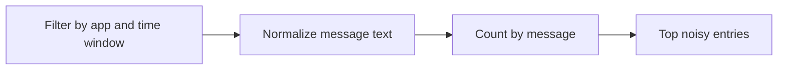

---
content_sources:
  diagrams:
    - id: query-pipeline
      type: flowchart
      source: mslearn-adapted
      based_on:
        - https://learn.microsoft.com/en-us/azure/container-apps/observability
        - https://learn.microsoft.com/en-us/azure/container-apps/log-monitoring
        - https://learn.microsoft.com/en-us/azure/container-apps/troubleshooting
content_validation:
  status: verified
  last_reviewed: "2026-04-12"
  reviewer: ai-agent
  core_claims:
    - claim: "Azure Container Apps can send application console logs to a Log Analytics workspace for querying."
      source: "https://learn.microsoft.com/azure/container-apps/logging"
      verified: true
    - claim: "Log Analytics uses Kusto Query Language to filter, summarize, and visualize collected log data."
      source: "https://learn.microsoft.com/azure/azure-monitor/logs/log-analytics-tutorial"
      verified: true
---

# Top Noisy Messages

Use this query to identify repetitive log lines that may indicate error storms or low-signal noise.

## Data Source

| Table | Schema Note |
|---|---|
| `ContainerAppConsoleLogs_CL` | Legacy schema. If empty, try `ContainerAppConsoleLogs` (non-`_CL`). |

## Query Pipeline

<!-- diagram-id: query-pipeline -->


## Query

```kusto
let AppName = "my-container-app";
let Window = 6h;
ContainerAppConsoleLogs_CL
| where ContainerAppName_s == AppName and TimeGenerated >= ago(Window)
| summarize occurrences=count() by Log_s
| top 20 by occurrences desc
```

## Example Output

| Log_s | occurrences |
|---|---:|
| [INFO] health probe OK path=/health status=200 | 128 |
| [WARN] retrying downstream call attempt=1 | 46 |
| [INFO] Starting gunicorn 25.3.0 | 12 |
| PORT=8000 | 12 |
| Workers=auto | 12 |

## Interpretation Notes

- High-frequency identical errors are good candidates for first remediation.
- Noise reduction improves on-call signal quality.
- Normal pattern: healthy mix of informational logs with low repetitive errors.

## Limitations

- Does not group semantically similar but text-different messages.
- Large dynamic fields can fragment counts.

## See Also

- [Latest Errors and Exceptions](latest-errors-and-exceptions.md)
- [Container Start Failure Playbook](../../playbooks/startup-and-provisioning/container-start-failure.md)
