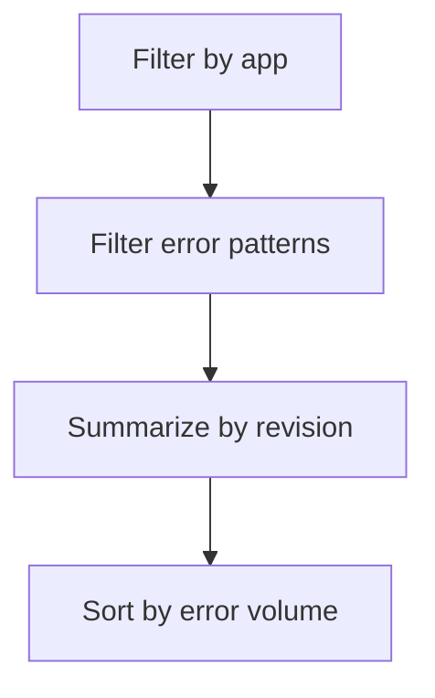

---
content_sources:
  diagrams:
    - id: query-pipeline
      type: flowchart
      source: mslearn-adapted
      based_on:
        - https://learn.microsoft.com/en-us/azure/container-apps/observability
        - https://learn.microsoft.com/en-us/azure/container-apps/revisions
        - https://learn.microsoft.com/en-us/azure/container-apps/troubleshooting
content_validation:
  status: verified
  last_reviewed: "2026-04-12"
  reviewer: ai-agent
  core_claims:
    - claim: "Azure Container Apps can send application console logs to a Log Analytics workspace for querying."
      source: "https://learn.microsoft.com/azure/container-apps/logging"
      verified: true
    - claim: "Log Analytics uses Kusto Query Language to filter, summarize, and visualize collected log data."
      source: "https://learn.microsoft.com/azure/azure-monitor/logs/log-analytics-tutorial"
      verified: true
---

# Errors by Revision

Use this query to compare error volume across revisions and detect rollout regressions.

## Data Source

| Table | Schema Note |
|---|---|
| `ContainerAppConsoleLogs_CL` | Legacy schema. If empty, try `ContainerAppConsoleLogs` (non-`_CL`). |

## Query Pipeline

<!-- diagram-id: query-pipeline -->


## Query

```kusto
let AppName = "my-container-app";
ContainerAppConsoleLogs_CL
| where ContainerAppName_s == AppName
| where Log_s has_any ("error", "exception", "traceback", "failed")
| summarize errors=count(), firstSeen=min(TimeGenerated), lastSeen=max(TimeGenerated) by RevisionName_s
| order by errors desc
```

## Example Output

| RevisionName_s | errors | firstSeen | lastSeen |
|---|---:|---|---|
| ca-myapp--0000002 | 18 | 2026-04-04T11:40:58.104Z | 2026-04-04T11:46:13.922Z |
| ca-myapp--0000001 | 2 | 2026-04-04T11:31:14.005Z | 2026-04-04T11:32:02.480Z |

## Interpretation Notes

- Sharp error concentration on latest revision is a rollback signal.
- Compare with traffic distribution before rollback decisions.
- Normal pattern: stable low error rates on active revisions.

## Limitations

- Requires consistent log level usage across versions.
- Does not include successful request baseline.

## See Also

- [Failed Requests App Insights](failed-requests-app-insights.md)
- [Bad Revision Rollout and Rollback Playbook](../../playbooks/platform-features/bad-revision-rollout-and-rollback.md)
