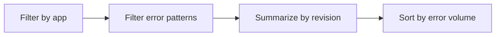

# Errors by Revision

Use this query to compare error volume across revisions and detect rollout regressions.

## Data Source

| Table | Schema Note |
|---|---|
| `ContainerAppConsoleLogs_CL` | Legacy schema. If empty, try `ContainerAppConsoleLogs` (non-`_CL`). |

## Query Pipeline



## Query

```kusto
let AppName = "my-container-app";
ContainerAppConsoleLogs_CL
| where ContainerAppName_s == AppName
| where Log_s has_any ("error", "exception", "traceback", "failed")
| summarize errors=count(), firstSeen=min(TimeGenerated), lastSeen=max(TimeGenerated) by RevisionName_s
| order by errors desc
```

## Interpretation Notes

- Sharp error concentration on latest revision is a rollback signal.
- Compare with traffic distribution before rollback decisions.
- Normal pattern: stable low error rates on active revisions.

## Limitations

- Requires consistent log level usage across versions.
- Does not include successful request baseline.

## See Also

- [Failed Requests App Insights](failed-requests-app-insights.md)
- [Bad Revision Rollout and Rollback Playbook](../../playbooks/platform-features/bad-revision-rollout-and-rollback.md)
