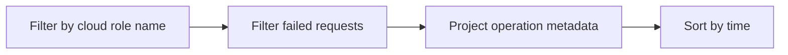

---
hide:
  - toc
---

# Failed Requests App Insights

Use this query in Application Insights (workspace-based) to inspect failed HTTP requests and operation context.

## Data Source

| Table | Schema Note |
|---|---|
| `requests` | App Insights table. Requires telemetry pipeline configured for the app. |

## Query Pipeline



## Query

```kusto
let AppName = "my-container-app";
requests
| where cloud_RoleName == AppName
| where success == false
| project timestamp, name, resultCode, duration, operation_Id
| order by timestamp desc
```

## Example Output

| timestamp | name | resultCode | duration | operation_Id |
|---|---|---|---|---|
| 2026-04-04T11:45:14.221Z | GET /api/items | 500 | 00:00:00.1820000 | 9f7a7d9d0bb84f0b |
| 2026-04-04T11:45:12.918Z | GET /health/dependency | 503 | 00:00:01.0040000 | f0e5946f613c4a49 |
| 2026-04-04T11:45:10.603Z | POST /api/orders | 504 | 00:00:02.0000000 | 4dbfc25be8c74999 |

## Interpretation Notes

- `operation_Id` links failed request to traces and exceptions.
- `resultCode` helps split ingress/proxy errors from app exceptions.
- Normal pattern: low failed-request ratio aligned with SLO.

## Limitations

- Requires App Insights instrumentation and sampling awareness.
- High sampling can hide low-frequency failures.

## See Also

- [Link Exceptions to Operations](link-exceptions-to-operations.md)
- [Ingress Not Reachable Playbook](../../playbooks/ingress-and-networking/ingress-not-reachable.md)
