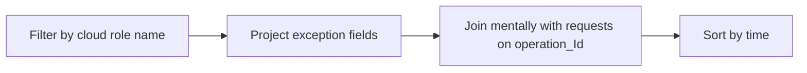

# Link Exceptions to Operations

Use this query to correlate exceptions to request operation IDs for end-to-end failure tracing.

## Data Source

| Table | Schema Note |
|---|---|
| `exceptions` | App Insights table. Requires telemetry pipeline configured for the app. |

## Query Pipeline



## Query

```kusto
let AppName = "my-container-app";
exceptions
| where cloud_RoleName == AppName
| project timestamp, type, outerMessage, operation_Id
| order by timestamp desc
```

## Interpretation Notes

- Match `operation_Id` with failed requests to find root exception per user call.
- Recurring `type` often indicates a single dominant fault class.
- Normal pattern: infrequent exceptions and rapid recovery.

## Limitations

- Exception telemetry volume can be sampling-limited.
- Does not include infrastructure-only failures without app telemetry.

## See Also

- [Failed Requests App Insights](failed-requests-app-insights.md)
- [Latest Errors and Exceptions](../console-and-runtime/latest-errors-and-exceptions.md)
