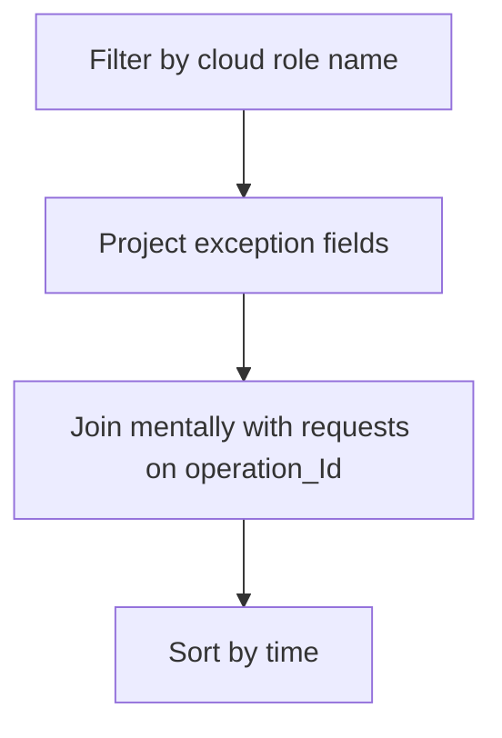

---
content_sources:
  diagrams:
  - id: query-pipeline
    type: flowchart
    source: mslearn-adapted
    based_on:
    - https://learn.microsoft.com/en-us/azure/container-apps/observability
    - https://learn.microsoft.com/en-us/azure/container-apps/log-monitoring
    - https://learn.microsoft.com/en-us/azure/container-apps/troubleshooting
content_validation:
  status: verified
  last_reviewed: '2026-04-12'
  reviewer: ai-agent
  core_claims:
  - claim: Azure Container Apps observability supports integration with Azure Monitor and Application Insights for telemetry
      analysis.
    source: https://learn.microsoft.com/azure/container-apps/observability
    verified: true
  - claim: Log Analytics uses Kusto Query Language to query and analyze collected telemetry data.
    source: https://learn.microsoft.com/en-us/azure/azure-monitor/logs/log-analytics-tutorial
    verified: true
---
# Link Exceptions to Operations

Use this query to correlate exceptions to request operation IDs for end-to-end failure tracing.

## Data Source

| Table | Schema Note |
|---|---|
| `exceptions` | App Insights table. Requires telemetry pipeline configured for the app. |

## Query Pipeline

<!-- diagram-id: query-pipeline -->


## Query

```kusto
let AppName = "my-container-app";
exceptions
| where cloud_RoleName == AppName
| project timestamp, type, outerMessage, operation_Id
| order by timestamp desc
```

## Example Output

| timestamp | type | outerMessage | operation_Id |
|---|---|---|---|
| 2026-04-04T11:45:14.219Z | RuntimeError | upstream dependency timeout | 9f7a7d9d0bb84f0b |
| 2026-04-04T11:45:12.917Z | PermissionError | token acquired but storage access denied (403) | f0e5946f613c4a49 |
| 2026-04-04T11:45:10.600Z | ConnectionError | connection refused by backend service | 4dbfc25be8c74999 |

## Interpretation Notes

- Match `operation_Id` with failed requests to find root exception per user call.
- Recurring `type` often indicates a single dominant fault class.
- Normal pattern: infrequent exceptions and rapid recovery.

## Limitations

- Exception telemetry volume can be sampling-limited.
- Does not include infrastructure-only failures without app telemetry.

## See Also

- [Failed Requests App Insights](failed-requests-app-insights.md)
- [Latest Errors and Exceptions](../console-and-runtime/latest-errors-and-exceptions.md)

## Sources

- [Microsoft Learn source 1](https://learn.microsoft.com/en-us/azure/container-apps/observability)
- [Microsoft Learn source 2](https://learn.microsoft.com/en-us/azure/container-apps/log-monitoring)
- [Microsoft Learn source 3](https://learn.microsoft.com/en-us/azure/container-apps/troubleshooting)
- [Microsoft Learn source 4](https://learn.microsoft.com/azure/container-apps/observability)
- [Microsoft Learn source 5](https://learn.microsoft.com/en-us/azure/azure-monitor/logs/log-analytics-tutorial)
