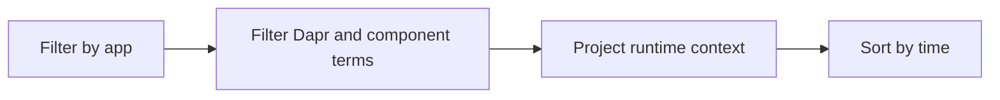

---
content_sources:
  diagrams:
    - id: query-pipeline
      type: flowchart
      source: mslearn-adapted
      based_on:
        - https://learn.microsoft.com/en-us/azure/container-apps/dapr-overview
        - https://learn.microsoft.com/en-us/azure/container-apps/observability
        - https://learn.microsoft.com/en-us/azure/container-apps/troubleshooting
content_validation:
  status: verified
  last_reviewed: "2026-04-12"
  reviewer: ai-agent
  core_claims:
    - claim: "Azure Container Apps can send application console logs to a Log Analytics workspace for querying."
      source: "https://learn.microsoft.com/azure/container-apps/logging"
      verified: true
    - claim: "Log Analytics uses Kusto Query Language to filter, summarize, and visualize collected log data."
      source: "https://learn.microsoft.com/azure/azure-monitor/logs/log-analytics-tutorial"
      verified: true
---

# Dapr Sidecar Logs

Use this query when Dapr sidecar startup, component loading, or invocation behaviors are failing.

## Data Source

| Table | Schema Note |
|---|---|
| `ContainerAppConsoleLogs_CL` | Legacy schema. If empty, try `ContainerAppConsoleLogs` (non-`_CL`). |

## Query Pipeline

<!-- diagram-id: query-pipeline -->


## Query

```kusto
let AppName = "my-container-app";
ContainerAppConsoleLogs_CL
| where ContainerAppName_s == AppName
| where Log_s has_any ("dapr", "sidecar", "component", "pubsub", "state", "invoke")
| project TimeGenerated, RevisionName_s, Log_s
| order by TimeGenerated desc
```

## Example Output

| TimeGenerated | RevisionName_s | Log_s |
|---|---|---|
| 2026-04-04T11:39:03.024Z | ca-myapp--0000001 | dapr sidecar started. app id=ca-myapp |
| 2026-04-04T11:39:03.410Z | ca-myapp--0000001 | component loaded: statestore (redis) |
| 2026-04-04T11:39:14.102Z | ca-myapp--0000001 | invoke error: target app not found |

## Interpretation Notes

- Component initialization errors usually include metadata or auth hints.
- Sidecar health failures often appear before app-level request failures.
- Normal pattern: startup logs then low-error steady-state operation.

## Limitations

- Requires Dapr logs to be routed into console log stream.
- May include app logs that mention `dapr` without sidecar failure.

## See Also

- [Job Execution History](job-execution-history.md)
- [Dapr Sidecar or Component Failure Playbook](../../playbooks/platform-features/dapr-sidecar-or-component-failure.md)
