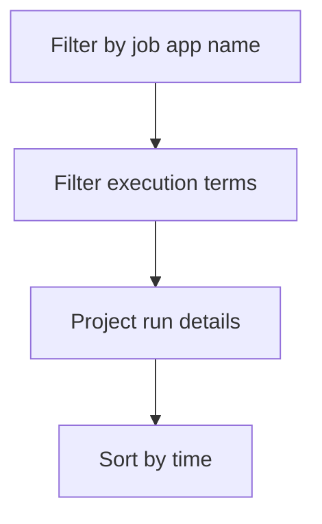

---
content_sources:
  diagrams:
    - id: query-pipeline
      type: flowchart
      source: mslearn-adapted
      based_on:
        - https://learn.microsoft.com/en-us/azure/container-apps/jobs
        - https://learn.microsoft.com/en-us/azure/container-apps/observability
        - https://learn.microsoft.com/en-us/azure/container-apps/troubleshooting
content_validation:
  status: verified
  last_reviewed: "2026-04-12"
  reviewer: ai-agent
  core_claims:
    - claim: "Azure Container Apps can send system logs that record platform events to a Log Analytics workspace."
      source: "https://learn.microsoft.com/azure/container-apps/logging"
      verified: true
    - claim: "Log Analytics uses Kusto Query Language to filter, summarize, and visualize collected log data."
      source: "https://learn.microsoft.com/azure/azure-monitor/logs/log-analytics-tutorial"
      verified: true
---

# Job Execution History

Use this query to review Container Apps Job execution events, failures, retries, and timeout patterns.

## Data Source

| Table | Schema Note |
|---|---|
| `ContainerAppSystemLogs_CL` | Legacy schema. If empty, try `ContainerAppSystemLogs` (non-`_CL`). |

## Query Pipeline

<!-- diagram-id: query-pipeline -->


## Query

```kusto
let JobName = "job-myapp";
ContainerAppSystemLogs_CL
| where JobName_s == JobName
| where Log_s has_any ("job", "execution", "retry", "timeout", "failed", "completed")
| project TimeGenerated, JobName_s, ExecutionName_s, Reason_s, Type_s, Log_s
| order by TimeGenerated desc
```

## Example Output

| TimeGenerated | JobName_s | ExecutionName_s | Reason_s | Type_s | Log_s |
|---|---|---|---|---|---|
| 2026-04-04T12:54:30.462Z | job-myapp | job-myapp-6gx2m | Completed | Normal | Execution has successfully completed |
| 2026-04-04T12:54:25.409Z | job-myapp | job-myapp-6gx2m | ContainerTerminated | Warning | Container terminated with exit code '0' |
| 2026-04-04T12:54:23.569Z | job-myapp | job-myapp-6gx2m | ContainerStarted | Normal | Started container 'job-container' |
| 2026-04-04T12:54:11.477Z | job-myapp | job-myapp-6gx2m | PulledImage | Normal | Successfully pulled image in 2.42s (58720256 bytes) |
| 2026-04-04T12:53:55.549Z | job-myapp | job-myapp-6gx2m | SuccessfulCreate | Normal | Successfully created pod for Job Execution |

## Interpretation Notes

- Group by time windows to identify retry storms.
- Repeated timeout entries indicate timeout policy misalignment.
- Normal pattern: predictable execution cadence and completion markers.

## Limitations

- Job detail depth can vary by trigger model.
- Execution IDs may need CLI retrieval for full drill-down.

## See Also

- [Scaling Events](../scaling-and-replicas/scaling-events.md)
- [Container App Job Execution Failure Playbook](../../playbooks/platform-features/container-app-job-execution-failure.md)
