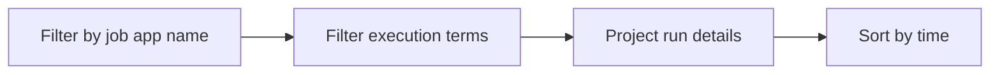

# Job Execution History

Use this query to review Container Apps Job execution events, failures, retries, and timeout patterns.

## Data Source

| Table | Schema Note |
|---|---|
| `ContainerAppSystemLogs_CL` | Legacy schema. If empty, try `ContainerAppSystemLogs` (non-`_CL`). |

## Query Pipeline



## Query

```kusto
let AppName = "my-container-job";
ContainerAppSystemLogs_CL
| where ContainerAppName_s == AppName
| where Log_s has_any ("job", "execution", "retry", "timeout", "failed", "completed")
| project TimeGenerated, RevisionName_s, Reason_s, Log_s
| order by TimeGenerated desc
```

## Interpretation Notes

- Group by time windows to identify retry storms.
- Repeated timeout entries indicate timeout policy misalignment.
- Normal pattern: predictable execution cadence and completion markers.

## Limitations

- Job detail depth can vary by trigger model.
- Execution IDs may need CLI retrieval for full drill-down.

## See Also

- [Scaling Events](../scaling-and-replicas/scaling-events.md)
- [Container App Job Execution Failure Playbook](../../playbooks/platform-features/container-app-job-execution-failure.md)
