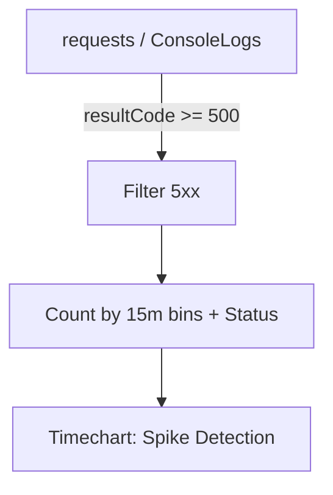

---
content_sources:
  diagrams:
    - id: purpose-tracks-5xx-volume-over-time
      type: flowchart
      source: mslearn-adapted
      based_on:
        - https://learn.microsoft.com/azure/container-apps/opentelemetry-agents
        - https://learn.microsoft.com/azure/container-apps/log-monitoring
        - https://learn.microsoft.com/kusto/query/
content_validation:
  status: verified
  last_reviewed: "2026-04-12"
  reviewer: ai-agent
  core_claims:
    - claim: "Azure Container Apps observability supports integration with Azure Monitor and Application Insights for telemetry analysis."
      source: "https://learn.microsoft.com/azure/container-apps/observability"
      verified: true
    - claim: "Log Analytics uses Kusto Query Language to query and analyze collected telemetry data."
      source: "https://learn.microsoft.com/azure/azure-monitor/logs/log-analytics-tutorial"
      verified: true
---

# 5xx Trend Over Time

**Scenario**: Intermittent or sustained server-side errors reported by customers or monitoring alerts.
**Data Source**: Application Insights `requests` table or `ContainerAppConsoleLogs_CL`
**Purpose**: Tracks 5xx volume over time and separates by status code to detect spikes and dominant failure types.

<!-- diagram-id: purpose-tracks-5xx-volume-over-time -->


## Query (Application Insights)

```kusto
requests
| where timestamp > ago(24h)
| where toint(resultCode) >= 500
| summarize Count=count() by bin(timestamp, 15m), resultCode
| render timechart
```

## Alternative: Console Log Pattern Matching

If Application Insights is not configured, extract 5xx from structured logs:

```kusto
let AppName = "my-container-app";
ContainerAppConsoleLogs_CL
| where ContainerAppName_s == AppName
| where TimeGenerated > ago(24h)
| where Log_s has_any ("500", "501", "502", "503", "504")
| extend StatusCode = extract(@"status[=:]\s*(\d{3})", 1, Log_s)
| where StatusCode in ("500", "501", "502", "503", "504")
| summarize Count=count() by bin(TimeGenerated, 15m), StatusCode
| render timechart
```

## Ingress-Level 5xx Detection

For ingress/gateway errors (502, 503, 504), use system logs:

```kusto
let AppName = "my-container-app";
ContainerAppSystemLogs_CL
| where ContainerAppName_s == AppName
| where TimeGenerated > ago(24h)
| where Log_s has_any ("502", "503", "504", "upstream", "gateway")
| summarize Count=count() by bin(TimeGenerated, 15m), Reason_s
| render timechart
```

## Example Output

| timestamp | resultCode | Count |
|---|---|---:|
| 2026-04-04T10:00:00Z | 500 | 12 |
| 2026-04-04T10:00:00Z | 502 | 5 |
| 2026-04-04T10:15:00Z | 500 | 8 |
| 2026-04-04T10:15:00Z | 503 | 23 |
| 2026-04-04T10:30:00Z | 500 | 45 |
| 2026-04-04T10:30:00Z | 502 | 67 |

## Interpretation Notes

- **Normal**: Low baseline 5xx with occasional isolated blips (< 1% of total requests).
- **Abnormal**: Sustained or bursty 5xx clusters, especially if one status code dominates.
- **502/504 spikes**: Often indicate backend unhealthy (probe failures, cold start, or resource exhaustion).
- **503 spikes**: May indicate throttling or revision not ready.
- **Reading tip**: Align spikes with deployments, scaling events, and dependency incidents.

## Status Code Reference

| Code | Common Cause in Container Apps |
|---|---|
| 500 | Application exception or unhandled error |
| 502 | Bad Gateway - backend pod unhealthy or not responding |
| 503 | Service Unavailable - no healthy replicas or throttling |
| 504 | Gateway Timeout - backend response exceeded timeout |

## Limitations

- Data freshness may lag 2-5 minutes depending on ingestion.
- In low-volume apps, a small number of errors can appear as large percentage impact.
- This query cannot determine whether the error originated in app code, platform, or downstream dependency.
- Console log parsing depends on application log format consistency.

## See Also

- [HTTP Query Pack](index.md)
- [Latency Trend by Status Code](latency-trend-by-status-code.md)
- [Ingress Error Analysis](../ingress-and-networking/ingress-error-analysis.md)
- [KQL Query Catalog](../index.md)

## Sources

- [Application Insights for Container Apps](https://learn.microsoft.com/azure/container-apps/opentelemetry-agents)
- [Log monitoring in Azure Container Apps](https://learn.microsoft.com/azure/container-apps/log-monitoring)
- [Kusto Query Language (KQL) overview](https://learn.microsoft.com/kusto/query/)
