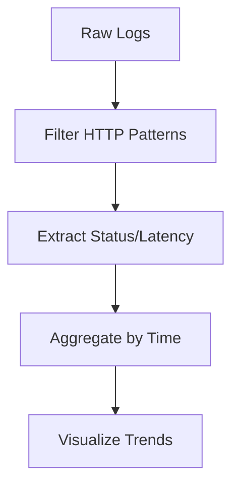

---
content_sources:
  diagrams:
    - id: query-pipeline-overview
      type: flowchart
      source: mslearn-adapted
      based_on:
        - https://learn.microsoft.com/azure/container-apps/log-monitoring
        - https://learn.microsoft.com/azure/container-apps/opentelemetry-agents
        - https://learn.microsoft.com/kusto/query/
---

# HTTP Query Pack

HTTP request analysis queries for Azure Container Apps. Use these to investigate latency, error rates, and request patterns.

## Data Sources

| Table | Description |
|---|---|
| `ContainerAppConsoleLogs_CL` | Application logs including HTTP request details |
| `requests` | Application Insights request telemetry (if configured) |
| `dependencies` | Application Insights dependency calls |

!!! note "Schema Variation"
    If `_CL` tables are empty, try the non-`_CL` variants (`ContainerAppConsoleLogs`).

## Query Pipeline Overview

<!-- diagram-id: query-pipeline-overview -->

## Available Queries

| Query | Purpose |
|---|---|
| [Latency Trend by Status Code](latency-trend-by-status-code.md) | P50/P95/P99 latency split by HTTP status |
| [5xx Trend Over Time](5xx-trend-over-time.md) | Server error volume and spike detection |
| [Slowest Requests by Path](slowest-requests-by-path.md) | Identify slow endpoints |

## When to Use

- Performance degradation reported by users
- Intermittent 5xx errors in monitoring alerts
- Latency SLA breaches
- Post-incident analysis of HTTP behavior

## See Also

- [KQL Query Catalog](../index.md)
- [Ingress Error Analysis](../ingress-and-networking/ingress-error-analysis.md)
- [Ingress Not Reachable Playbook](../../playbooks/ingress-and-networking/ingress-not-reachable.md)

## Sources

- [Log monitoring in Azure Container Apps](https://learn.microsoft.com/azure/container-apps/log-monitoring)
- [Application Insights for Container Apps](https://learn.microsoft.com/azure/container-apps/opentelemetry-agents)
- [Kusto Query Language (KQL) overview](https://learn.microsoft.com/kusto/query/)
