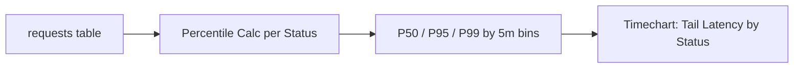

# Latency Trend by Status Code

**Scenario**: Performance degradation where you need to distinguish normal successful traffic from failing traffic latency.
**Data Source**: Application Insights `requests` table (requires OpenTelemetry or App Insights SDK)
**Purpose**: Shows P50/P95/P99 latency trends split by HTTP status code to identify whether specific status groups are driving tail latency.



## Query

```kusto
requests
| where timestamp > ago(1h)
| extend StatusBucket = case(
    resultCode startswith "2", "2xx",
    resultCode startswith "3", "3xx",
    resultCode startswith "4", "4xx",
    resultCode startswith "5", "5xx",
    "Other")
| summarize 
    P50=percentile(duration, 50), 
    P95=percentile(duration, 95), 
    P99=percentile(duration, 99), 
    Count=count() 
    by bin(timestamp, 5m), StatusBucket
| render timechart
```

## Alternative: Console Log Pattern Matching

If Application Insights is not configured, extract latency from structured console logs:

```kusto
let AppName = "my-container-app";
ContainerAppConsoleLogs_CL
| where ContainerAppName_s == AppName
| where TimeGenerated > ago(1h)
| where Log_s has "status=" and Log_s has "duration="
| extend StatusCode = extract(@"status=(\d+)", 1, Log_s)
| extend DurationMs = todouble(extract(@"duration=(\d+\.?\d*)", 1, Log_s))
| where isnotempty(StatusCode) and isnotnull(DurationMs)
| extend StatusBucket = case(
    StatusCode startswith "2", "2xx",
    StatusCode startswith "4", "4xx",
    StatusCode startswith "5", "5xx",
    "Other")
| summarize 
    P50=percentile(DurationMs, 50), 
    P95=percentile(DurationMs, 95), 
    P99=percentile(DurationMs, 99),
    Count=count() 
    by bin(TimeGenerated, 5m), StatusBucket
| render timechart
```

## Example Output

| timestamp | StatusBucket | P50 | P95 | P99 | Count |
|---|---|---:|---:|---:|---:|
| 2026-04-04T10:00:00Z | 2xx | 45 | 120 | 350 | 1523 |
| 2026-04-04T10:00:00Z | 5xx | 2100 | 4500 | 8200 | 47 |
| 2026-04-04T10:05:00Z | 2xx | 48 | 125 | 380 | 1489 |
| 2026-04-04T10:05:00Z | 5xx | 2300 | 5100 | 9500 | 52 |

## Interpretation Notes

- **Normal**: P95/P99 remain relatively stable and do not diverge sharply from P50 for dominant status codes.
- **Abnormal**: Large P95/P99 spikes concentrated in 5xx indicate error-path slowness, retries, or timeouts.
- **Reading tip**: Compare high-volume status codes first; low-count status groups can look noisy due to small sample sizes.

## Limitations

- Requires Application Insights integration or structured logging with status/duration fields.
- Console log parsing depends on your application's log format.
- Data freshness depends on telemetry ingestion latency (typically 2-5 minutes).
- Low-traffic periods can distort percentiles due to small sample sizes.

## See Also

- [HTTP Query Pack](index.md)
- [5xx Trend Over Time](5xx-trend-over-time.md)
- [Slowest Requests by Path](slowest-requests-by-path.md)
- [KQL Query Catalog](../index.md)

## Sources

- [Application Insights for Container Apps](https://learn.microsoft.com/azure/container-apps/opentelemetry-agents)
- [Log monitoring in Azure Container Apps](https://learn.microsoft.com/azure/container-apps/log-monitoring)
- [Kusto Query Language (KQL) overview](https://learn.microsoft.com/kusto/query/)
