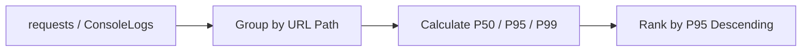

---
hide:
  - toc
content_sources:
  diagrams:
    - id: purpose-ranks-request-paths-by-p95
      type: flowchart
      source: mslearn-adapted
      based_on:
        - https://learn.microsoft.com/azure/container-apps/opentelemetry-agents
        - https://learn.microsoft.com/azure/container-apps/log-monitoring
        - https://learn.microsoft.com/kusto/query/
content_validation:
  status: verified
  last_reviewed: "2026-04-12"
  reviewer: ai-agent
  core_claims:
    - claim: "Azure Container Apps observability supports integration with Azure Monitor and Application Insights for telemetry analysis."
      source: "https://learn.microsoft.com/azure/container-apps/observability"
      verified: true
    - claim: "Log Analytics uses Kusto Query Language to query and analyze collected telemetry data."
      source: "https://learn.microsoft.com/azure/azure-monitor/logs/log-analytics-tutorial"
      verified: true
---

# Slowest Requests by Path

**Scenario**: Need to identify which API endpoints or pages are causing the worst user experience.
**Data Source**: Application Insights `requests` table or `ContainerAppConsoleLogs_CL`
**Purpose**: Ranks request paths by P95 latency to pinpoint slow endpoints for optimization.

<!-- diagram-id: purpose-ranks-request-paths-by-p95 -->


## Query (Application Insights)

```kusto
requests
| where timestamp > ago(1h)
| where success == true or toint(resultCode) < 500
| extend UrlPath = tostring(parse_url(url).Path)
| summarize 
    P50=percentile(duration, 50),
    P95=percentile(duration, 95),
    P99=percentile(duration, 99),
    Count=count()
    by UrlPath
| where Count > 10
| order by P95 desc
| take 20
```

## Alternative: Console Log Pattern Matching

If Application Insights is not configured:

```kusto
let AppName = "my-container-app";
ContainerAppConsoleLogs_CL
| where ContainerAppName_s == AppName
| where TimeGenerated > ago(1h)
| where Log_s has "GET" or Log_s has "POST" or Log_s has "PUT" or Log_s has "DELETE"
| extend UrlPath = extract(@"(GET|POST|PUT|DELETE)\s+(/[^\s\?]*)", 2, Log_s)
| extend DurationMs = todouble(extract(@"duration[=:]\s*(\d+\.?\d*)", 1, Log_s))
| where isnotempty(UrlPath) and isnotnull(DurationMs)
| summarize 
    P50=percentile(DurationMs, 50),
    P95=percentile(DurationMs, 95),
    P99=percentile(DurationMs, 99),
    Count=count()
    by UrlPath
| where Count > 10
| order by P95 desc
| take 20
```

## Example Output

| UrlPath | P50 | P95 | P99 | Count |
|---|---:|---:|---:|---:|
| /api/reports/generate | 1200 | 8500 | 15000 | 234 |
| /api/search | 450 | 2800 | 5200 | 1523 |
| /api/users/sync | 800 | 2100 | 4800 | 89 |
| /api/orders | 120 | 450 | 890 | 4521 |
| /health | 5 | 15 | 45 | 8934 |

## Interpretation Notes

- **Focus on P95/P99**: These represent the worst user experiences that affect perceived performance.
- **High P95 with low count**: May indicate specific edge cases or data-dependent slowness.
- **High P95 with high count**: Priority optimization target - affects many users.
- **Compare P50 vs P95 gap**: Large gaps suggest inconsistent performance (caching, cold paths, or resource contention).

## Common Slow Endpoint Patterns

| Pattern | Likely Cause |
|---|---|
| `/api/reports/*` | Complex queries, large data aggregation |
| `/api/search` | Unindexed queries, full-text search |
| `/api/*/sync` | External API calls, blocking I/O |
| `/api/upload` | Large payload processing |
| First request after idle | Cold start, connection pool warm-up |

## Limitations

- URL path extraction depends on log format and may miss query parameters.
- Minimum count threshold (10) filters out rarely-used endpoints.
- Does not distinguish between user-caused slowness (large payloads) and system issues.
- Application Insights sampling may undercount high-volume paths.

## See Also

- [HTTP Query Pack](index.md)
- [Latency Trend by Status Code](latency-trend-by-status-code.md)
- [Request Latency from Logs](../console-and-runtime/request-latency-from-logs.md)
- [KQL Query Catalog](../index.md)

## Sources

- [Application Insights for Container Apps](https://learn.microsoft.com/azure/container-apps/opentelemetry-agents)
- [Log monitoring in Azure Container Apps](https://learn.microsoft.com/azure/container-apps/log-monitoring)
- [Kusto Query Language (KQL) overview](https://learn.microsoft.com/kusto/query/)
