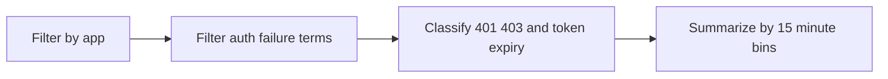

---
content_sources:
  diagrams:
    - id: query-pipeline
      type: flowchart
      source: mslearn-adapted
      based_on:
        - https://learn.microsoft.com/azure/container-apps/managed-identity
        - https://learn.microsoft.com/azure/container-apps/manage-secrets
        - https://learn.microsoft.com/azure/container-apps/troubleshooting
content_validation:
  status: verified
  last_reviewed: "2026-04-12"
  reviewer: ai-agent
  core_claims:
    - claim: "Azure Container Apps can send application console logs to a Log Analytics workspace for querying."
      source: "https://learn.microsoft.com/azure/container-apps/logging"
      verified: true
    - claim: "Log Analytics uses Kusto Query Language to filter, summarize, and visualize collected log data."
      source: "https://learn.microsoft.com/azure/azure-monitor/logs/log-analytics-tutorial"
      verified: true
---

# Authentication Failure Timeline

Use this query to track authentication failures over time and spot recurring 401/403 or token expiry patterns.

## Data Source

| Table | Schema Note |
|---|---|
| `ContainerAppConsoleLogs_CL` | Legacy schema. If empty, try `ContainerAppConsoleLogs` (non-`_CL`). |

## Query Pipeline

<!-- diagram-id: query-pipeline -->


## Query

```kusto
let AppName = "my-container-app";
ContainerAppConsoleLogs_CL
| where ContainerAppName_s == AppName
| where Log_s has_any ("401", "403", "Unauthorized", "Forbidden", "token expired", "expired token", "invalid_token")
| extend FailureType = case(
    Log_s has_any ("token expired", "expired token", "invalid_token"), "TokenExpiry",
    Log_s has_any ("403", "Forbidden"), "Forbidden403",
    Log_s has_any ("401", "Unauthorized"), "Unauthorized401",
    "OtherAuthFailure")
| summarize FailureCount = count() by bin(TimeGenerated, 15m), FailureType
| order by TimeGenerated asc
```

## Example Output

| TimeGenerated | FailureType | FailureCount |
|---|---|---|
| 2026-04-04T12:00:00.000Z | Unauthorized401 | 7 |
| 2026-04-04T12:15:00.000Z | TokenExpiry | 3 |
| 2026-04-04T12:30:00.000Z | Forbidden403 | 11 |

## Interpretation Notes

- A spike in `Unauthorized401` often indicates missing or rejected bearer tokens at the application layer.
- `TokenExpiry` clusters usually suggest refresh failures, clock skew, or tokens cached past expiration.
- Persistent `Forbidden403` after successful token acquisition often points to RBAC or downstream resource permission issues.

## Limitations

- Requires the application or SDK to emit auth-related status codes or token expiry messages into console logs.
- This timeline shows failure patterns, but not the exact upstream identity provider or missing permission.

## See Also

- [Managed Identity Token Errors](managed-identity-token-errors.md)
- [Managed Identity Auth Failure Playbook](../../playbooks/identity-and-configuration/managed-identity-auth-failure.md)
