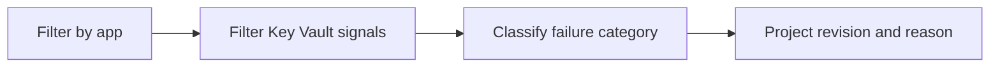

---
content_sources:
  diagrams:
    - id: query-pipeline
      type: flowchart
      source: mslearn-adapted
      based_on:
        - https://learn.microsoft.com/azure/container-apps/managed-identity
        - https://learn.microsoft.com/azure/container-apps/manage-secrets
        - https://learn.microsoft.com/azure/container-apps/troubleshooting
content_validation:
  status: verified
  last_reviewed: "2026-04-12"
  reviewer: ai-agent
  core_claims:
    - claim: "Azure Container Apps can send system logs that record platform events to a Log Analytics workspace."
      source: "https://learn.microsoft.com/azure/container-apps/logging"
      verified: true
    - claim: "Log Analytics uses Kusto Query Language to filter, summarize, and visualize collected log data."
      source: "https://learn.microsoft.com/azure/azure-monitor/logs/log-analytics-tutorial"
      verified: true
---

# Key Vault Access Errors

Use this query to analyze Key Vault secret reference resolution failures and separate access denied, missing secret, and connectivity-related signals.

## Data Source

| Table | Schema Note |
|---|---|
| `ContainerAppSystemLogs_CL` | Legacy schema. If empty, try `ContainerAppSystemLogs` (non-`_CL`). |

## Query Pipeline

<!-- diagram-id: query-pipeline -->


## Query

```kusto
let AppName = "my-container-app";
ContainerAppSystemLogs_CL
| where ContainerAppName_s == AppName
| where Log_s has_any ("KeyVault", "key vault", "vault.azure.net", "secretUri", "SecretUri")
| where Log_s has_any ("denied", "forbidden", "unauthorized", "not found", "timeout", "resolve", "resolution failed")
| extend FailureCategory = case(
    Log_s has_any ("denied", "forbidden", "unauthorized"), "AccessDenied",
    Log_s has_any ("not found"), "SecretNotFound",
    Log_s has_any ("timeout"), "ConnectivityOrTimeout",
    "ResolutionFailure")
| project TimeGenerated, RevisionName_s, Reason_s, FailureCategory, Log_s
| order by TimeGenerated desc
```

## Example Output

| TimeGenerated | RevisionName_s | Reason_s | FailureCategory | Log_s |
|---|---|---|---|---|
| 2026-04-04T11:50:06.302Z | ca-myapp--0000003 | RevisionUpdate | AccessDenied | KeyVault reference resolution failed for secretUri 'https://demo-kv.vault.azure.net/secrets/storage-conn': access denied |
| 2026-04-04T11:50:06.111Z | ca-myapp--0000003 | RevisionUpdate | SecretNotFound | Unable to resolve KeyVault secret reference: secret not found in vault |
| 2026-04-04T11:49:58.820Z | ca-myapp--0000003 | ContainerAppUpdate | ConnectivityOrTimeout | KeyVault secretUri lookup timed out during revision activation |

## Interpretation Notes

- `AccessDenied` usually means the app identity can reach Key Vault but lacks the required secret read permission.
- `SecretNotFound` indicates the URI or secret version is wrong, deleted, or unavailable in the target vault.
- `ConnectivityOrTimeout` suggests a network, DNS, firewall, or transient platform access problem during secret resolution.

## Limitations

- Platform log wording can change, so some failures may require adjusting filter terms.
- This query isolates Key Vault resolution symptoms but should be paired with identity and vault configuration checks.

## See Also

- [Secret Reference Failures](secret-reference-failures.md)
- [Secret and Key Vault Reference Failure Playbook](../../playbooks/identity-and-configuration/secret-and-key-vault-reference-failure.md)
