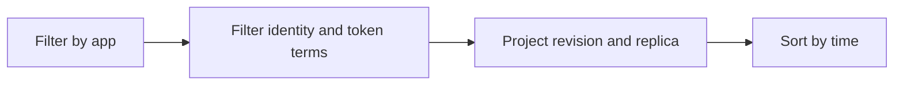

---
hide:
  - toc
content_sources:
  diagrams:
    - id: query-pipeline
      type: flowchart
      source: mslearn-adapted
      based_on:
        - https://learn.microsoft.com/en-us/azure/container-apps/managed-identity
        - https://learn.microsoft.com/en-us/azure/container-apps/troubleshooting
        - https://learn.microsoft.com/en-us/azure/container-apps/observability
content_validation:
  status: verified
  last_reviewed: "2026-04-12"
  reviewer: ai-agent
  core_claims:
    - claim: "Azure Container Apps can send application console logs to a Log Analytics workspace for querying."
      source: "https://learn.microsoft.com/azure/container-apps/logging"
      verified: true
    - claim: "Log Analytics uses Kusto Query Language to filter, summarize, and visualize collected log data."
      source: "https://learn.microsoft.com/azure/azure-monitor/logs/log-analytics-tutorial"
      verified: true
---

# Managed Identity Token Errors

Use this query to detect token acquisition and authorization failures related to managed identity usage.

## Data Source

| Table | Schema Note |
|---|---|
| `ContainerAppConsoleLogs_CL` | Legacy schema. If empty, try `ContainerAppConsoleLogs` (non-`_CL`). |

## Query Pipeline

<!-- diagram-id: query-pipeline -->


## Query

```kusto
let AppName = "my-container-app";
ContainerAppConsoleLogs_CL
| where ContainerAppName_s == AppName
| where Log_s has_any ("ManagedIdentityCredential", "token", "CredentialUnavailable", "403", "401", "Forbidden")
| project TimeGenerated, RevisionName_s, Log_s
| order by TimeGenerated desc
```

## Example Output

| TimeGenerated | RevisionName_s | Log_s |
|---|---|---|
| 2026-04-04T12:54:24.880Z | ca-myapp--0000001 | {"timestamp":"...","level":"INFO","message":"DefaultAzureCredential acquired a token from ManagedIdentityCredential"} |
| 2026-04-04T12:54:24.880Z | ca-myapp--0000001 | {"timestamp":"...","level":"ERROR","message":"Blob read failed with 403 Forbidden"} |
| 2026-04-04T12:54:24.880Z | ca-myapp--0000001 | {"timestamp":"...","level":"ERROR","message":"CredentialUnavailable: Managed identity endpoint unavailable"} |

## Interpretation Notes

- `CredentialUnavailable` suggests identity endpoint/config issue.
- `403` with token success usually means RBAC scope mismatch.
- Normal pattern: low noise token logs and no persistent auth errors.

## Limitations

- Requires app SDK logs to include identity details.
- Cannot alone determine exact missing role assignment.

## See Also

- [Secret Reference Failures](secret-reference-failures.md)
- [Managed Identity Auth Failure Playbook](../../playbooks/identity-and-configuration/managed-identity-auth-failure.md)
