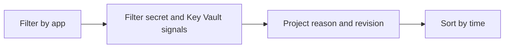

---
hide:
  - toc
content_sources:
  diagrams:
    - id: query-pipeline
      type: flowchart
      source: mslearn-adapted
      based_on:
        - https://learn.microsoft.com/en-us/azure/container-apps/manage-secrets
        - https://learn.microsoft.com/en-us/azure/container-apps/troubleshooting
        - https://learn.microsoft.com/en-us/azure/container-apps/managed-identity
content_validation:
  status: verified
  last_reviewed: "2026-04-12"
  reviewer: ai-agent
  core_claims:
    - claim: "Azure Container Apps can send system logs that record platform events to a Log Analytics workspace."
      source: "https://learn.microsoft.com/azure/container-apps/logging"
      verified: true
    - claim: "Log Analytics uses Kusto Query Language to filter, summarize, and visualize collected log data."
      source: "https://learn.microsoft.com/azure/azure-monitor/logs/log-analytics-tutorial"
      verified: true
---

# Secret Reference Failures

Use this query to identify failures caused by missing secrets, invalid secret references, or Key Vault access problems.

## Data Source

| Table | Schema Note |
|---|---|
| `ContainerAppSystemLogs_CL` | Legacy schema. If empty, try `ContainerAppSystemLogs` (non-`_CL`). |

## Query Pipeline

<!-- diagram-id: query-pipeline -->


## Query

```kusto
let AppName = "my-container-app";
ContainerAppSystemLogs_CL
| where ContainerAppName_s == AppName
| where Log_s has_any ("secret", "secretRef", "KeyVault", "vault", "denied", "reference")
| project TimeGenerated, RevisionName_s, Reason_s, Log_s
| order by TimeGenerated desc
```

## Example Output

| TimeGenerated | RevisionName_s | Reason_s | Log_s |
|---|---|---|---|
| 2026-04-04T11:50:06.302Z | ca-myapp--0000003 | RevisionUpdate | secretRef 'storage-conn' not found in revision template |
| 2026-04-04T11:50:06.301Z | ca-myapp--0000003 | RevisionUpdate | KeyVault reference resolution failed: access denied |
| 2026-04-04T11:49:58.820Z | ca-myapp--0000003 | ContainerAppUpdate | validating secret references before revision activation |

## Interpretation Notes

- Secret reference errors during provisioning often block revision activation.
- Vault-related denied errors usually point to identity permission scope.
- Normal pattern: no secret errors after stable rollout.

## Limitations

- Error string wording may vary by platform updates.
- Must correlate with `az containerapp secret list` and identity checks.

## See Also

- [Managed Identity Token Errors](managed-identity-token-errors.md)
- [Secret and Key Vault Reference Failure Playbook](../../playbooks/identity-and-configuration/secret-and-key-vault-reference-failure.md)
