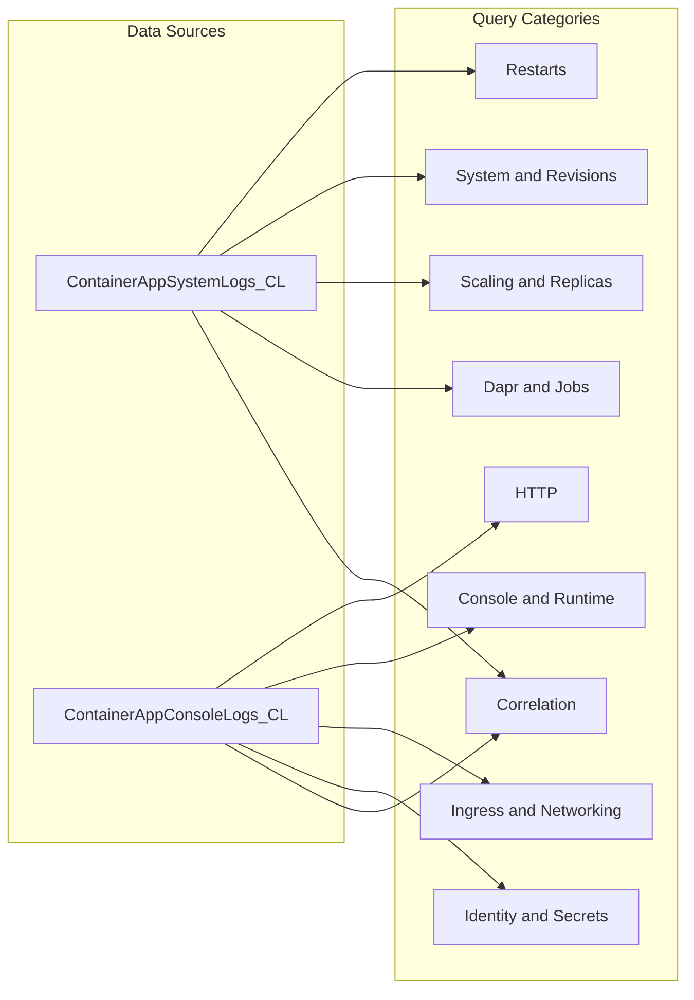

---
hide:
  - toc
---

# KQL Queries

Use this section as a query catalog. Each page includes scenario context, data-source notes, query pipeline, interpretation guidance, and limitations.

## Schema Note

| Workspace table | Common columns |
| --- | --- |
| `ContainerAppConsoleLogs_CL` | `ContainerAppName_s`, `ContainerJobName_s`, `RevisionName_s`, `ContainerName_s`, `Log_s`, `Stream_s`, `ContainerImage_s`, `EnvironmentName_s`, `ContainerGroupName_s` |
| `ContainerAppSystemLogs_CL` | `ContainerAppName_s`, `RevisionName_s`, `Reason_s`, `Type_s`, `Log_s`, `Level`, `EventSource_s`, `ReplicaName_s`, `JobName_s`, `ExecutionName_s`, `EnvironmentName_s` |
| `ContainerAppConsoleLogs` | Newer schema in some workspaces |
| `ContainerAppSystemLogs` | Newer schema in some workspaces |

If `_CL` tables are empty, check non-`_CL` tables in your workspace.

## Sample Result

Real lifecycle summary from a deployed Container Apps environment:

| Reason_s | Type_s | count_ |
|---|---|---:|
| ProbeFailed | Warning | 74 |
| RevisionUpdate | Normal | 14 |
| ContainerAppUpdate | Normal | 9 |
| RevisionReady | Normal | 7 |
| ContainerAppReady | Normal | 6 |
| KEDAScalersStarted | Normal | 6 |
| RevisionDeactivating | Normal | 5 |
| ContainerStarted | Normal | 3 |
| PulledImage | Normal | 3 |
| ContainerCreated | Normal | 3 |
| AssigningReplica | Normal | 3 |
| PullingImage | Normal | 2 |
| ContainerTerminated | Warning | 2 |

## Query Categories

### HTTP

- [HTTP Query Pack](http/index.md)
- [Latency Trend by Status Code](http/latency-trend-by-status-code.md)
- [5xx Trend Over Time](http/5xx-trend-over-time.md)
- [Slowest Requests by Path](http/slowest-requests-by-path.md)

### Restarts

- [Restarts Query Pack](restarts/index.md)
- [Restart Timing Correlation](restarts/restart-timing-correlation.md)
- [Repeated Startup Attempts](restarts/repeated-startup-attempts.md)

### System and Revisions

- [Revision Failures and Startup](system-and-revisions/revision-failures-and-startup.md)
- [Image Pull and Auth Errors](system-and-revisions/image-pull-and-auth-errors.md)
- [Replica Crash Signals](system-and-revisions/replica-crash-signals.md)

### Console and Runtime

- [Latest Errors and Exceptions](console-and-runtime/latest-errors-and-exceptions.md)
- [Request Latency from Logs](console-and-runtime/request-latency-from-logs.md)
- [Top Noisy Messages](console-and-runtime/top-noisy-messages.md)

### Ingress and Networking

- [Ingress Error Analysis](ingress-and-networking/ingress-error-analysis.md)
- [DNS and Connectivity Failures](ingress-and-networking/dns-and-connectivity-failures.md)

### Scaling and Replicas

- [Scaling Events](scaling-and-replicas/scaling-events.md)
- [Replica Count Over Time](scaling-and-replicas/replica-count-over-time.md)

### Identity and Secrets

- [Managed Identity Token Errors](identity-and-secrets/managed-identity-token-errors.md)
- [Secret Reference Failures](identity-and-secrets/secret-reference-failures.md)

### Dapr and Jobs

- [Dapr Sidecar Logs](dapr-and-jobs/dapr-sidecar-logs.md)
- [Job Execution History](dapr-and-jobs/job-execution-history.md)

### Correlation

- [Errors by Revision](correlation/errors-by-revision.md)
- [Failed Requests App Insights](correlation/failed-requests-app-insights.md)
- [Link Exceptions to Operations](correlation/link-exceptions-to-operations.md)

## See Also

- [Troubleshooting Hub](../index.md)
- [First 10 Minutes Checklist](../first-10-minutes/index.md)
- [Evidence Map](../evidence-map.md)

## Sources
- [Log monitoring in Azure Container Apps (Microsoft Learn)](https://learn.microsoft.com/azure/container-apps/log-monitoring)
- [ContainerAppConsoleLogs table reference (Microsoft Learn)](https://learn.microsoft.com/azure/azure-monitor/reference/tables/containerappconsolelogs)
- [ContainerAppSystemLogs table reference (Microsoft Learn)](https://learn.microsoft.com/azure/azure-monitor/reference/tables/containerappsystemlogs)
