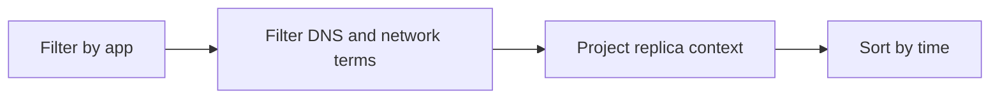

# DNS and Connectivity Failures

Use this query when dependency calls fail due to DNS lookup errors, timeouts, or transport connectivity issues.

## Data Source

| Table | Schema Note |
|---|---|
| `ContainerAppConsoleLogs_CL` | Legacy schema. If empty, try `ContainerAppConsoleLogs` (non-`_CL`). |

## Query Pipeline



## Query

```kusto
let AppName = "my-container-app";
ContainerAppConsoleLogs_CL
| where ContainerAppName_s == AppName
| where Log_s has_any ("name resolution", "NXDOMAIN", "timeout", "connection refused", "TLS", "handshake")
| project TimeGenerated, RevisionName_s, ReplicaName_s, Log_s
| order by TimeGenerated desc
```

## Interpretation Notes

- Clustered errors across replicas often indicate shared DNS or network path problems.
- Single-replica concentration can indicate noisy neighbor or transient pod issues.
- Normal pattern: rare connectivity errors under external service turbulence.

## Limitations

- Console logs require explicit app-side exception logging.
- Cannot independently verify DNS zone linkage.

## See Also

- [Ingress Error Analysis](ingress-error-analysis.md)
- [Internal DNS and Private Endpoint Failure Playbook](../../playbooks/ingress-and-networking/internal-dns-and-private-endpoint-failure.md)
