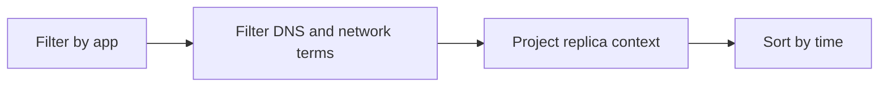

---
content_sources:
  diagrams:
    - id: query-pipeline
      type: flowchart
      source: mslearn-adapted
      based_on:
        - https://learn.microsoft.com/en-us/azure/container-apps/networking
        - https://learn.microsoft.com/en-us/azure/container-apps/troubleshooting
        - https://learn.microsoft.com/en-us/azure/container-apps/environment
content_validation:
  status: verified
  last_reviewed: "2026-04-12"
  reviewer: ai-agent
  core_claims:
    - claim: "Azure Container Apps can send application console logs to a Log Analytics workspace for querying."
      source: "https://learn.microsoft.com/azure/container-apps/logging"
      verified: true
    - claim: "Log Analytics uses Kusto Query Language to filter, summarize, and visualize collected log data."
      source: "https://learn.microsoft.com/azure/azure-monitor/logs/log-analytics-tutorial"
      verified: true
---

# DNS and Connectivity Failures

Use this query when dependency calls fail due to DNS lookup errors, timeouts, or transport connectivity issues.

## Data Source

| Table | Schema Note |
|---|---|
| `ContainerAppConsoleLogs_CL` | Legacy schema. If empty, try `ContainerAppConsoleLogs` (non-`_CL`). |

## Query Pipeline

<!-- diagram-id: query-pipeline -->


## Query

```kusto
let AppName = "my-container-app";
ContainerAppConsoleLogs_CL
| where ContainerAppName_s == AppName
| where Log_s has_any ("name resolution", "NXDOMAIN", "timeout", "connection refused", "TLS", "handshake")
| project TimeGenerated, RevisionName_s, Log_s
| order by TimeGenerated desc
```

## Example Output

| TimeGenerated | RevisionName_s | Log_s |
|---|---|---|
| 2026-04-04T11:45:13.328Z | ca-myapp--0000002 | DNS name resolution failed for redis.internal: NXDOMAIN |
| 2026-04-04T11:45:12.014Z | ca-myapp--0000002 | TLS handshake timeout connecting to api.partner.example |
| 2026-04-04T11:45:10.650Z | ca-myapp--0000002 | connection refused host=10.0.3.12 port=443 |

## Interpretation Notes

- Clustered errors across replicas often indicate shared DNS or network path problems.
- Single-replica concentration can indicate noisy neighbor or transient pod issues.
- Normal pattern: rare connectivity errors under external service turbulence.

## Limitations

- Console logs require explicit app-side exception logging.
- Cannot independently verify DNS zone linkage.

## See Also

- [Ingress Error Analysis](ingress-error-analysis.md)
- [Internal DNS and Private Endpoint Failure Playbook](../../playbooks/ingress-and-networking/internal-dns-and-private-endpoint-failure.md)
