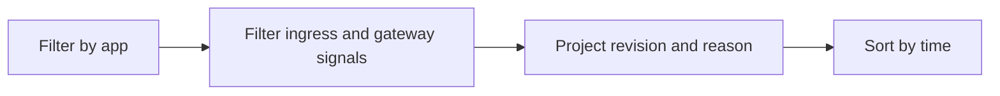

# Ingress Error Analysis

Use this query to investigate ingress-related request failures such as 502/504 and backend connectivity errors.

## Data Source

| Table | Schema Note |
|---|---|
| `ContainerAppSystemLogs_CL` | Legacy schema. If empty, try `ContainerAppSystemLogs` (non-`_CL`). |

## Query Pipeline



## Query

```kusto
let AppName = "my-container-app";
ContainerAppSystemLogs_CL
| where ContainerAppName_s == AppName
| where Log_s has_any ("ingress", "gateway", "502", "503", "504", "connection refused", "upstream")
| project TimeGenerated, RevisionName_s, Reason_s, Log_s
| order by TimeGenerated desc
```

## Interpretation Notes

- Repeated 502/504 with unhealthy revisions points to backend readiness issues.
- Errors without revision failures may indicate caller network path or DNS issues.
- Normal pattern: occasional transient errors, not sustained spikes.

## Limitations

- Ingress behavior details can vary by environment topology.
- Needs correlation with console logs for app-level failures.

## See Also

- [DNS and Connectivity Failures](dns-and-connectivity-failures.md)
- [Ingress Not Reachable Playbook](../../playbooks/ingress-and-networking/ingress-not-reachable.md)
