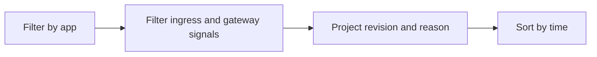

---
hide:
  - toc
content_sources:
  diagrams:
    - id: query-pipeline
      type: flowchart
      source: mslearn-adapted
      based_on:
        - https://learn.microsoft.com/en-us/azure/container-apps/ingress-overview
        - https://learn.microsoft.com/en-us/azure/container-apps/networking
        - https://learn.microsoft.com/en-us/azure/container-apps/troubleshooting
content_validation:
  status: verified
  last_reviewed: "2026-04-12"
  reviewer: ai-agent
  core_claims:
    - claim: "Azure Container Apps can send system logs that record platform events to a Log Analytics workspace."
      source: "https://learn.microsoft.com/azure/container-apps/logging"
      verified: true
    - claim: "Log Analytics uses Kusto Query Language to filter, summarize, and visualize collected log data."
      source: "https://learn.microsoft.com/azure/azure-monitor/logs/log-analytics-tutorial"
      verified: true
---

# Ingress Error Analysis

Use this query to investigate ingress-related request failures such as 502/504 and backend connectivity errors.

## Data Source

| Table | Schema Note |
|---|---|
| `ContainerAppSystemLogs_CL` | Legacy schema. If empty, try `ContainerAppSystemLogs` (non-`_CL`). |

## Query Pipeline

<!-- diagram-id: query-pipeline -->


## Query

```kusto
let AppName = "my-container-app";
ContainerAppSystemLogs_CL
| where ContainerAppName_s == AppName
| where Log_s has_any ("ingress", "gateway", "502", "503", "504", "connection refused", "upstream")
| project TimeGenerated, RevisionName_s, Reason_s, Log_s
| order by TimeGenerated desc
```

## Example Output

| TimeGenerated | RevisionName_s | Reason_s | Log_s |
|---|---|---|---|
| 2026-04-04T11:44:02.611Z | ca-myapp--0000002 | ProbeFailed | upstream request timeout while waiting for backend response (504) |
| 2026-04-04T11:43:57.204Z | ca-myapp--0000002 | ProbeFailed | ingress gateway received 502 from backend pod |
| 2026-04-04T11:42:11.933Z | ca-myapp--0000002 | RevisionUpdate | ingress endpoint switched to latest revision |

## Interpretation Notes

- Repeated 502/504 with unhealthy revisions points to backend readiness issues.
- Errors without revision failures may indicate caller network path or DNS issues.
- Normal pattern: occasional transient errors, not sustained spikes.

## Limitations

- Ingress behavior details can vary by environment topology.
- Needs correlation with console logs for app-level failures.

## See Also

- [DNS and Connectivity Failures](dns-and-connectivity-failures.md)
- [Ingress Not Reachable Playbook](../../playbooks/ingress-and-networking/ingress-not-reachable.md)
