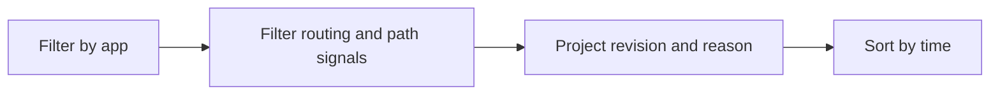

---
content_sources:
  diagrams:
    - id: query-pipeline
      type: flowchart
      source: mslearn-adapted
      based_on:
        - https://learn.microsoft.com/en-us/azure/container-apps/ingress-overview
        - https://learn.microsoft.com/en-us/azure/container-apps/networking
        - https://learn.microsoft.com/en-us/azure/container-apps/troubleshooting
content_validation:
  status: verified
  last_reviewed: "2026-04-12"
  reviewer: ai-agent
  core_claims:
    - claim: "Azure Container Apps can send system logs that record platform events to a Log Analytics workspace."
      source: "https://learn.microsoft.com/azure/container-apps/logging"
      verified: true
    - claim: "Log Analytics uses Kusto Query Language to filter, summarize, and visualize collected log data."
      source: "https://learn.microsoft.com/azure/azure-monitor/logs/log-analytics-tutorial"
      verified: true
---

# Request Routing Analysis

Use this query to trace ingress routing decisions such as path matching, revision selection, and traffic split changes.

## Data Source

| Table | Schema Note |
|---|---|
| `ContainerAppSystemLogs_CL` | Legacy schema. If empty, try `ContainerAppSystemLogs` (non-`_CL`). |

## Query Pipeline

<!-- diagram-id: query-pipeline -->


## Query

```kusto
let AppName = "my-container-app";
ContainerAppSystemLogs_CL
| where ContainerAppName_s == AppName
| where Log_s has_any ("route", "routing", "path", "traffic split", "matched", "revision")
| project TimeGenerated, RevisionName_s, Reason_s, Log_s
| order by TimeGenerated desc
```

## Example Output

| TimeGenerated | RevisionName_s | Reason_s | Log_s |
|---|---|---|---|
| 2026-04-12T09:14:37.904Z | ca-myapp--0000007 | TrafficWeightUpdate | ingress routing updated traffic split: ca-myapp--0000007=90, ca-myapp--0000006=10 |
| 2026-04-12T09:14:33.287Z | ca-myapp--0000007 | RequestRouting | request matched path prefix /api/orders and routed to revision ca-myapp--0000007 |
| 2026-04-12T09:14:28.551Z | ca-myapp--0000006 | RequestRouting | request matched catch-all path / and routed to revision ca-myapp--0000006 |

## Interpretation Notes

- Routing entries that suddenly switch revisions can explain behavior differences during rollout windows.
- Repeated fallback to catch-all paths suggests an ingress rule mismatch or unexpected request path shape.
- Normal pattern: path matches and traffic split updates align with intentional revision deployment activity.

## Limitations

- System logs show platform routing signals, not complete end-to-end application request traces.
- Path-level detail depends on what ingress events are emitted in the environment.

## See Also

- [Ingress Error Analysis](ingress-error-analysis.md)
- [Timeout and Retry Patterns](timeout-and-retry-patterns.md)
