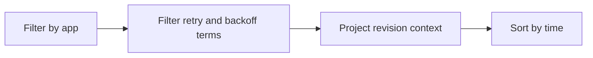

---
content_sources:
  diagrams:
    - id: query-pipeline
      type: flowchart
      source: mslearn-adapted
      based_on:
        - https://learn.microsoft.com/en-us/azure/container-apps/ingress-overview
        - https://learn.microsoft.com/en-us/azure/container-apps/networking
        - https://learn.microsoft.com/en-us/azure/container-apps/troubleshooting
content_validation:
  status: verified
  last_reviewed: "2026-04-12"
  reviewer: ai-agent
  core_claims:
    - claim: "Azure Container Apps can send application console logs to a Log Analytics workspace for querying."
      source: "https://learn.microsoft.com/azure/container-apps/logging"
      verified: true
    - claim: "Log Analytics uses Kusto Query Language to filter, summarize, and visualize collected log data."
      source: "https://learn.microsoft.com/azure/azure-monitor/logs/log-analytics-tutorial"
      verified: true
---

# Timeout and Retry Patterns

Use this query to investigate repeated retry loops, backoff escalation, and exhausted retry budgets after latency pressure.

## Data Source

| Table | Schema Note |
|---|---|
| `ContainerAppConsoleLogs_CL` | Legacy schema. If empty, try `ContainerAppConsoleLogs` (non-`_CL`). |

## Query Pipeline

<!-- diagram-id: query-pipeline -->


## Query

```kusto
let AppName = "my-container-app";
ContainerAppConsoleLogs_CL
| where ContainerAppName_s == AppName
| where Log_s has_any ("retry", "retrying", "backoff", "attempt", "retries exhausted", "deadline exceeded")
| project TimeGenerated, RevisionName_s, Log_s
| order by TimeGenerated desc
```

## Example Output

| TimeGenerated | RevisionName_s | Log_s |
|---|---|---|
| 2026-04-12T09:31:26.441Z | ca-myapp--0000007 | retries exhausted for inventory client after attempt=4 backoff=16s |
| 2026-04-12T09:31:18.230Z | ca-myapp--0000007 | retry scheduled for upstream call attempt=2 backoff=4s jitter=enabled |
| 2026-04-12T09:31:09.917Z | ca-myapp--0000007 | context deadline exceeded after retry budget consumed for orders.internal request |

## Interpretation Notes

- Escalating attempt counts with longer backoff intervals indicate the application is retrying rather than failing fast.
- Exhausted retry budgets usually indicate persistent dependency slowness rather than a single transient fault.
- Normal pattern: occasional isolated retries, not sustained bursts that align with user-facing latency spikes.

## Limitations

- Retry evidence appears only when the application or client library logs retry metadata explicitly.
- This query does not distinguish safe retries from duplicate business operations without app-specific context.

## See Also

- [Request Routing Analysis](request-routing-analysis.md)
- [Ingress Error Analysis](ingress-error-analysis.md)
