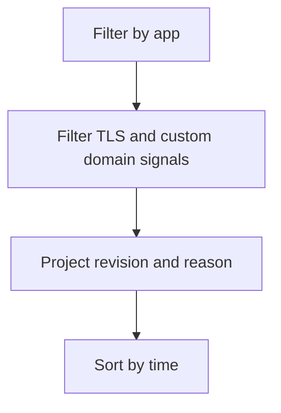

---
content_sources:
  diagrams:
    - id: query-pipeline
      type: flowchart
      source: mslearn-adapted
      based_on:
        - https://learn.microsoft.com/en-us/azure/container-apps/ingress-overview
        - https://learn.microsoft.com/en-us/azure/container-apps/networking
        - https://learn.microsoft.com/en-us/azure/container-apps/troubleshooting
content_validation:
  status: verified
  last_reviewed: "2026-04-12"
  reviewer: ai-agent
  core_claims:
    - claim: "Azure Container Apps can send application console logs to a Log Analytics workspace for querying."
      source: "https://learn.microsoft.com/azure/container-apps/logging"
      verified: true
    - claim: "Log Analytics uses Kusto Query Language to filter, summarize, and visualize collected log data."
      source: "https://learn.microsoft.com/azure/azure-monitor/logs/log-analytics-tutorial"
      verified: true
---

# TLS Handshake Errors

Use this query to investigate ingress TLS configuration events such as certificate binding changes, SNI mismatch signals, and custom domain handshake failures.

## Data Source

| Table | Schema Note |
|---|---|
| `ContainerAppSystemLogs_CL` | Legacy schema. If empty, try `ContainerAppSystemLogs` (non-`_CL`). |

## Query Pipeline

<!-- diagram-id: query-pipeline -->


## Query

```kusto
let AppName = "my-container-app";
ContainerAppSystemLogs_CL
| where ContainerAppName_s == AppName
| where Log_s has_any ("TLS", "certificate", "custom domain", "SNI", "hostname", "binding")
| project TimeGenerated, RevisionName_s, Reason_s, Log_s
| order by TimeGenerated desc
```

## Example Output

| TimeGenerated | RevisionName_s | Reason_s | Log_s |
|---|---|---|---|
| 2026-04-12T09:22:41.118Z | ca-myapp--0000007 | CustomDomainUpdate | TLS certificate binding updated for host api.contoso.example |
| 2026-04-12T09:22:38.642Z | ca-myapp--0000007 | IngressConfiguration | SNI hostname api.contoso.example did not match active certificate binding |
| 2026-04-12T09:22:35.004Z | ca-myapp--0000007 | CertificateSync | custom domain certificate secret sync failed during handshake configuration refresh |

## Interpretation Notes

- SNI mismatch signals usually point to hostname-to-certificate binding drift or an incomplete custom domain rollout.
- Certificate sync failures can explain why clients see intermittent TLS errors even when the app revision is healthy.
- Normal pattern: certificate binding updates are rare and align with planned ingress or custom domain changes.

## Limitations

- System logs expose platform TLS events, not full client-side certificate negotiation details.
- Exact handshake symptoms still need correlation with caller telemetry or browser output.

## See Also

- [Ingress Error Analysis](ingress-error-analysis.md)
- [DNS and Connectivity Failures](dns-and-connectivity-failures.md)
