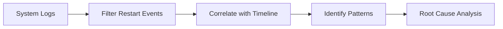

---
content_sources:
  diagrams:
    - id: query-pipeline-overview
      type: flowchart
      source: mslearn-adapted
      based_on:
        - https://learn.microsoft.com/azure/container-apps/log-monitoring
        - https://learn.microsoft.com/azure/container-apps/health-probes
        - https://learn.microsoft.com/kusto/query/
---

# Restarts Query Pack

Queries for analyzing container and replica restart patterns in Azure Container Apps. Use these to correlate restarts with latency spikes and error incidents.

## Data Sources

| Table | Description |
|---|---|
| `ContainerAppSystemLogs_CL` | Platform events including restart signals |
| `ContainerAppConsoleLogs_CL` | Application logs showing shutdown/startup sequences |

!!! note "Schema Variation"
    If `_CL` tables are empty, try the non-`_CL` variants.

## Query Pipeline Overview

<!-- diagram-id: query-pipeline-overview -->

## Available Queries

| Query | Purpose |
|---|---|
| [Restart Timing Correlation](restart-timing-correlation.md) | Correlate restarts with incident windows |
| [Repeated Startup Attempts](repeated-startup-attempts.md) | Detect crash loops and startup failures |

## When to Use

- Latency or error spikes coincide with unknown events
- Users report intermittent failures
- Replica count fluctuations in monitoring
- Post-deployment stability analysis

## Container Apps Restart Triggers

| Trigger | Reason_s Pattern | Description |
|---|---|---|
| Probe failure | `ProbeFailed` | Liveness/readiness probe failed |
| OOM kill | `ContainerTerminated`, `OOMKilled` | Memory limit exceeded |
| Crash | `ContainerTerminated`, `Error` | Application crash or unhandled exception |
| Scaling | `AssigningReplica`, `TerminatingReplica` | KEDA scale-in/out events |
| Revision update | `RevisionUpdate` | New revision deployed |
| Platform maintenance | `ContainerRestarted` | Platform-initiated restart |

## See Also

- [KQL Query Catalog](../index.md)
- [Replica Crash Signals](../system-and-revisions/replica-crash-signals.md)
- [Revision Failures and Startup](../system-and-revisions/revision-failures-and-startup.md)

## Sources

- [Log monitoring in Azure Container Apps](https://learn.microsoft.com/azure/container-apps/log-monitoring)
- [Health probes in Azure Container Apps](https://learn.microsoft.com/azure/container-apps/health-probes)
- [Kusto Query Language (KQL) overview](https://learn.microsoft.com/kusto/query/)
