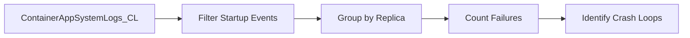

---
hide:
  - toc
content_sources:
  diagrams:
    - id: purpose-identifies-replicas-with-multiple-startup
      type: flowchart
      source: mslearn-adapted
      based_on:
        - https://learn.microsoft.com/azure/container-apps/log-monitoring
        - https://learn.microsoft.com/azure/container-apps/troubleshooting
        - https://learn.microsoft.com/azure/container-apps/health-probes
content_validation:
  status: verified
  last_reviewed: "2026-04-12"
  reviewer: ai-agent
  core_claims:
    - claim: "Azure Container Apps can send system logs that record platform events to a Log Analytics workspace."
      source: "https://learn.microsoft.com/azure/container-apps/logging"
      verified: true
    - claim: "Log Analytics uses Kusto Query Language to filter, summarize, and visualize collected log data."
      source: "https://learn.microsoft.com/azure/azure-monitor/logs/log-analytics-tutorial"
      verified: true
---

# Repeated Startup Attempts

**Scenario**: Container fails to start successfully and enters a crash loop or repeated restart cycle.
**Data Source**: `ContainerAppSystemLogs_CL`
**Purpose**: Identifies replicas with multiple startup failures to detect crash loops and persistent startup issues.

<!-- diagram-id: purpose-identifies-replicas-with-multiple-startup -->


## Query

```kusto
let AppName = "my-container-app";
ContainerAppSystemLogs_CL
| where ContainerAppName_s == AppName
| where TimeGenerated > ago(6h)
| where Reason_s has_any (
    "BackOff",
    "CrashLoopBackOff", 
    "ContainerTerminated",
    "ProbeFailed",
    "FailedScheduling",
    "FailedMount"
)
| summarize 
    FailureCount=count(),
    FirstSeen=min(TimeGenerated),
    LastSeen=max(TimeGenerated),
    Reasons=make_set(Reason_s)
    by RevisionName_s, ReplicaName_s
| where FailureCount > 3
| order by FailureCount desc
```

## Startup Failure Timeline

```kusto
let AppName = "my-container-app";
ContainerAppSystemLogs_CL
| where ContainerAppName_s == AppName
| where TimeGenerated > ago(2h)
| where Reason_s has_any ("Started", "ContainerTerminated", "ProbeFailed", "BackOff")
| project TimeGenerated, RevisionName_s, ReplicaName_s, Reason_s, Log_s
| order by ReplicaName_s, TimeGenerated asc
```

## Example Output

| RevisionName_s | ReplicaName_s | FailureCount | FirstSeen | LastSeen | Reasons |
|---|---|---:|---|---|---|
| ca-myapp--abc123 | ca-myapp--abc123-7d8f9 | 15 | 2026-04-04T10:00:00Z | 2026-04-04T12:30:00Z | ["CrashLoopBackOff", "ContainerTerminated"] |
| ca-myapp--abc123 | ca-myapp--abc123-5c6d7 | 8 | 2026-04-04T11:15:00Z | 2026-04-04T12:00:00Z | ["ProbeFailed", "BackOff"] |
| ca-myapp--def456 | ca-myapp--def456-2a3b4 | 4 | 2026-04-04T09:00:00Z | 2026-04-04T09:30:00Z | ["FailedMount"] |

## Startup Failure Patterns

| Pattern | Reason_s | Likely Cause |
|---|---|---|
| **CrashLoopBackOff** | `CrashLoopBackOff` | App crashes immediately after start; check exit code and logs |
| **Probe Failures** | `ProbeFailed` | App starts but health check fails; verify probe config and port |
| **Mount Failures** | `FailedMount` | Volume or secret mount failed; check storage/Key Vault access |
| **Scheduling Failures** | `FailedScheduling` | Resource constraints; check CPU/memory requests |
| **Image Pull Failures** | `ImagePullBackOff` | ACR access or image not found |

## Console Logs for Failed Container

Get application logs from a specific failing replica:

```kusto
let AppName = "my-container-app";
let FailingReplica = "ca-myapp--abc123-7d8f9";
ContainerAppConsoleLogs_CL
| where ContainerAppName_s == AppName
| where ContainerGroupName_s has FailingReplica or ReplicaName_s == FailingReplica
| where TimeGenerated > ago(2h)
| project TimeGenerated, Stream_s, Log_s
| order by TimeGenerated asc
| take 100
```

## Interpretation Notes

- **FailureCount > 10 in 1 hour**: Strong indicator of crash loop; immediate investigation required.
- **FailureCount 3-5**: May indicate transient issues or slow startup; check if eventually stabilizes.
- **Multiple replicas failing**: Likely configuration or code issue affecting all instances.
- **Single replica failing**: May indicate node-specific issue or bad deployment.
- **Check time between FirstSeen and LastSeen**: Short duration with high count = rapid crash loop.

## Limitations

- Threshold of 3 failures may need adjustment based on your app's normal behavior.
- Some startup issues may not emit explicit failure events.
- Query cannot distinguish between expected restarts (deployments, scale-in) and problematic restarts.
- ReplicaName_s format may vary; adjust filtering as needed.

## See Also

- [Restarts Query Pack](index.md)
- [Restart Timing Correlation](restart-timing-correlation.md)
- [Revision Failures and Startup](../system-and-revisions/revision-failures-and-startup.md)
- [Image Pull and Auth Errors](../system-and-revisions/image-pull-and-auth-errors.md)
- [KQL Query Catalog](../index.md)

## Sources

- [Log monitoring in Azure Container Apps](https://learn.microsoft.com/azure/container-apps/log-monitoring)
- [Troubleshoot Azure Container Apps](https://learn.microsoft.com/azure/container-apps/troubleshooting)
- [Health probes in Azure Container Apps](https://learn.microsoft.com/azure/container-apps/health-probes)
